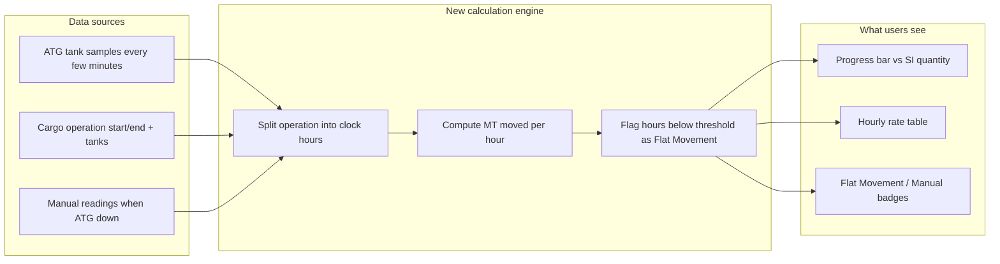

# ATG Hourly Cargo Progress — Leadership Proposal

**Document type:** Pre-implementation proposal for management review  
**System:** Jetty Planning System (JPS)  
**Status:** Draft — pending approval before development  
**Date:** August 2026  
**Related technical plan:** `.cursor/plans/atg_hourly_cargo_progress_b6e1b962.plan.md`  
**Related prior work:** Cargo Operations session-first UX (operational tab); [ATG Transfer & Drain Detection Algorithm Draft](ATG-Transfer-Drain-Detection-Algorithm-Draft.md)

---

## 1. Executive summary

We propose upgrading JPS cargo operations progress tracking so that **progress bars and transfer rates are driven by real ATG (Automatic Tank Gauge) data hour-by-hour**, instead of a single flat average over the whole operation.

The enhancement will:

- Support **live operations** (progress updates in real time) and **historical / backdated operations** (accurate reconstruction from stored ATG samples).
- Respect **Loading vs Unloading** direction (tank mass should decrease or increase accordingly).
- Show **actual hourly transfer rates** per clock hour (e.g. 14:00–15:00 WITA), **not** “total volume ÷ total duration.”
- Automatically label stagnant hours as **“Flat Movement”** (valve closed, pause, flow stopped).
- Provide a **manual fallback** when ATG is offline, with clear “Manual” labeling in the UI.

**Recommended approach:** deliver in **four phases**. Phase 1 requires **no database migration** and can be rolled back by redeploying the previous application version.

---

## 2. Problem statement

### What we do today

| Capability | Current behavior | Limitation |
|------------|------------------|------------|
| **Progress %** | Mix of form draft totals and daily ATG aggregates | Live bar can lag; backdated starts are inconsistent |
| **Transfer rate** | One number: total moved ÷ total hours | Hides pauses and active periods; misleading for long transfers |
| **ATG quantity** | Start/end mass delta per segment | Includes flat periods in the total; no hourly breakdown |
| **Loading vs Unloading** | Uses absolute mass change | Does not validate direction against operation type |
| **ATG outage** | Manual qty at segment close only | No in-progress manual tracking or hourly view |
| **Flat / pause detection** | Documented in draft algorithm only | Not shown to operators in JPS |

### Business impact of the gap

- Supervisors cannot see **when** transfer actually happened vs when the line was idle.
- Reported “average rate” can look healthy even when **several hours had zero movement**.
- Operations with **backdated start times** (started yesterday, still running today) are hard to reconcile.
- When ATG fails, operators fall back to manual entry **without** a structured progress story for management.

---

## 3. Proposed solution (plain language)



### Core rules (agreed)

1. **Hourly buckets = clock-aligned in port timezone** (e.g. 14:00–15:00 WITA, 15:00–16:00 WITA), including partial first/last hours when the operation starts or ends mid-hour.
2. **Loading:** shore tank mass **decreases** → product moving to vessel.
3. **Unloading:** shore tank mass **increases** → product moving from vessel to shore tanks.
4. **Flat Movement:** any clock hour where moved quantity or rate falls below a configurable threshold (default **2 MT/h**) is labeled **“Flat Movement.”**
5. **Manual mode:** operators log cumulative readings at checkpoints; system distributes progress across clock hours and applies the same Flat Movement rules.
6. **SI quantity variance is normal and non-blocking:** actual moved quantity (from ATG or manual) will often be **slightly above or below** the Shipping Instruction (SI) quantity. This is expected in real operations and **must not prevent** closing a segment, saving cargo activity, or progressing the operation to Post-Checking / sign-off.

---

## 3.1 SI quantity variance — completion policy

In practice, final loaded/unloaded quantity rarely matches the SI quantity exactly (measurement tolerance, tank heel, line drain, temperature correction, etc.). The hourly progress feature **must not introduce new hard gates** on exact SI match.

| Scenario | System behavior | Blocks completion? |
|----------|-----------------|-------------------|
| **Moved qty < SI qty** (under-delivery) | Progress bar shows remaining balance; informational banner when all segments are closed | **No** — operator confirms and saves (existing flow) |
| **Moved qty > SI qty** (over-delivery) | Progress bar caps at **100%**; label shows “X MT over SI” | **No** — operator confirms and saves (existing flow) |
| **Moved qty = SI qty** (exact match) | Progress shows 100%, “Complete” | N/A |
| **Operation sign-off** | Requires operation `completion_percent = 100%` and QC/qty checks — **not** exact SI match | **No** variance gate |

**Design rules for P1–P3:**

- **Progress %** = `min(100, movedQty ÷ siQty × 100)` — never exceeds 100% on the bar even when over-delivered.
- **Moved qty display** shows the **actual ATG/manual total**, which may differ from SI (e.g. “9,950 / 10,000 MT” or “10,080 / 10,000 MT (+80 over SI)”).
- **Hourly table** sums to actual moved qty; hourly rates are **not** forced to reconcile to SI qty.
- **No new validation** on segment close, “Complete transfer,” or sign-off that requires `movedQty === siQty`.
- **Informational only:** existing SI mismatch banner + confirm dialog remain; supervisor sees variance but operator can proceed after acknowledgment.

This preserves today’s JPS behavior while making hourly ATG reporting more accurate — variance is visible for audit, not a workflow blocker.

---

## 4. Use cases (with examples)

### Case 1 — Ongoing operation (start today, still running)

**Example:** Today 27 Aug 2026, 16:00 WITA. Cargo ops started today. End time not set.

| Aspect | Behavior |
|--------|----------|
| Progress bar | Updates live from ATG; includes partial current hour |
| Hourly table | 16:00–17:00, 17:00–18:00, … up to now |
| Rates | 16:00–17:00 → 100 MT/h (active); 17:00–18:00 → 0 MT/h (**Flat Movement**) |

### Case 2 — Completed operation (historical)

**Example:** Start 26 Aug 05:00 WITA → End 27 Aug 11:30 WITA.

| Aspect | Behavior |
|--------|----------|
| Progress bar | Total moved = ATG delta from start to end |
| Hourly table | Full clock-hour breakdown across the window |
| Flat Movement | Any hour with near-zero transfer is flagged |
| Persistence | Closed hours stored for reporting after ATG sample archive |

### Case 3 — Ongoing with backdated start

**Example:** Start 26 Aug 08:00 WITA (yesterday), still running, end not set.

| Aspect | Behavior |
|--------|----------|
| Progress bar | Baseline ATG reading at 26 Aug 08:00; cumulative to now |
| Hourly table | Historical hours from 26 Aug through current hour, then live |
| Rates | Same Flat Movement rules on every hour |

### Case 4 — ATG unavailable (manual fallback)

**Example:** Transfer active but ATG disconnected or uncalibrated.

| Aspect | Behavior |
|--------|----------|
| Progress bar | Based on manual cumulative readings at checkpoints |
| Hourly table | Time-allocated from checkpoints; source badge **Manual** |
| Flat Movement | Hours with zero change between checkpoints labeled flat |
| Operator workflow | “Log manual reading” with timestamp + cumulative MT moved |

---

## 5. What users will see (UI)

### Operational progress section (vessel detail)

- Existing **daily progress chart** (unchanged).
- **New hourly rate table:** clock time | MT moved | MT/h | status (Active / **Flat Movement** / Incomplete).
- **Current hour rate** replaces misleading “total ÷ duration” headline rate.
- **Source badge:** ATG | Manual | Hybrid.

### Cargo operations modal (session-first flow)

- Live panel shows **current clock hour rate** and Flat Movement when applicable.
- Progress bar aligned with API (fixes backdated-start scenarios).

### Manual checkpoint entry (Phase 3)

- Button to log reading when ATG is down.
- List of checkpoints with audit trail (who, when, qty).

---

## 6. Flat Movement — threshold logic

**Purpose:** Distinguish productive transfer hours from pauses (valve closure, hose change, waiting, drain/plateau on ATG chart).

| Status | Condition (simplified) | User-facing label |
|--------|------------------------|-------------------|
| **Active** | Rate ≥ threshold and measurable movement | Normal hour (green) |
| **Flat Movement** | Rate below threshold OR near-zero MT moved | **Flat Movement** (gray badge) |
| **Incomplete** | Missing ATG samples at hour boundary | Amber warning |

**Default thresholds (tunable per port in Master – Port):**

| Setting | Default | Rationale |
|---------|---------|-----------|
| Flat rate threshold | **2.0 MT/h** | Aligned with ATG drain-detection draft (`R_idle_mass = 2 t/h`) |
| Minimum movement | **1.0 MT** | Ignore sensor noise |
| Sample tolerance | **15 minutes** | Match existing ATG window logic |

**Note:** This labels **individual clock hours**. Longer “drain / flat-after-movement phases” (multi-hour plateaus) can be a future enhancement using the existing [ATG Transfer & Drain Detection Algorithm Draft](ATG-Transfer-Drain-Detection-Algorithm-Draft.md).

---

## 7. Technical approach (summary for IT leadership)

### What we reuse (low risk)

- Existing **ATG sample table** (`tank_gauging_samples`) — no new hardware integration.
- Existing **cargo load line** model (segment start/end, tanks, manual/auto mode).
- Existing **operational progress API** — extended, not replaced.
- Recent **session-first cargo ops UI** — live polling already in place.

### What we add

| Component | Purpose |
|-----------|---------|
| New library `atg-hourly-progress.js` | Clock-hour buckets, direction-aware delta, Flat Movement classifier |
| Extended API `GET /operations/:id/operational-progress` | Returns `hourlyBuckets[]`, current-hour rate, improved `completionPercent` |
| New tables (Phase 2+) | Hourly persistence, manual checkpoints, port threshold config |
| UI hourly table + badges | Operational progress + cargo ops session panel |

### What we do **not** change initially

- Daily progress bars and existing cargo segment save logic.
- Mobile operator Start/Stop flow.
- ATG poller / Tankvision integration.

---

## 8. Phased rollout and rollback

| Phase | Deliverable | Database change | Rollback |
|-------|-------------|-----------------|----------|
| **P1** | Hourly calculation + API + UI table (compute on read) | **None** | Redeploy previous app build (~5 min on SIT) |
| **P2** | Persist hourly rows; snapshot on segment close; cron | Migration 110 + rollback SQL | App rollback + run rollback script |
| **P3** | Manual checkpoint UI + API | Included in P2 migration | Disable manual feature |
| **P4** (optional) | Advanced drain phase detection | None initially | Feature flag |

**Recommendation:** Approve **P1 for SIT/UAT first**. Validate hourly table and Flat Movement labels against known TK-5201 transfer data before P2 persistence.

---

## 9. Risks and mitigations

| Risk | Mitigation |
|------|------------|
| Hourly rates disagree with operator expectation | Tunable per-port thresholds; partial-hour labeling; supervisor can expand advanced segment view |
| Sparse ATG samples → incomplete hours | Mark as **Incomplete**, not zero; 15 min tolerance already proven in production |
| Direction mismatch (noise/reversal) | Count 0 for that hour + warning; do not inflate totals with `abs()` |
| **Actual qty ≠ SI qty** (common in operations) | Show variance badge; cap progress bar at 100%; **never block** segment close or sign-off |
| Migration complexity | Defer DB changes to P2; P1 is read-only computation |
| Sample purge loses history | P2 persists closed hourly buckets before archive |
| Scope creep (full drain state machine) | Deferred to P4; P1–P3 deliver agreed hourly + flat hour labeling |

---

## 10. Decisions requested from leadership

Please confirm or adjust before development starts:

1. **Approve phased approach** — P1 (no migration) first, then P2 persistence?
2. **Flat Movement threshold** — Accept default **2 MT/h** per port, configurable in Master – Port?
3. **Clock-aligned hours** — Confirm port timezone hours (not “Hour 1 / Hour 2 from start”)?
4. **Manual checkpoint workflow** — Required for P1 or acceptable in P3?
5. **UAT acceptance** — Use TK-5201 Aug 2026 transfer as reference dataset (existing draft report)?
6. **SI variance policy** — Confirm that moved qty above/below SI is **informational only** and does not block cargo completion or sign-off?

---

## 11. Effort estimate (indicative)

| Phase | Scope | Rough effort |
|-------|-------|--------------|
| P1 | Backend engine + API + UI hourly table | 1–2 sprints |
| P2 | Migration, persistence, cron | 0.5–1 sprint |
| P3 | Manual checkpoints UI/API | 0.5–1 sprint |
| P4 | Drain phase detection (optional) | TBD after P1–P3 UAT |

*Estimates assume one developer familiar with JPS; testing and UAT with operations team additional.*

---

## 12. Success criteria (UAT)

- [ ] Ongoing loading: progress bar moves live; hourly table updates current partial hour.
- [ ] Completed 26h+ operation: hourly table spans full window; flat hours labeled.
- [ ] Backdated start: progress from past start time matches ATG total delta at close.
- [ ] Loading operation: tank mass decrease drives moved qty; unloading uses increase.
- [ ] Simulated ATG outage: manual checkpoints produce progress + hourly table with Manual badge.
- [ ] Flat hour (zero transfer for 1 clock hour) shows **Flat Movement**, not hidden in average.
- [ ] **Under SI:** all segments closed, moved qty below SI — operator can save/complete after confirm; progress shows actual moved qty.
- [ ] **Over SI:** moved qty above SI — progress bar capped at 100%, “over SI” label shown; operator can save/complete after confirm.
- [ ] P1 rollback: redeploy previous build with no DB restore.

---

## 13. Out of scope (this proposal)

- Auto-detect “operation complete” from ATG (operator still clicks Complete).
- Replacing daily progress charts (hourly is additive).
- Solid commodity / non-tank cargo (liquid + ATG tanks only).
- Full multi-hour “drain phase” state machine (future P4).
- Changes to Tankvision poller frequency (separate ops decision).

---

## 14. Appendix — data model (Phase 2)

For technical reviewers; not required for business approval.

**New table: `operation_hourly_cargo_progress`**

- One row per load line per clock hour: `hour_start`, `hour_end`, `qty_moved`, `rate_tph`, `movement_status` (active | flat_movement | incomplete), `source` (atg | manual).

**New table: `operation_cargo_manual_checkpoints`**

- Checkpoint readings: `load_line_id`, `recorded_at`, `cumulative_qty`, audit fields.

**Port config extensions**

- `atg_flat_rate_threshold_tph` (default 2.0)
- `atg_min_qty_moved_t` (default 1.0)

Rollback script: `Backend/rollback/110_rollback_hourly_cargo_progress.sql`

---

## 15. Appendix — example API output (illustrative)

```json
{
  "completionPercent": 42.5,
  "movedQty": 4250,
  "siQty": 10000,
  "rateSummary": {
    "currentHourLine": "Current hour (16:00–17:00 WITA): 95 MT/h",
    "lastActiveHourLine": "Last active: 15:00–16:00 · 120 MT/h"
  },
  "hourlyBuckets": [
    {
      "hourLabelLocal": "15:00–16:00 WITA",
      "qtyMoved": 120,
      "rateTph": 120,
      "movementStatus": "active",
      "source": "atg"
    },
    {
      "hourLabelLocal": "16:00–17:00 WITA",
      "qtyMoved": 0,
      "rateTph": 0,
      "movementStatus": "flat_movement",
      "source": "atg"
    }
  ]
}
```

---

## 16. Document history

| Version | Date | Author | Notes |
|---------|------|--------|-------|
| 1.0 | Aug 2026 | JPS team | Initial leadership proposal from technical plan |
| 1.1 | Aug 2026 | JPS team | Added SI qty variance policy — non-blocking completion |

---

**Next step after approval:** Execute Phase P1 on a feature branch → SIT validation → leadership sign-off for P2 migration.
