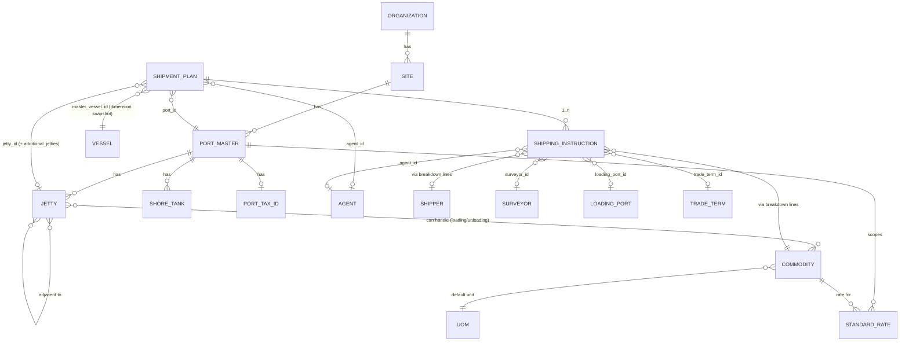

# Jetty Planning System (JPS) ↔ DataHub (DHM): Master Data Expansion — Data Requirements

**Purpose:** working reference for the discussion with the DataHub Management (DHM) team about syncing more master data into JPS.
**Audience:** JPS engineering, DHM System Integrator / Data Engineer / Data Steward, product/ops stakeholders.
**Status:** Draft for discussion — not yet implemented beyond what is listed in [§1 Current State](#1-current-state-what-is-synced-today).
**Related doc:** `Docs/Guide/DATAHUB_CLIENT_INTEGRATION.md` (the DHM client contract JPS already implements for vessel).

---

## Contents

1. [Current state: what is synced today](#1-current-state-what-is-synced-today)
2. [Why we need more master data: the Jetty Planning use case](#2-why-we-need-more-master-data-the-jetty-planning-use-case)
3. [Quick-reference summary table](#3-quick-reference-summary-table)
4. [Data domain 1 — Site & Berth (Port, Jetty)](#4-data-domain-1--site--berth-port-jetty)
5. [Data domain 2 — Vessel (already syncing)](#5-data-domain-2--vessel-already-syncing)
6. [Data domain 3 — Commodity & unit of measure](#6-data-domain-3--commodity--unit-of-measure)
7. [Data domain 4 — Commercial counterparties (Shipper, Agent, Surveyor, Loading Port)](#7-data-domain-4--commercial-counterparties-shipper-agent-surveyor-loading-port)
8. [Data domain 5 — Trade / freight terms](#8-data-domain-5--trade--freight-terms)
9. [Data domain 6 — Operational configuration (shore tanks, cargo handling methods, standard rates, port tax ID)](#9-data-domain-6--operational-configuration-shore-tanks-cargo-handling-methods-standard-rates-port-tax-id)
10. [How it all connects: entity relationship map](#10-how-it-all-connects-entity-relationship-map)
11. [Gap analysis vs. the current DHM catalog](#11-gap-analysis-vs-the-current-dhm-catalog)
12. [Proposed sync pattern per entity](#12-proposed-sync-pattern-per-entity)
13. [Matching / de-duplication keys](#13-matching--de-duplication-keys)
14. [Proposed phasing](#14-proposed-phasing)
15. [Open questions for the DHM workshop](#15-open-questions-for-the-dhm-workshop)

---

## 1. Current state: what is synced today

Only **vessel** is integrated, and it already uses two of DHM's three patterns together:

| Direction | Mechanism | Where |
| --- | --- | --- |
| **DHM → JPS** (pull) | `GET /v1/sync/vessel` snapshot + cursor, staged in `datahub_vessel_sync_runs` / `datahub_vessel_sync_items`, a user reviews the per-field diff in **Admin → DataHub** and approves before it is written to `master_vessels` | `Backend/src/lib/datahub-vessel-sync.js`, `Backend/src/routes/master-vessels.js`, `Frontend/src/pages/AdminDataHub.jsx` |
| **JPS → DHM** (push) | When a vessel is created/edited in the JPS **Master → Vessel** screen, JPS calls `POST/PUT /v1/inbound/vessel` after saving locally | `Backend/src/lib/datahub-vessel-push.js` (`tryPushAfterSave`) |

`master_vessels` is the local golden-record replica (`hub_code`, `hub_record_id`, `hub_version`, `hub_updated_at` link back to DHM). It is **wired into the core Jetty Planning workflow**: creating a Shipment Plan requires picking a `master_vessel_id`, and JPS snapshots the vessel's LOA/GT/draft onto the plan at that moment (`Backend/src/lib/resolve-master-vessel.js`). Nothing else is synced yet — every other master list below (port, jetty, commodity, shipper, agent, surveyor, loading port, trade term, shore tank, cargo handling method) is managed **only inside JPS**, by hand, per user, with no link to a hub golden record.

This document inventories everything else so we can decide, entity by entity, whether/how to bring it under the same DHM-managed model.

---

## 2. Why we need more master data: the Jetty Planning use case

Jetty Planning's core object is the **Shipment Plan** (`shipment_plans` — one row per vessel call). Its job is to answer: *which vessel, at which jetty, doing what, when, and is that physically/commercially valid?* Everything in this document is master data that a Shipment Plan (directly, or through its child Shipping Instruction) either **validates against** or **displays**:

```
Shipping Instruction (SI)                     Shipment Plan (vessel call)
  commodity, trade term, shipper,               vessel (LOA/draft/GT/DWT snapshot from master_vessels)
  loading port, surveyor, agent  ─┐             port + jetty (+ additional jetties for multi-berth)
                                  │             agent, purpose (Loading/Unloading)
                                  ▼             ETA/TA/ETB/POB/TB/SOB timeline, SLA clock
                          shipment_plan_id  ◄──────────────────────────────────┘
                                  │
                                  ▼
                     Allocation & At-Berth Operations
                       - jetty must accept the vessel's DWT/draft/LOA (jetty master specs)
                       - jetty must be capable of the SI's commodity (jetty ↔ commodity capability)
                       - throughput rate = f(commodity, port, Loading/Unloading) → SLA due time
                       - cargo movement is tracked against shore tanks (source/destination)
```

So "master data that matters for Jetty Planning" is **not just vessel** — it is every reference value a planner or the system uses to (a) validate a berth allocation is physically possible, (b) compute the SLA/ETC clock, and (c) populate the commercial documents (Shipping Instruction, clearance) that ride along with the vessel call. Sections 4–9 cover each of those in full attribute detail.

---

## 3. Quick-reference summary table

| # | Entity (JPS name) | JPS table(s) | Matches a DHM catalog slug? | Core to Jetty Planning? | Currently synced? |
| --- | --- | --- | --- | --- | --- |
| 1 | Port / Site | `ports` | `port_master` (parent chain `organization → site → port_master`) | **Yes** — the plan's port scope, timezone, operational day | No |
| 2 | Jetty / Berth | `jetties`, `jetty_commodities`, `jetty_adjacencies` | `jetty` | **Yes** — the physical berth a vessel is allocated to | No |
| 3 | Vessel | `master_vessels` | `vessel` | **Yes** | **Yes** (pull + push) |
| 4 | Commodity | `si_commodities` | `commodity` | **Yes** — drives SLA rate, jetty capability, tank farm | No |
| 5 | Unit of measure | `metric` | — (no DHM slug) | Supporting (commodity qty unit) | No |
| 6 | Shipper | `si_shippers` | `shipper` | Commercial doc (SI) | No |
| 7 | Agent | `si_agents` | `agent` | Commercial doc + plan-level (`shipment_plans.agent_id`) | No |
| 8 | Surveyor | `si_surveyors` | `surveyor` | Commercial doc (SI) | No |
| 9 | Loading port (origin) | `si_loading_ports` | `loading_port` | Commercial doc (SI) | No |
| 10 | Trade term | `si_trade_terms` | `incoterm` (name mismatch, same concept) | Commercial doc (SI) | No |
| 11 | Freight term | *not a table — hardcoded enum in the UI* | `freight_terms` (different meaning in DHM, see [§8](#8-data-domain-5--trade--freight-terms)) | Commercial doc (SI), low usage | No |
| 12 | Purpose (Loading/Unloading) | `si_purposes` | — (no DHM slug; a business enum, not a master) | Supporting | No |
| 13 | Cargo handling method | `master_cargo_handling_methods` | — (no DHM slug) | Operational (At-Berth) | No |
| 14 | Shore tank | `master_tanks` | — (no DHM slug) | Operational (Tank Farm / cargo tracking) | No |
| 15 | Standard rate (throughput) | `standard_rates` | — (no DHM slug) | **Yes** — feeds the SLA/ETC calculation | No |
| 16 | Port tax ID (NPWP) | `si_port_npwp` | — (no DHM slug) | Commercial doc only | No |
| — | Organization | *n/a in JPS* | `organization` | n/a — JPS has no concept of this today | n/a |
| — | Forwarder | *n/a in JPS* | `forwarder` | n/a — JPS has no forwarder field anywhere | n/a |

Rows 1–4 are the ones that block or directly improve Jetty Planning's physical/SLA logic; they should be the priority of the discussion. Rows 6–11 improve the Shipping Instruction/commercial-document side. Rows 13–16 currently have **no equivalent slug in the DHM catalog** at all — that's the main gap to raise with the DHM team (see [§11](#11-gap-analysis-vs-the-current-dhm-catalog)).

---

## 4. Data domain 1 — Site & Berth (Port, Jetty)

### 4.1 Port (`ports`) — DHM slug candidate: `port_master`

The port is the operating site (e.g. **Bontang**). It scopes almost everything else: jetties, shore tanks, standard rates, user access (`user_ports`), and every Shipment Plan (`shipment_plans.port_id`).

| JPS column | Type | Required for JPS use | Notes / maps to DHM field |
| --- | --- | --- | --- |
| `name` | text | Yes | → `port_master.name` |
| `description` | text | No | free text |
| `schedule_timezone` | text (IANA tz) | Yes | e.g. `Asia/Makassar`. **DHM `port_master` catalog has no timezone field today.** |
| `operational_day_start` | time | Yes | business "day boundary" for daily cargo progress reports; JPS-specific, unlikely to be a DHM concern |
| `allow_multi_jetty_berthing` | boolean | Yes | whether one vessel call may span >1 jetty at this port |
| `atg_flat_rate_threshold_tph` / `atg_min_qty_moved_t` | numeric | No | ATG (tank gauging) drain-detection tuning; operational, not master |
| (implicit) `unlocode`, `country` | — | Nice to have | DHM `port_master` catalog *does* have these — JPS doesn't capture them today; would be new for JPS |

**Gap vs. DHM `port_master` catalog:** DHM's `port_master` needs a parent `site_id`, and `site` needs a parent `organization_id`. JPS today is flat (no site/organization concept) — see [§11.1](#111-organizationsite-hierarchy-jps-has-neither).

### 4.2 Jetty / Berth (`jetties` + `jetty_commodities` + `jetty_adjacencies`) — DHM slug candidate: `jetty`

The jetty is the actual berth. This is the single most important physical-validation master for Jetty Planning: it is what a vessel's dimensions get checked against.

| JPS column | Type | Required for JPS use | Notes / maps to DHM field |
| --- | --- | --- | --- |
| `port_id` | FK → ports | Yes | → `jetty.port_master_id` |
| `order_no` | int | Yes | display/scheduling order within the port |
| `name` | text | Yes | → `jetty.name` |
| `description` | text | No | free text |
| `status` | enum `Available` \| `Out of Service` | Yes | operational state, not master-static — likely stays JPS-only |
| `capacity` | int (default 1) | Yes | how many vessels may occupy this jetty concurrently (double-bank berthing) |
| `jetty_length_m` | numeric(10,2) | Yes | berth length — checked against vessel LOA |
| `jetty_draft` | numeric(10,2) | Yes | max draft accepted |
| `jetty_dwt` | numeric(14,3) | Yes | max vessel DWT accepted |
| `rtsp_link` | text | No | CCTV stream URL for JettyLive — JPS-only, not master data |
| **`jetty_commodities`** (jetty_id, commodity_id, `operational_purpose` = Loading/Unloading) | join table | Yes | which commodities this jetty can load/unload — used for jetty *suggestions* on a Shipment Plan |
| **`jetty_adjacencies`** (jetty_id, adjacent_jetty_id) | join table | Yes | physically-adjacent jetty pairs — used to validate/plan multi-jetty berthing |

`jetty.max_loa` already exists as a single field in DHM's current `jetty` catalog (per `DATAHUB_CLIENT_INTEGRATION.md` §5). JPS needs **four** dimensions (`length`, `draft`, `dwt`, `capacity`) plus **two relational facts** (commodity capability, adjacency) that the DHM catalog doesn't have a place for today — this is the biggest schema gap to raise (see [§11.2](#112-jetty-master-is-missing-jps-critical-fields)).

---

## 5. Data domain 2 — Vessel (already syncing)

Kept here for completeness/reference — this is the one entity DHM and JPS already agree on. Full field list (from `Backend/src/lib/datahub-client.js` + `master_vessels`):

| Hub field (`Vessel_*`) | JPS column | Type | Notes |
| --- | --- | --- | --- |
| `Vessel_Name` | `vessel_name` | text | Unique (case-insensitive), required |
| `Vessel_IMO` | `vessel_imo` | text | Unique when present |
| `Vessel_MMSI` | `vessel_mmsi` | text | Unique when present |
| `Vessel_Code_SAP` | `vessel_code_sap` | text | |
| `Vessel_Capacity_MT` | `vessel_capacity_mt` | numeric(14,3) | used with GT to derive plan `vessel_dwt` |
| `Vessel_Gross_Tonnage` | `vessel_gross_tonnage` | numeric(14,3) | snapshotted onto the Shipment Plan |
| `Vessel_Draft` | `vessel_draft` | numeric(10,2) | snapshotted onto the Shipment Plan; checked against jetty draft |
| `Vessel_Length_Overral` (hub's spelling) | `vessel_length_overall` | text→numeric | snapshotted onto the Shipment Plan as `vessel_loa_m`; checked against jetty length |
| `Vessel_Type` | `vessel_type` | enum `barge`\|`tanker`\|`SPOB` | |
| `Heater` | `heater` | boolean | |
| `Type_lambung` (hull type) | `type_lambung` | enum (3 values) | |
| `Type_Charter` | `type_charter` | enum `Voyage Charter`\|`Time Charter` | |

Nothing to request here — flagging it only so the DataHub team sees the full picture of what's already working end-to-end, as a template for how the other entities below could work.

---

## 6. Data domain 3 — Commodity & unit of measure

### 6.1 Commodity (`si_commodities`) — DHM slug candidate: `commodity`

This is the second most important master for Jetty Planning after vessel/jetty: it drives which jetty can be suggested, what throughput rate applies, and how quantities convert between units.

| JPS column | Type | Required | Notes / maps to DHM field |
| --- | --- | --- | --- |
| `name` | text | Yes | → `commodity.name` (e.g. "CRUDE PALM OIL") |
| `short_name` | text | Yes | e.g. "CPO" — used on compact schedule views |
| `commodity_type` | enum `Solid` \| `Liquid` | Yes | drives tank vs. non-tank handling logic |
| `kl_to_mt_factor` | numeric | For liquids | conversion factor kilolitre → metric ton |
| `default_metric_id` | FK → `metric` | Yes | default unit for quantity entry (KL or MT) |
| (hub only) `hs_code` | — | No | DHM catalog has this; JPS doesn't capture it — could be adopted |

Existing DHM `commodity` catalog (`hs_code`, `uom`) is close but thinner than JPS's model — JPS additionally needs `short_name`, `commodity_type`, and `kl_to_mt_factor`, which have no DHM field today.

### 6.2 Unit of measure (`metric`)

| JPS column | Type | Notes |
| --- | --- | --- |
| `code` | text | `KL` or `MT` today |
| `label` | text | "Kilo litre" / "Metric ton" |

Small, closed list. Low priority to sync as its own DHM entity — likely fine to keep as a JPS-local enum unless DHM already has a canonical UOM master other apps use.

---

## 7. Data domain 4 — Commercial counterparties (Shipper, Agent, Surveyor, Loading Port)

These four all share the same shape today (`id`, `name`, `long_name`, `sort_order`, soft delete, audit) and the same DHM shape (`shipper`/`agent`/`surveyor` all: `code`, `name`, optional `country`, `email`). They feed the Shipping Instruction and, for **agent**, the Shipment Plan itself.

| Entity | JPS table | DHM slug | Required for Jetty Planning | Notes |
| --- | --- | --- | --- | --- |
| Shipper | `si_shippers` | `shipper` | Commercial doc only (SI breakdown line, `shipping_instruction_breakdown.shipper_id`) | JPS has `long_name` (full legal name); DHM has `country`, `email` — neither side has both today |
| Agent | `si_agents` | `agent` | **Yes for the plan** — `shipment_plans.agent_id` is the canonical vessel-call agent, shown on the schedule/clearance docs | Same field gap as shipper |
| Surveyor | `si_surveyors` | `surveyor` | Commercial doc only (SI) | Same field gap as shipper |
| Loading port (origin) | `si_loading_ports` | `loading_port` | Commercial doc only (SI — where the cargo was loaded before arriving) | **Not the same concept as JPS's own `ports` table** — this is a free-text-like reference list of *external* ports (e.g. "DUMAI", "TANAH GROGOT"), not the port JPS operates. DHM's `loading_port` catalog requires a `port_master_id` parent, which doesn't fit this JPS usage — flag for discussion in [§11.3](#113-loading_port-in-dhm-assumes-a-different-model-than-jps-loading-port). |

Attribute list (same shape for all three "party" tables — shipper/surveyor/agent):

| JPS column | Type | Required | Notes |
| --- | --- | --- | --- |
| `name` | text | Yes | short display name, unique case-insensitive |
| `long_name` | text | No | full legal name |
| `sort_order` | int | No | UI ordering |

`si_loading_ports` has only `name` + `sort_order` (no long name).

---

## 8. Data domain 5 — Trade / freight terms

### 8.1 Trade term (`si_trade_terms`) — DHM slug candidate: `incoterm`

| JPS column | Type | Notes |
| --- | --- | --- |
| `code` | text | e.g. `FOB`, `CIF`, `CFR` — same concept as DHM's `incoterm.name` |
| `sort_order` | int | |

This is a naming mismatch only (JPS calls it "trade term", DHM calls the equivalent concept "incoterm") — the values (FOB/CIF/CFR/...) are literally Incoterms, so this should map cleanly.

### 8.2 Freight term — **not a JPS master table today**

The Shipping Instruction has a `freight_terms` free-text/enum field (`PREPAID`, `COLLECT`, `AS_PER_CHARTER_PARTY`, `OTHER`) rendered from a hardcoded list in `Frontend/src/pages/MasterFreightTerms.jsx` — it is **not** stored in a DB table and has no CRUD API. DHM's `freight_terms` catalog entity (`code`, `name`, `description`) models something that looks like it's meant to be a generic named term list, not specifically "who pays the freight" — worth clarifying with DHM whether their `freight_terms` slug is meant for this JPS concept at all, or whether it's a different domain concept that happens to share a name (see [§11.4](#114-freight_terms-naming-collision)).

### 8.3 Purpose (`si_purposes`)

`Loading` / `Unloading` — a 2-value business enum used on both the SI and the Shipment Plan. Not really "master data" in the DHM sense (no code/name pattern beyond a fixed pair); listed here for completeness only. Recommend **not** proposing this as a DHM entity.

---

## 9. Data domain 6 — Operational configuration (shore tanks, cargo handling methods, standard rates, port tax ID)

These four have **no equivalent slug in the current DHM catalog at all**. They are currently 100% JPS-owned. Whether they *should* become DHM masters (so other systems like a TOS or ERP see the same shore-tank list, for instance) is the central open question for this group.

### 9.1 Shore tank (`master_tanks`)

Per-port shore tank list, used as the source/destination selector on liquid cargo operations (Tank Farm / At-Berth cargo activities) and joined to live ATG (tank gauging) telemetry.

| JPS column | Type | Required | Notes |
| --- | --- | --- | --- |
| `port_id` | FK → ports | Yes | scoped per port |
| `code` | text | Yes | e.g. `5104`, `3203`, `Bak 5-8` — unique per port |
| `name` | text | No | |
| `description` | text | No | |
| `sort_order` | int | No | |

~67 tanks per port today, entered by hand. A natural candidate for a new DHM entity (`shore_tank`, parent `port_master`) if other systems (e.g. a terminal operating system) also need the shore tank list.

### 9.2 Cargo handling method (`master_cargo_handling_methods`)

Global (not per-port) list: `Hose`, `Conveyor`, `Grab Bucket`, `Dump Truck`, `Bucket Elevator`. Used to classify how cargo moves during an operation.

| JPS column | Type | Notes |
| --- | --- | --- |
| `code` | text | unique |
| `name` | text | unique |
| `is_active` | boolean | |

Small, stable, global list — low urgency, but cheap to add as a DHM entity if wanted since it has almost no relational complexity.

### 9.3 Standard rate (`standard_rates`)

**This directly feeds the Jetty Planning SLA/ETC calculation.** For each (port, commodity, activity type) it holds a throughput rate, e.g. "CPO Loading at Bontang = 500 MTPH". This is what `estimated_completion_time` on a Shipment Plan is computed from.

| JPS column | Type | Required | Notes |
| --- | --- | --- | --- |
| `commodity_id` | FK → si_commodities | Yes | |
| `port_id` | FK → ports | Yes | rate is port-specific |
| `activity_type` | enum `LOADING` \| `UNLOADING` | Yes | |
| `rate_value` | numeric | Yes | |
| `rate_metric` | enum `KLPH` \| `MTPH` \| `MTPD` | Yes | |
| `material_key` | text | legacy | mirrors commodity name at time of write, kept for the older SLA formula path |

Unique per (`commodity_id`, `port_id`, `activity_type`). This is genuinely operational config tied to *this* site's contracts/SLAs, not a "golden record" shared across companies — likely the strongest candidate to **stay JPS-local** rather than become a DHM master, but raising it so the DHM team can say so explicitly (or disagree) is still useful.

### 9.4 Port tax ID (`si_port_npwp`)

| JPS column | Type | Notes |
| --- | --- | --- |
| `port_id` | FK → ports | one row per port |
| `npwp` | text | Indonesian tax ID printed on SI / clearance documents |

Small and specific to Indonesian tax documents. Could be folded into the `port_master` entity as an optional field rather than proposed as its own DHM entity.

---

## 10. How it all connects: entity relationship map



Notes on this diagram:
- **`ORGANIZATION`** and **`SITE`** are DHM concepts JPS doesn't have today — JPS's `ports` table sits directly at the `PORT_MASTER` level with no explicit parent. See [§11.1](#111-organizationsite-hierarchy-jps-has-neither).
- **`LOADING_PORT`** here is the *commercial/origin* port on a Shipping Instruction, a different concept from `PORT_MASTER` (the port JPS operates). Don't conflate them — see [§11.3](#113-loading_port-in-dhm-assumes-a-different-model-than-jps-loading-port).

---

## 11. Gap analysis vs. the current DHM catalog

### 11.1 Organization/Site hierarchy — JPS has neither

DHM's model is `organization → site → port_master → jetty`. JPS only has `ports` (≈ `port_master`) and `jetties`. There is no JPS concept of a `site` or `organization` today.

**Discussion point:** when JPS syncs `ports` against DHM's `port_master`, what `site_id` should it send? Options to discuss:
- DHM pre-creates one `organization` + one `site` for the JPS-operated company/site, and JPS just references that fixed `site_id` for every port it owns.
- JPS ports map 1:1 to DHM `site`, and `port_master` becomes a redundant middle layer JPS always creates one of per site.
- DHM relaxes `port_master.site_id` to optional for apps that don't model sites.

### 11.2 Jetty master is missing JPS-critical fields

DHM's `jetty` catalog today only has `name`, `port_master_id`, `max_loa`, `is_active`. JPS needs, at minimum:
- `jetty_draft` (max draft)
- `jetty_dwt` (max DWT)
- `capacity` (concurrent vessel count / double-bank berthing)
- commodity capability (which commodities, split by Loading vs. Unloading)
- adjacency (which other jetties are physically next to this one, for multi-jetty berthing)

The last two are relational, not scalar fields — they may need to be new DHM entities (e.g. `jetty_commodity_capability`, `jetty_adjacency`) rather than columns on `jetty`.

### 11.3 `loading_port` in DHM assumes a different model than JPS "loading port"

DHM's `loading_port` catalog requires `port_master_id` (a parent jetty-port). JPS's `si_loading_ports` is a flat, freely-typed list of *external* origin ports (e.g. "DUMAI", "POSO, INDONESIA", "RVTG") that are not JPS-operated ports and would never have a `port_master` row. Confirm with DHM whether their `loading_port` entity is meant to always be a child of an operated `port_master`, or whether it can stand alone for this "external origin port" use case.

### 11.4 `freight_terms` naming collision

DHM's `freight_terms` catalog (`code`, `name`, `description`) reads like a generic named-term list. JPS's "freight terms" concept is really "who pays freight" (`PREPAID`/`COLLECT`/`AS_PER_CHARTER_PARTY`/`OTHER`) — a small closed enum, not an open master list. Clarify whether these are actually the same concept before mapping JPS to this slug.

### 11.5 No DHM entity yet for: shore tank, cargo handling method, standard rate, port tax ID

See [§9](#9-data-domain-6--operational-configuration-shore-tanks-cargo-handling-methods-standard-rates-port-tax-id) for full attribute lists. Decide per entity whether DHM should host it as a new master type, or whether it's fine for it to stay JPS-local operational config (leaning towards **local** for `standard_rates`, **open to either** for shore tank / cargo handling method, **fold into `port_master`** for the tax ID).

### 11.6 Minor field-naming/typo carry-overs to be aware of

The existing vessel contract has `Vessel_Length_Overral` (hub's typo, kept because it's the wire contract) and PascalCase/underscore field names that don't match JPS's snake_case columns (JPS's client adapter already handles this mapping — see `HUB_FIELD_TO_COLUMN` in `datahub-client.js`). Any new entity contract should follow the same "hub owns the wire name, JPS adapter maps it" approach rather than trying to rename the hub's fields.

---

## 12. Proposed sync pattern per entity

Using DHM's own three patterns (`Docs/Guide/DATAHUB_CLIENT_INTEGRATION.md` §1):

| Entity | Recommended pattern | Rationale |
| --- | --- | --- |
| Vessel | **A + C** (already implemented) | Reference implementation — keep as-is |
| Port | **A + C**, same as vessel | JPS is the natural place ops staff edit a port's operational config (timezone, operational day, multi-jetty flag); those local edits should push up, and any hub-side corrections should pull down for review |
| Jetty | **A + C**, same as vessel — *pending* [§11.2](#112-jetty-master-is-missing-jps-critical-fields) resolution | Physical specs rarely change; a reviewed pull + push-on-edit mirrors the vessel flow well |
| Commodity | **A + C** | Commodity list changes occasionally (new grade added); same reviewed-diff pattern protects the port-specific rate links |
| Shipper / Agent / Surveyor / Loading port / Trade term | **A + C**, lower priority than 1–4 | These are edited rarely and mostly need to be consistent across systems generating commercial documents |
| Shore tank / Cargo handling method / Standard rate / Port tax ID | **Not synced (JPS-local) for now** | No DHM entity exists yet; revisit after [§11.5](#115-no-dhm-entity-yet-for-shore-tank-cargo-handling-method-standard-rate-port-tax-id) is discussed |

Pattern **B (lookup-only, no local insert)** doesn't fit any of these — JPS always wants a local replica for dropdowns/validation/offline resilience, same reasoning as the existing vessel integration.

---

## 13. Matching / de-duplication keys

When staging a pulled hub record against the existing JPS row (same "diff before apply" review flow as vessel), the natural match key per entity is:

| Entity | Primary match | Secondary match (fallback, like vessel's name-match) |
| --- | --- | --- |
| Port | `hub_code` | `name` (case-insensitive) |
| Jetty | `hub_code` | `(port_id, name)` case-insensitive |
| Commodity | `hub_code` | `name` (case-insensitive, already unique in JPS) |
| Shipper / Agent / Surveyor | `hub_code` | `name` (case-insensitive, already unique in JPS) |
| Loading port | `hub_code` | `name` (case-insensitive, already unique in JPS) |
| Trade term | `hub_code` | `code` (upper-case, already unique in JPS) |

All of the "secondary match" columns above are **already** unique-indexed in JPS today (see the `idx_*_active` unique indexes in `Backend/migrations/008_si_reference_data.sql`), so the same reconciliation approach used for `master_vessels` (`buildSyncPlan` in `datahub-vessel-sync.js`) can be reused directly for these entities.

---

## 14. Proposed phasing

1. **Phase 1 — unblock physical/SLA validation.** Port + Jetty + Commodity (+ jetty↔commodity capability, jetty adjacency). This is the data that makes a berth allocation valid or not and drives the SLA clock — the highest-value, most Jetty-Planning-specific set.
2. **Phase 2 — commercial documents.** Shipper, Agent, Surveyor, Loading port, Trade term — needed for the Shipping Instruction and clearance paperwork to be consistent with other systems.
3. **Phase 3 — new DHM entities (pending DHM decision).** Shore tank, cargo handling method, standard rate, port tax ID — only if the DHM team agrees these should be centrally mastered rather than staying JPS-local.

---

## 15. Open questions for the DHM workshop

- [ ] Where do JPS's `ports` sit in the `organization → site → port_master` hierarchy — does DHM pre-provision a fixed `organization`/`site` for JPS, or does JPS need to manage those too? ([§11.1](#111-organizationsite-hierarchy-jps-has-neither))
- [ ] Can the `jetty` entity gain `draft`, `dwt`, and `capacity` fields (alongside existing `max_loa`)? ([§11.2](#112-jetty-master-is-missing-jps-critical-fields))
- [ ] Should jetty↔commodity capability and jetty adjacency be new DHM relationship entities, or should JPS keep managing those locally against hub-synced `jetty`/`commodity` rows? ([§11.2](#112-jetty-master-is-missing-jps-critical-fields))
- [ ] Does DHM's `commodity` entity accept new fields (`short_name`, `commodity_type`, `kl_to_mt_factor`), or should JPS keep those as a local extension joined by `hub_code`? ([§6.1](#61-commodity-si_commodities--dhm-slug-candidate-commodity))
- [ ] Is DHM's `loading_port` entity meant to represent an *external, non-operated* origin port (JPS's usage), or must it always be a child of a `port_master` JPS operates? ([§11.3](#113-loading_port-in-dhm-assumes-a-different-model-than-jps-loading-port))
- [ ] Is DHM's `freight_terms` entity the same concept as "who pays freight" (PREPAID/COLLECT/etc.), or a different generic term list that happens to share a name? ([§11.4](#114-freight_terms-naming-collision))
- [ ] Does DHM want to host shore tank, cargo handling method, and/or port tax ID as new master types? Standard rate is recommended to stay JPS-local (contract/SLA-specific) — does DHM agree? ([§11.5](#115-no-dhm-entity-yet-for-shore-tank-cargo-handling-method-standard-rate-port-tax-id))
- [ ] Confirm the reviewed pull-then-approve UX (same as `AdminDataHub.jsx` today) is acceptable to extend to 4–9 more entities, or whether some should sync silently without a manual approval step.
- [ ] Webhook scope: should `record.updated`/`record.deleted` webhooks be registered for the newly-onboarded entity types too, or is polling via `/v1/sync` sufficient for JPS's needs?
