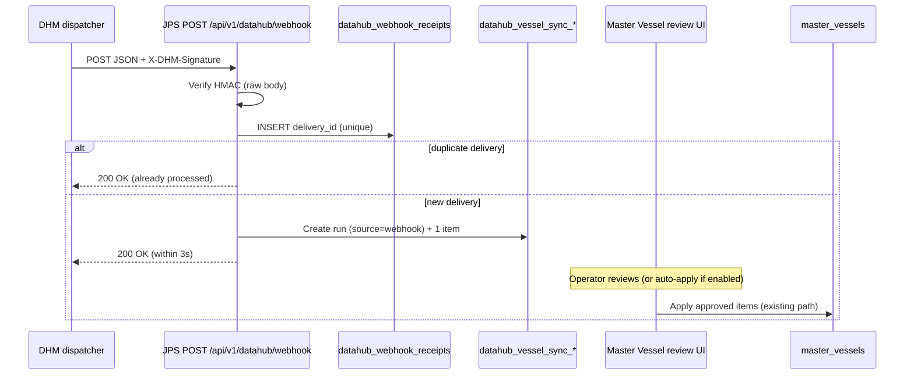

# DataHub (DHM) inbound webhooks — implementation plan

**Purpose:** enable JPS to **receive** DHM push notifications (`record.created` / `record.updated` / `record.deleted`) so vessel master data stays current without relying only on manual **Sync from DataHub** pulls.

**Audience:** JPS backend/frontend engineers, DHM System Integrator (URL registration + secret handoff).

**Related docs**

- DHM contract: [`DATAHUB_CLIENT_INTEGRATION.md`](./DATAHUB_CLIENT_INTEGRATION.md) §10 Webhooks
- Current pull sync: `Backend/src/routes/master-vessels.js`, `Backend/src/lib/datahub-vessel-sync.js`
- Master-data expansion (future entities): [`DATAHUB-MASTER-DATA-EXPANSION-REQUIREMENTS.md`](./DATAHUB-MASTER-DATA-EXPANSION-REQUIREMENTS.md)

**Status:** Plan only — not implemented.

**Deployment focus:** **Staging first** (HTTP, DHM + JPS backend co-located on **`172.28.92.57`**). **Production** (HTTPS callback) is documented later — out of scope until staging E2E passes.

---

## Contents

1. [Goals and non-goals](#1-goals-and-non-goals)
2. [How it fits today](#2-how-it-fits-today)
3. [Target architecture](#3-target-architecture)
4. [DHM contract (what we must implement)](#4-dhm-contract-what-we-must-implement)
5. [JPS endpoint and middleware](#5-jps-endpoint-and-middleware)
6. [Configuration and DHM portal setup](#6-configuration-and-dhm-portal-setup) — includes [staging on .57](#61-staging-first-http-option-d--172289257)
7. [Database changes](#7-database-changes)
8. [Processing pipeline (vessel v1)](#8-processing-pipeline-vessel-v1)
9. [Apply policy: review vs auto-apply](#9-apply-policy-review-vs-auto-apply)
10. [Deleted records (`record.deleted`)](#10-deleted-records-recorddeleted)
11. [Admin UI and operator UX](#11-admin-ui-and-operator-ux)
12. [Security and operations](#12-security-and-operations)
13. [Testing](#13-testing)
14. [Delivery phases](#14-delivery-phases)
15. [Future: more entity types](#15-future-more-entity-types)

---

## 1. Goals and non-goals

### Goals (v1)

- Accept DHM webhook POSTs at a **stable callback URL** on the JPS API (staging: **HTTP** on **`172.28.92.57`**; production later: HTTPS).
- Verify **`X-DHM-Signature`** on the **raw request body** using a stored webhook secret.
- **Dedupe** on **`X-DHM-Delivery-Id`** (and body `deliveryId`) so DHM retries do not double-stage.
- For **`entityType: vessel`**, turn each event into the **same staged sync model** already used for manual pull (`datahub_vessel_sync_runs` / `datahub_vessel_sync_items`), so **Master → Vessel → DataHub review** keeps working.
- Respond **2xx within 3 seconds**; do heavy work after the response (async queue or fast DB insert only).
- Document the **exact URL** and secret workflow for the DHM integrator.

### Non-goals (v1)

- Replacing manual full snapshot sync (keep **`POST …/sync/runs`** for bulk reconcile).
- JPS registering webhooks **to DHM via API** (registration stays in the **DHM portal**, per contract).
- Inbound webhooks for port/jetty/commodity (design should extend later; ship vessel first).
- Outbound **partner** webhooks (`integration-webhooks.js`) — unrelated; no change.

---

## 2. How it fits today

| Mechanism | Direction | Status |
| --- | --- | --- |
| `GET /v1/sync/vessel` | DHM → JPS | **Yes** — manual **Sync from DataHub** creates a staged run |
| `POST/PUT /v1/inbound/vessel` | JPS → DHM | **Yes** — after local vessel save |
| DHM webhook POST | DHM → JPS | **No** — this plan |

Today, when DHM changes a vessel, JPS only learns if someone runs a full pull. Webhooks close that gap **one record at a time**.

---

## 3. Target architecture



**Design principle:** webhooks **feed the existing review pipeline**, not a parallel write path. That preserves audit, diff display, and optional human approval.

---

## 4. DHM contract (what we must implement)

From [`DATAHUB_CLIENT_INTEGRATION.md`](./DATAHUB_CLIENT_INTEGRATION.md) §10:

| Item | Requirement |
| --- | --- |
| Method | `POST` to JPS-registered URL |
| Timeout | DHM waits **~3s** — handler must be fast |
| Signature header | `X-DHM-Signature: sha256=<hex>` — HMAC-SHA256 of **raw body bytes**, secret = webhook secret from portal |
| Event header | `X-DHM-Event`: `record.created` \| `record.updated` \| `record.deleted` |
| Dedupe header | `X-DHM-Delivery-Id` — stable on replay |
| Body (example) | `event`, `occurredAt`, `eventId`, `deliveryId`, `entityType`, `recordId`, `version`, `data`, optional `sourceApplication` |
| Deleted | `record.deleted` → treat as tombstone (`isDeleted: true` in sync semantics) |
| Failure | DHM retries with backoff (up to **8** attempts) — idempotency is mandatory |

**Note:** Partner webhooks use `timestamp.body` signing (`integration-webhooks.js`). DHM uses **raw body only** — do not reuse partner signing helpers for verification.

---

## 5. JPS endpoint and middleware

### Route

| Property | Value |
| --- | --- |
| Path | **`POST /api/v1/datahub/webhook`** |
| Auth | **None** (no session cookie). Trust **HMAC only**. |
| CSRF | **Excluded** — same as other machine-to-machine routes |
| Content-Type | `application/json` |

Mount a **dedicated raw body parser** for this path **before** `express.json()` (global JSON parser breaks signature verification):

```js
// index.js (conceptual)
app.post(
  '/api/v1/datahub/webhook',
  express.raw({ type: 'application/json', limit: '1mb' }),
  datahubWebhookHandler
);
app.use(express.json());
```

Alternatively: sub-router mounted first with `express.raw` on that route only.

### Handler steps (sync part, must finish within ~3s)

1. If `datahub_config.webhook_enabled !== true` or secret missing → **`503`** (DHM will retry; fix config) or **`404`** if you prefer to hide the endpoint when disabled — **recommend 503** with `{ "error": "DataHub webhooks disabled" }`.
2. Read `rawBody` from `req.body` (Buffer).
3. Verify `X-DHM-Signature` equals `sha256=` + HMAC-SHA256(secret, rawBody).
4. `JSON.parse` rawBody → `payload`.
5. Resolve `deliveryId` from header `X-DHM-Delivery-Id` or `payload.deliveryId`; reject if missing → **400**.
6. `INSERT INTO datahub_webhook_receipts (delivery_id, …)` — on unique violation → **200** `{ "status": "duplicate" }`.
7. If `payload.entityType !== 'vessel'` → **200** `{ "status": "ignored", "reason": "unsupported entity" }` (log for metrics; extend later).
8. Normalize record → call **`stageVesselFromHubEvent(...)`** (new lib function).
9. **200** `{ "status": "accepted", "runId": … }`.

### Async part (optional v1.1)

If staging ever exceeds 3s (unlikely for one row), split:

- Step 8 enqueues `datahub_webhook_jobs` with payload reference;
- Worker calls `stageVesselFromHubEvent`;
- HTTP still returns 200 after receipt insert + enqueue.

For v1, a single INSERT + one sync run in one transaction should be enough.

---

## 6. Configuration and DHM portal setup

### JPS stores (extend `datahub_config`)

| Column | Type | Purpose |
| --- | --- | --- |
| `webhook_secret_encrypted` | text | AES-256-GCM (reuse `smtp-config` encrypt helpers like private key) |
| `webhook_enabled` | boolean | default false |
| `webhook_auto_apply` | boolean | default false — see [§9](#9-apply-policy-review-vs-auto-apply) |
| `last_webhook_at` | timestamptz | health / admin display |
| `last_webhook_error` | text | last handler failure (not delivery failure) |

Environment fallback (optional, for dev):

- `DHM_WEBHOOK_SECRET=…` when DB secret empty (mirror `DHM_PRIVATE_KEY` pattern in `datahub-config.js`).

### Admin UI (`AdminDataHub.jsx`)

Add:

- Toggle **Enable inbound webhooks**.
- Field **Webhook secret** (write-only; show `webhookSecretConfigured`).
- Read-only **Callback URL** — staging default:  
  `http://172.28.92.57:3000/api/v1/datahub/webhook`  
  Override via env **`JPS_DATAHUB_WEBHOOK_CALLBACK_URL`** (must match DHM portal registration exactly).
- Toggle **Auto-apply webhook changes** (only when webhooks enabled).
- Display `last_webhook_at` / `last_webhook_error`.

### DHM portal (Integrator — outside JPS code)

**Staging (now):** follow [§6.1](#61-staging-first-http-option-d--172289257). **Production (later):** HTTPS callback — [Appendix A](#appendix-a--callback-urls).

1. Register the **staging** callback URL (HTTP per Option D, or `127.0.0.1` if DHM dispatcher is on the same host).
2. Copy **webhook HMAC secret** into JPS Admin (or env `DHM_WEBHOOK_SECRET` on `.57`).
3. Subscribe events: `record.created`, `record.updated`, `record.deleted` for **`vessel`**.
4. On **`.57`**, reachability is loopback/LAN — no inbound internet required. If delivery still fails, use **`GET /v1/sync`** polling as backup.

### 6.1 Staging first (HTTP, Option D + 172.28.92.57)

Staging policy: **no TLS** on the integration path (same as [INBOUND-SHIPPING-INSTRUCTION-PARTNER-API.md](./INBOUND-SHIPPING-INSTRUCTION-PARTNER-API.md): UI via **`172.28.92.56:3080`**, backend on **`.57`**).

**Topology (staging)**

| Component | Host | Port | Notes |
| --- | --- | --- | --- |
| JPS backend (Node API) | `172.28.92.57` | **3000** | Webhook handler lives here: `/api/v1/datahub/webhook` |
| JPS frontend (nginx) | `172.28.92.56` | **3080** | Proxies `/api/` → `.57:3000` for **external** partners |
| **DHM API + dispatcher** | **`172.28.92.57`** (same server as JPS backend) | (DHM port, e.g. 4100) | Co-located with JPS — dispatcher calls JPS over loopback or LAN |

Because **DHM and JPS backend share `.57`**, network reachability is not the hard part; **portal URL validation** is (DHM rejects plain `http://172.28.92.56:3080/…` under the default contract).

#### Option D (chosen for staging)

Ask the **DHM System Integrator** to allow **HTTP webhook URLs** for the JPS staging integration (non-production app slug), e.g. allowlist:

- `http://172.28.92.57:3000/api/v1/datahub/webhook` **(recommended for co-located DHM → JPS)**
- optionally also `http://172.28.92.56:3080/api/v1/datahub/webhook` if you want the callback to match the **same nginx path** external partners use (DHM on `.57` must be able to reach `.56:3080` on the LAN)

Document the agreed URL in the DHM portal and in JPS Admin (**read-only “expected callback URL”** for operators).

**Ask DHM to confirm in writing:**

1. Staging app may register **`http://172.28.92.57:3000/api/v1/datahub/webhook`** (or the `.56:3080` variant).
2. Portal validation change is **staging-only**; production will still use HTTPS (later).
3. Events: `record.created`, `record.updated`, `record.deleted` for entity **`vessel`**.

#### Fallback if Option D is delayed (no portal change yet)

DHM’s default rules already allow **`http://127.0.0.1`** / **`http://localhost`** when the **dispatcher runs on the same machine** as JPS:

```text
http://127.0.0.1:3000/api/v1/datahub/webhook
```

Use this for **lab smoke tests** on `.57` only if the DHM dispatcher process actually POSTs to localhost. It does **not** help partners or remote DHM; it is a temporary bridge until Option D is live.

Do **not** register `http://172.28.92.56:3080/…` without Option D — registration will **`400`** per [`DATAHUB_CLIENT_INTEGRATION.md`](./DATAHUB_CLIENT_INTEGRATION.md) §10.

#### Staging checklist (DHM + JPS on `.57`)

| Step | Owner | Action |
| --- | --- | --- |
| 1 | DHM Integrator | Option D: allow staging HTTP URL(s) above |
| 2 | DHM Integrator | Register callback + hand **webhook secret** to JPS admin |
| 3 | JPS ops | Paste secret in **Admin → DataHub**; enable inbound webhooks |
| 4 | JPS ops | Set `JPS_PUBLIC_API_URL` or Admin display to the **same URL** registered in DHM (avoid drift) |
| 5 | JPS dev | Implement `POST /api/v1/datahub/webhook` on port **3000** (see §5) |
| 6 | Both | Edit a vessel in DHM → receipt in `datahub_webhook_receipts` + staged sync run |
| 7 | Both | Replay same delivery in DHM portal → **200 duplicate**, no second run |

**Production:** defer until staging checklist passes — [Appendix A — Production (later)](#appendix-a--callback-urls).

---

## 7. Database changes

**New migration** (e.g. `120_datahub_webhook.sql`):

### `datahub_webhook_receipts`

Idempotency + audit.

| Column | Notes |
| --- | --- |
| `id` | bigserial |
| `delivery_id` | text **UNIQUE NOT NULL** |
| `event` | text |
| `entity_type` | text |
| `record_id` | uuid/text |
| `hub_code` | text nullable (from `data.data.code`) |
| `received_at` | timestamptz default now |
| `sync_run_id` | FK → `datahub_vessel_sync_runs.id` nullable |
| `status` | `accepted` \| `ignored` \| `failed` |
| `error` | text nullable |

### Extend `datahub_vessel_sync_runs`

| Column | Notes |
| --- | --- |
| `source` | text default `'manual'` — values: `manual`, `webhook` |
| `webhook_delivery_id` | text nullable, FK-like link to receipt |

Index: `(source, started_at DESC)` for filtering webhook runs in UI.

No change to `datahub_vessel_sync_items` schema — reuse `payload` / `field_diff` / `decision` as today.

---

## 8. Processing pipeline (vessel v1)

### New module: `Backend/src/lib/datahub-webhook.js`

Responsibilities:

| Function | Role |
| --- | --- |
| `verifyDhmWebhookSignature(secret, rawBody, signatureHeader)` | Pure; unit-tested |
| `parseDhmWebhookPayload(rawBody, headers)` | Parse + validate required fields |
| `hubRecordFromWebhookPayload(payload)` | Map body → shape for `normalizeHubVessel()` |
| `stageVesselFromHubEvent(pool, { hubRecord, event, deliveryId, actorId: null })` | Core staging |

### Map webhook body → existing normalizer

DHM webhook `data` uses the same keys as sync `record.data`. Build:

```js
const record = {
  id: payload.recordId,
  version: payload.version,
  isDeleted: payload.event === 'record.deleted',
  updatedAt: payload.occurredAt,
  data: payload.data,
};
const hubVessel = normalizeHubVessel(record); // datahub-client.js
```

If `data` is missing or thin, optional fallback (v1.1): **`GET /v1/sync/vessel/{recordId}`** using stored API credentials before staging.

### Reuse `buildSyncPlan`

```js
const localRows = await loadAllActiveMasterVessels(); // or query by hub_code / name only
const { items } = buildSyncPlan([hubVessel], localRows);
// expect 0–1 meaningful item (deleted may yield skip — see §10)
```

Extract shared **`insertStagedSyncRun(client, { items, summary, source, webhookDeliveryId, createdBy })`** from `master-vessels.js` so manual pull and webhook share one code path.

### Webhook-specific defaults for `decision`

| `diff_kind` | Default `decision` when `webhook_auto_apply = false` | When `webhook_auto_apply = true` |
| --- | --- | --- |
| `new` | `pending` | `approved` → auto-apply in same transaction after run insert |
| `changed` | `pending` | `approved` → auto-apply |
| `unchanged` | `rejected` (no row noise) | `rejected` |

Manual pull keeps today’s behaviour (pre-approve new/changed). Webhook runs use **`pending`** by default so operators see **“from DataHub webhook”** in the review queue.

### New route file

`Backend/src/routes/datahub-webhook.js` — thin HTTP layer calling `datahub-webhook.js`.

Register in `index.js` **before** JSON middleware (see §5).

---

## 9. Apply policy: review vs auto-apply

| Mode | Behaviour | When to use |
| --- | --- | --- |
| **Review (default)** | Webhook creates staged run; operator opens **Master → Vessel** sync review (filter `source=webhook`) and applies | Production until trust is established |
| **Auto-apply** | After staging, call existing `applyVesselItem` for each `approved` item inside a transaction; mark run `applied` | Staging/dev, or mature prod with DHM as sole source of truth |

Auto-apply must still write **activity log** entries (same as manual apply). Consider notifying admins when auto-apply fails (reuse notification patterns later).

**Conflict:** if JPS pushed to DHM and webhook echoes the same version, `buildSyncPlan` may classify `unchanged` — OK, dedupe receipt still stored, no noisy run (or run with 0 actionable items — prefer **no run** if all unchanged).

---

## 10. Deleted records (`record.deleted`)

Current pull sync **ignores** hub tombstones (`buildSyncPlan` skips `isDeleted`).

**v1 policy (recommended, explicit):**

- Verify webhook, record receipt, **do not soft-delete** `master_vessels` automatically.
- Create a staged item with `diff_kind: 'deleted'` (extend enum) **or** log `status: ignored` on receipt with reason `hub_tombstone_policy`.
- Show in Admin a **“Hub deleted vessel VSL-xxxx — no local delete”** banner (optional v1.1).

**Rationale:** active Shipment Plans reference `master_vessel_id`; auto-delete is risky. DHM tombstone is informational until product defines retirement rules.

If product later wants hub-driven retirements: soft-delete only when **zero active plans** reference the vessel.

---

## 11. Admin UI and operator UX

### Admin → DataHub

- Webhook secret, enable flag, auto-apply, callback URL copy button, last event time.

### Master → Vessel

- Sync run list: badge **`Webhook`** vs **`Manual`** (`source` column).
- Optional filter: “Show webhook runs only”.
- Toast or bell when new webhook run arrives (poll or SSE later — optional).

### Activity log

- New summaries: `DataHub webhook accepted vessel VSL-0123 (run #42)` / `Applied webhook sync #42`.

---

## 12. Security and operations

| Topic | Guidance |
| --- | --- |
| Secret storage | Encrypted at rest; never returned on GET; rotate via Admin |
| Rate limiting | Optional: per-IP limit on `/datahub/webhook` to reduce abuse if URL leaks |
| `TRUST_PROXY` | Must be correct behind nginx/load balancer for optional IP logging |
| Public URL | Document staging vs prod URLs for DHM registration |
| Logging | Log `deliveryId`, `entityType`, `event`, `hub_code` — **not** full secret or private key |
| Health | Extend Admin DataHub panel: webhooks enabled + last success time |
| Disabled integration | If `datahub_config.enabled = false`, webhooks should still work if `webhook_enabled` (credentials needed for fallback fetch) — or require both enabled; **recommend:** webhooks require `enabled` + valid API keys + webhook secret |

---

## 13. Testing

### Unit tests (`npm run test:datahub` or new `test:datahub-webhook`)

- Signature verification: valid / invalid / wrong prefix / tampered body.
- Dedupe: same `deliveryId` twice → second returns duplicate, no second run.
- `hubRecordFromWebhookPayload` for created/updated/deleted.
- Staging: webhook update changes one field → `diff_kind: changed`, correct `field_diff`.

### Integration tests (mock fetch)

- POST webhook with mock secret → staged run row exists.
- Auto-apply path updates `master_vessels`.

### Manual / staging on `.57`

1. DHM integrator: Option D URL + secret (see §6.1).
2. From `.57`: `curl -sS http://127.0.0.1:3000/api/v1/health` (JPS up).
3. Optional: simulate webhook with correct HMAC before DHM is wired.
4. Change vessel in DHM → JPS receipt + staged run.
5. DHM replay → 200 duplicate.

---

## 14. Delivery phases

| Phase | Scope | Exit criteria |
| --- | --- | --- |
| **P0 — Foundation** | Migration, `datahub-webhook.js` verify + receipts, route with raw body, Admin secret + enable + callback URL | Invalid signature → 401; valid POST → receipt row; duplicate delivery → 200 duplicate |
| **P1 — Vessel staging** | `stageVesselFromHubEvent`, refactor shared insert from manual sync, `source=webhook`, review UI badge | Webhook update appears in sync review; manual apply still works |
| **P2 — Auto-apply (optional flag)** | `webhook_auto_apply` + transactional apply | Staging env: hub change lands in `master_vessels` without manual click |
| **P3 — Staging E2E with DHM on `.57`** | Option D registered; live vessel change → staged run | Checklist §6.1 complete |
| **P4 — Ops polish** | Activity log, runbook | Integrator self-serve |
| **P5 — Hardening** | `GET /v1/sync/vessel/{id}` fallback; metrics | Thin payloads OK |
| **P6 — Production (later)** | HTTPS callback URL + firewall | Separate go-live |

Estimated engineering (order of magnitude): **P0+P1 ≈ 3–5 dev days** with tests; **P3 staging E2E** depends on DHM Option D lead time.

---

## 15. Future: more entity types

When port/jetty/commodity sync exists:

- Same **`POST /api/v1/datahub/webhook`** entrypoint.
- Branch on `entityType` → `stagePortFromHubEvent`, etc.
- Separate staging tables **or** generic `datahub_sync_runs` with `entity_type` ( refactor when second entity ships).

Until then, return **200 ignored** for non-vessel types so DHM does not retry forever.

---

## Appendix A — Callback URLs

### Staging (current — HTTP, Option D, DHM + JPS on 172.28.92.57)

| Priority | Register in DHM portal | When to use |
| --- | --- | --- |
| **1 (recommended)** | `http://172.28.92.57:3000/api/v1/datahub/webhook` | DHM dispatcher on `.57` calls JPS backend directly; matches co-location |
| **2 (optional)** | `http://172.28.92.56:3080/api/v1/datahub/webhook` | Same path as partner API via nginx; requires DHM on `.57` → `.56:3080` LAN access + Option D |
| **3 (interim lab only)** | `http://127.0.0.1:3000/api/v1/datahub/webhook` | No Option D needed **if** DHM allows localhost and dispatcher uses loopback; not for long-term staging URL |

Requires **Option D** for rows 1–2 (HTTP on LAN IP / `:3080`). TLS not used on staging by policy.

### Production (later)

| Environment | Callback URL |
| --- | --- |
| Production | `https://<prod-api-host>/api/v1/datahub/webhook` |

Register only after staging E2E passes. Use HTTPS per DHM default rules; document prod host when known.

## Appendix B — Checklist for DHM workshop (staging first)

- [ ] **Option D:** approve HTTP webhook URL for JPS **staging** app (`http://172.28.92.57:3000/api/v1/datahub/webhook` or agreed variant).
- [ ] Confirm DHM **dispatcher on `.57`** will POST to that URL (loopback or LAN).
- [ ] Hand off **webhook HMAC secret** to JPS Admin on staging.
- [ ] Confirm webhook body `data` for `vessel` includes full fields (or we use GET by `recordId`).
- [ ] Confirm `X-DHM-Signature` = HMAC-SHA256 on raw body, prefix `sha256=`.
- [ ] Agree JPS policy on `record.deleted` (no auto local delete in v1).
- [ ] Complete one end-to-end vessel update on staging before any prod registration.
- [ ] **Production HTTPS URL** — discuss later; not blocking staging.
