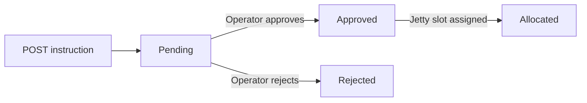

# Jetty Planning System — Shipping Instruction API Integration Guide

> **Audience:** External developers integrating their system (ERP, TMS, agency software) with the Jetty Planning System (JPS).
> **What you can do:** Submit Shipping Instructions automatically and check their review status — no more manual re-entry by jetty operators.
> **Testing this API:** See [INBOUND-SHIPPING-INSTRUCTION-API-TEST-GUIDE.md](./INBOUND-SHIPPING-INSTRUCTION-API-TEST-GUIDE.md) for a step-by-step local test walkthrough (curl, Postman, operator lifecycle).

---

## 1. Overview & Base URL

### How it works

1. Your system **submits** a Shipping Instruction via `POST`.
2. The instruction lands in JPS with status **`Pending`**.
3. A JPS operator **reviews** it and either **Approves** or **Rejects** it.
4. Once approved, the operator **allocates** a jetty/berth slot → status becomes **`Allocated`**.
5. Your system **polls** the `GET` endpoint to track this lifecycle.



### Base URL

| Environment | Base URL |
|-------------|----------|
| Staging (test) | `https://staging.jps.example.com/api/v1/integrations` |
| Production | `https://jps.example.com/api/v1/integrations` |

> Replace `jps.example.com` with the domain provided during onboarding.

### Basics

- **Protocol:** HTTPS only. Plain HTTP requests are rejected.
- **Content type:** `application/json` (request and response).
- **Encoding:** UTF-8.
- **Dates:** `YYYY-MM-DD` (date) and ISO 8601 UTC `YYYY-MM-DDTHH:mm:ssZ` (datetime).
- **Rate limit:** 120 requests per minute per API key. Exceeding it returns HTTP `429`.

---

## 2. Authentication Guide

Authentication uses a single API key passed in the `x-api-key` request header. That's it — no OAuth, no token refresh, no request signing.

During onboarding you will receive:

| Item | Example | Notes |
|------|---------|-------|
| API key | `jps_live_4f8a2b...` | Keep it secret. Server-side only. Identifies **which system** submitted the request (e.g. `EOS-EXPORT`, `KLIPS`). |
| Allowed `port_id`(s) | `3` | Your key only works for the port(s) assigned to you. |

**Source identification:** JPS records three layers on every submission:

| Layer | How it's captured | Example |
|-------|-------------------|---------|
| Source system | API key (`partner_name` on our side) | `EOS-EXPORT`, `EOS-IMPORT`, `KLIPS` |
| Source document | `external_reference` in the payload | `EOS-EXPORT-2026-091` |
| Requestor | `requested_by` in the payload (optional) | `budi.santoso@kpn.com` |

Provision one API key per integrating system. Use `external_reference` for your document/order number — no separate document field is needed.

### Example: curl

```bash
curl -X GET "https://jps.example.com/api/v1/integrations/shipping-instructions/1289" \
  -H "x-api-key: jps_live_4f8a2b1c9d0e..."
```

### Example: JavaScript (fetch)

```javascript
const response = await fetch(
  "https://jps.example.com/api/v1/integrations/shipping-instructions/1289",
  {
    headers: { "x-api-key": process.env.JPS_API_KEY },
  }
);
const result = await response.json();
```

### Example: Python (requests)

```python
import os
import requests

response = requests.get(
    "https://jps.example.com/api/v1/integrations/shipping-instructions/1289",
    headers={"x-api-key": os.environ["JPS_API_KEY"]},
)
result = response.json()
```

### Key handling rules

- Send the key on **every** request. A missing or invalid key returns HTTP `401`.
- Store the key in environment variables or a secrets manager — never in source code, mobile apps, or browser JavaScript.
- Keys can be rotated on request: we issue a new key, both keys work during a short grace period, then the old key is revoked.
- If you suspect a key is leaked, contact the JPS team immediately to revoke it.

---

## 3. Endpoints

| Method | Path | Purpose |
|--------|------|---------|
| `POST` | `/shipping-instructions` | Submit a new Shipping Instruction |
| `GET` | `/shipping-instructions/{id}` | Check the status of a submitted instruction |

All paths are relative to the base URL, e.g. the full submit URL is:
`https://jps.example.com/api/v1/integrations/shipping-instructions`

---

### 3.1 `POST /shipping-instructions` — Submit instruction

Submits a Shipping Instruction for operator review. On success, JPS returns an `id` — **store it**, you will use it to check status.

#### Request

```bash
curl -X POST "https://jps.example.com/api/v1/integrations/shipping-instructions" \
  -H "x-api-key: jps_live_4f8a2b1c9d0e..." \
  -H "Content-Type: application/json" \
  -d '{
    "external_reference": "EOS-EXPORT-2026-091",
    "requested_by": "budi.santoso@kpn.com",
    "port_id": 3,
    "vessel_name": "MV NUSANTARA",
    "voyage_no": "VY-8891",
    "purpose": "Loading",
    "eta": "2026-06-20T08:00:00Z",
    "etd": "2026-06-22T18:00:00Z",
    "agent_name": "PT Samudera Agency",
    "agent_contact": "ops@samudera-agency.example.com",
    "notes": "Auto-submitted from ERP",
    "cargo": [
      {
        "cargo_type": "CPO",
        "description": "Crude Palm Oil - main lot",
        "tonnage": 25000,
        "unit": "MT",
        "contract_no": "CTR-7788"
      },
      {
        "cargo_type": "PKO",
        "description": "Palm Kernel Oil",
        "tonnage": 5000,
        "unit": "MT",
        "contract_no": "CTR-7790"
      }
    ]
  }'
```

#### Success response — `201 Created`

```json
{
  "success": true,
  "data": {
    "id": 1289,
    "external_reference": "EOS-EXPORT-2026-091",
    "requested_by": "budi.santoso@kpn.com",
    "status": "Pending",
    "vessel_name": "MV NUSANTARA",
    "port_id": 3,
    "received_at": "2026-06-12T07:15:32Z"
  }
}
```

#### Idempotency

`external_reference` is your own unique identifier for the instruction (e.g. your ERP document number). It must be **unique per API key**.

- Submitting the **same** `external_reference` twice returns HTTP `409 DUPLICATE_REFERENCE` — the original submission is untouched.
- This makes retries safe: if you get a timeout or `5xx` and don't know whether the submission succeeded, simply retry. You will get either `201` (it hadn't arrived) or `409` (it had — recover the `id` via `GET /shipping-instructions?external_reference=...`, see below).

---

### 3.2 `GET /shipping-instructions/{id}` — Check status

Returns the current status of a submitted instruction. Use the `id` returned by the `POST` call.

#### Request

```bash
curl -X GET "https://jps.example.com/api/v1/integrations/shipping-instructions/1289" \
  -H "x-api-key: jps_live_4f8a2b1c9d0e..."
```

#### Success response — `200 OK`

```json
{
  "success": true,
  "data": {
    "id": 1289,
    "external_reference": "EOS-EXPORT-2026-091",
    "requested_by": "budi.santoso@kpn.com",
    "status": "Allocated",
    "vessel_name": "MV NUSANTARA",
    "voyage_no": "VY-8891",
    "purpose": "Loading",
    "eta": "2026-06-20T08:00:00Z",
    "etd": "2026-06-22T18:00:00Z",
    "port_id": 3,
    "allocation": {
      "jetty_name": "Jetty 2",
      "planned_berthing_time": "2026-06-20T10:00:00Z"
    },
    "rejection_reason": null,
    "submitted_at": "2026-06-12T07:15:32Z",
    "last_updated_at": "2026-06-13T02:40:11Z"
  }
}
```

Notes:

- `allocation` is `null` until the status reaches `Allocated`.
- `rejection_reason` is populated only when the status is `Rejected`.

#### Lookup by your own reference

If you lost the JPS `id` (e.g. after a timed-out submit), you can look it up by your reference:

```bash
curl -X GET "https://jps.example.com/api/v1/integrations/shipping-instructions?external_reference=SI-ERP-20260612-0001" \
  -H "x-api-key: jps_live_4f8a2b1c9d0e..."
```

Returns the same response shape as `GET /{id}` (HTTP `404` if no match).

#### Polling guidance

- Poll **at most once every 5 minutes** per instruction. Operator review is a human process — status changes take minutes to hours, not seconds.
- Stop polling once the status reaches a terminal state for your workflow (`Rejected`, or `Allocated` if that's all you need).

---

## 4. Request & Response Payloads

### 4.1 Submission fields (`POST` body)

| Field | Type | Required | Description |
|-------|------|----------|-------------|
| `external_reference` | string (max 100) | Yes | Your unique document/order ID in the source system. Used for idempotency and source tracing (e.g. `EOS-EXPORT-2026-091`). |
| `requested_by` | string (max 200) | No | Person or service account in your system who triggered the submission (e.g. email, username, or service id). Shown to JPS operators. |
| `port_id` | integer | Yes | JPS port ID. Must be one of your allowed ports (given at onboarding). |
| `vessel_name` | string (max 200) | Yes | Vessel name, e.g. `"MV NUSANTARA"`. |
| `voyage_no` | string (max 50) | No | Voyage number. |
| `purpose` | string | Yes | `"Loading"` or `"Unloading"`. |
| `eta` | datetime (ISO 8601 UTC) | Yes | Estimated time of arrival. |
| `etd` | datetime (ISO 8601 UTC) | No | Estimated time of departure. Must be after `eta` when provided. |
| `agent_name` | string (max 200) | Yes | Shipping agent / sender company name. |
| `agent_contact` | string (max 200) | No | Agent email or phone for operator follow-up. |
| `notes` | string (max 2000) | No | Free-text remarks for the operator. |
| `cargo` | array | Yes | At least one cargo line (see below). |

**Cargo line fields** (`cargo[]`):

| Field | Type | Required | Description |
|-------|------|----------|-------------|
| `cargo_type` | string (max 100) | Yes | Cargo/commodity name, e.g. `"CPO"`, `"PKO"`, `"Olein"`. |
| `description` | string (max 500) | No | Extra detail about the lot. |
| `tonnage` | number ≥ 0 | Yes | Quantity in the given unit. |
| `unit` | string | Yes | `"MT"` (metric tons) or `"KL"` (kiloliters). |
| `contract_no` | string (max 100) | No | Your contract / PO reference for this line. |

### 4.2 Instruction status values

| Status | Meaning | What to do |
|--------|---------|------------|
| `Pending` | Received, waiting for operator review. | Keep polling. |
| `Approved` | Operator accepted the instruction. Awaiting jetty allocation. | Keep polling if you need the berth slot. |
| `Rejected` | Operator declined it. See `rejection_reason`. | Fix and submit a **new** instruction with a **new** `external_reference`. |
| `Allocated` | A jetty/berth slot has been assigned. See `allocation`. | Done — vessel is scheduled. |

### 4.3 Response envelope

Every response uses the same envelope.

**Success:**

```json
{
  "success": true,
  "data": { "...": "..." }
}
```

**Error:**

```json
{
  "success": false,
  "error": {
    "code": "VALIDATION_ERROR",
    "message": "Field 'eta' is required",
    "details": [
      { "field": "eta", "issue": "required" },
      { "field": "cargo[0].unit", "issue": "must be one of: MT, KL" }
    ]
  },
  "request_id": "req_01HXYZABC123"
}
```

> Always log `request_id` — include it when contacting JPS support so we can trace the exact request.

### 4.4 Error examples

**Invalid API key — `401`:**

```json
{
  "success": false,
  "error": {
    "code": "INVALID_API_KEY",
    "message": "API key is missing or invalid",
    "details": null
  },
  "request_id": "req_01HXYZABC124"
}
```

**Duplicate submission — `409`:**

```json
{
  "success": false,
  "error": {
    "code": "DUPLICATE_REFERENCE",
    "message": "An instruction with external_reference 'SI-ERP-20260612-0001' already exists",
    "details": { "existing_id": 1289, "status": "Pending" }
  },
  "request_id": "req_01HXYZABC125"
}
```

**Unknown instruction — `404`:**

```json
{
  "success": false,
  "error": {
    "code": "NOT_FOUND",
    "message": "Shipping instruction 9999 not found",
    "details": null
  },
  "request_id": "req_01HXYZABC126"
}
```

---

## 5. Status Codes & Error Handling

### HTTP status codes

| HTTP | Error code | When | Retry? |
|------|------------|------|--------|
| `201` | — | Instruction created. | — |
| `200` | — | Status retrieved. | — |
| `400` | `VALIDATION_ERROR` | Payload failed validation. See `error.details`. | No — fix the payload first. |
| `401` | `INVALID_API_KEY` | Missing/invalid `x-api-key` header. | No — fix the key first. |
| `403` | `FORBIDDEN_PORT` | `port_id` not allowed for your API key. | No — check your allowed ports. |
| `404` | `NOT_FOUND` | Instruction `id` / `external_reference` unknown (or not yours). | No. |
| `409` | `DUPLICATE_REFERENCE` | `external_reference` already submitted. | No — it already exists. |
| `429` | `RATE_LIMITED` | Over 120 requests/minute. | Yes — wait and retry (see `Retry-After` header). |
| `500` | `INTERNAL_ERROR` | Unexpected JPS error. | Yes — retry with backoff. |

### Retry policy (recommended)

- **Retry** only on `429` and `5xx`, with exponential backoff (e.g. 5s, 30s, 2min, max 5 attempts).
- **Never retry** `4xx` errors without correcting the request — the result will not change.
- Retries of `POST` are safe thanks to `external_reference` idempotency (worst case you get a `409`, which means the original submission succeeded).

---

## 6. Quick-start checklist

- [ ] Receive your API key, allowed `port_id`(s), and staging base URL from the JPS team
- [ ] Store the key in an environment variable / secrets manager
- [ ] Submit a test instruction on **staging** and confirm you get `201` with an `id`
- [ ] Poll `GET /shipping-instructions/{id}` and confirm `status: "Pending"`
- [ ] Ask the JPS team to approve/reject/allocate the test instruction and verify each status appears
- [ ] Test error paths: missing key (`401`), bad payload (`400`), duplicate `external_reference` (`409`)
- [ ] Implement retry with backoff for `429`/`5xx` only
- [ ] Agree on a support contact channel and go live on production

---

## 7. Versioning & document history

| Version | Date | Changes |
|---------|------|---------|
| 2.1 | 2026-06-12 | Added optional `requested_by` field; clarified source identification (API key = system, `external_reference` = document). |
| 2.0 | 2026-06-12 | Rewritten for simple `x-api-key` authentication; flat payload; external status lifecycle (`Pending` / `Approved` / `Rejected` / `Allocated`); replaces the previous HMAC-signature design. |
| 1.0 | 2026-04-23 | Initial draft (HMAC-SHA256 request signing). |

Owner: JPS Backend/API Team
