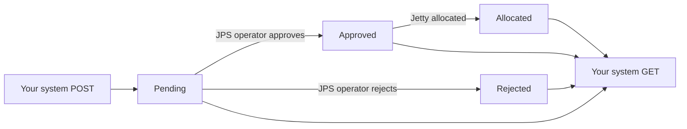

# Jetty Planning System — Shipping Instruction API Integration Guide

> **Audience:** External full-stack developers building an integration from your system (EOS Export/Import, KLIPS, ERP, TMS, etc.) into the Jetty Planning System (JPS).
>
> **What you can do:** Submit Shipping Instructions automatically and poll their review status. JPS operators review, approve, and allocate jetty resources in the web app — your system does not need to implement that workflow.
>
> **This document is self-contained:** API contract, staging environment details, and step-by-step tests you can run yourself.

---

## 1. Overview

### 1.1 How it works

1. Your system **submits** a Shipping Instruction via `POST`.
2. JPS creates a real **Shipment Plan** + **Shipping Instruction** with partner status **`Pending`**.
3. A JPS operator **reviews** in the web app and **Approves** or **Rejects**.
4. Once approved, an operator **allocates** a jetty/berth → status becomes **`Allocated`**.
5. Your system **polls** `GET` to track the lifecycle.



### 1.2 Source identification

JPS records three layers on every submission:

| Layer | How it is captured | Example |
|-------|-------------------|---------|
| Source system | API key (assigned per integrating system) | `EOS-EXPORT`, `EOS-IMPORT`, `KLIPS` |
| Source document | `external_reference` in your payload | `EOS-EXPORT-2026-091` |
| Requestor | `requested_by` in your payload (optional) | `budi.santoso@kpn.com` |

Provision **one API key per integrating system**. Use `external_reference` for your document/order number — no separate document field is needed.

### 1.3 Environments

| Environment | Integration base URL | Web app (operator UI) | Notes |
|-------------|---------------------|----------------------|-------|
| **Staging** | `http://172.28.92.56:3080/api/v1/integrations` | `http://172.28.92.56:3080` | Use for development and UAT |
| Production | `https://<production-host>/api/v1/integrations` | `https://<production-host>` | Provided at go-live |

**Staging server layout:**

| Server | IP | Role |
|--------|-----|------|
| Frontend | `172.28.92.56` | Nginx + React UI (port **3080**); proxies `/api/` to backend |
| Backend | `172.28.92.57` | Node API (port **3000**, private network) |
| Database | `172.28.92.60` | PostgreSQL (private network) |

**Call the API through the frontend proxy** (`172.28.92.56:3080`) — that is the URL external integrators should use. Direct backend access (`172.28.92.57:3000`) is only available from inside the private network.

**Network access:** Your workstation or integration server must reach `172.28.92.56:3080` (VPN, bastion, or corporate network). Confirm connectivity before coding:

```bash
curl -sS http://172.28.92.56:3080/api/v1/health
```

Expected: `{"status":"ok","timestamp":"..."}`

### 1.4 Basics

- **Protocol:** HTTP on staging (HTTPS on production when TLS is configured).
- **Content type:** `application/json` (request and response).
- **Encoding:** UTF-8.
- **Dates:** ISO 8601 UTC, e.g. `2026-07-01T08:00:00Z`.
- **Rate limit:** 120 requests per minute per API key → HTTP `429` if exceeded.

---

## 2. Authentication

Authentication uses a single API key in the `x-api-key` header. No OAuth, no token refresh, no request signing.

### 2.1 What you receive at onboarding

| Item | Example | Notes |
|------|---------|-------|
| API key | `jps_live_a73fc30d...` | **Server-side only.** Never commit to git or expose in browser code. |
| Partner name | `EOS-EXPORT` | Identifies your system on the JPS side (not sent in requests). |
| Port access | any | Keys are not port-scoped. You pass a valid `port_id` on each request. Staging uses port **`1`** (BONTANG). |

**Request your staging API key** from the JPS team. They create it with:

```bash
# (JPS admin only — run on backend server)
docker compose --env-file Backend/.env -f docker-compose.backend.yml exec -T jps-api \
  node scripts/create-integration-api-key.mjs --partner "YOUR-SYSTEM-NAME"
```

The plaintext key is shown **once**. Store it in your secrets manager or `.env` file immediately.

### 2.2 Header

Every request must include:

```
x-api-key: jps_live_<your-key>
Content-Type: application/json   # required on POST
```

### 2.3 Code examples

**curl:**

```bash
curl -sS "http://172.28.92.56:3080/api/v1/integrations/shipping-instructions/10" \
  -H "x-api-key: $JPS_API_KEY"
```

**JavaScript (Node / server-side fetch):**

```javascript
const BASE = process.env.JPS_API_BASE_URL; // http://172.28.92.56:3080/api/v1/integrations
const KEY  = process.env.JPS_API_KEY;

const res = await fetch(`${BASE}/shipping-instructions/10`, {
  headers: { "x-api-key": KEY },
});
const result = await res.json();
```

**Python:**

```python
import os, requests

BASE = os.environ["JPS_API_BASE_URL"]
KEY  = os.environ["JPS_API_KEY"]

r = requests.get(
    f"{BASE}/shipping-instructions/10",
    headers={"x-api-key": KEY},
    timeout=30,
)
result = r.json()
```

### 2.4 Key handling rules

- Send the key on **every** request. Missing/invalid key → HTTP `401`.
- Store in environment variables or a secrets manager — not in frontend bundles.
- Contact JPS to rotate or revoke a compromised key.
- Each partner can only read submissions made with **their own** API key.

---

## 3. Endpoints

| Method | Path | Purpose |
|--------|------|---------|
| `POST` | `/shipping-instructions` | Submit a new Shipping Instruction |
| `GET` | `/shipping-instructions/{id}` | Check status by JPS id (returned from POST) |
| `GET` | `/shipping-instructions?external_reference={ref}` | Check status by your own reference |

Full staging submit URL:

```
http://172.28.92.56:3080/api/v1/integrations/shipping-instructions
```

---

### 3.1 `POST /shipping-instructions` — Submit

Creates a Shipment Plan (`Submitted`) + linked Shipping Instruction + cargo breakdown. Returns JPS id and status `Pending`.

**Request example (staging-valid payload):**

```bash
curl -sS -X POST "http://172.28.92.56:3080/api/v1/integrations/shipping-instructions" \
  -H "x-api-key: $JPS_API_KEY" \
  -H "Content-Type: application/json" \
  -d '{
    "external_reference": "EOS-EXPORT-2026-091",
    "requested_by": "developer@your-company.com",
    "port_id": 1,
    "vessel_name": "MV NUSANTARA",
    "voyage_no": "VY-8891",
    "purpose": "Loading",
    "eta": "2026-07-01T08:00:00Z",
    "etd": "2026-07-03T18:00:00Z",
    "agent_name": "PT Samudera Agency",
    "agent_contact": "ops@agency.example.com",
    "notes": "Submitted from EOS Export",
    "cargo": [
      {
        "cargo_type": "CPO",
        "description": "Main lot",
        "tonnage": 25000,
        "unit": "MT",
        "contract_no": "CTR-7788"
      }
    ]
  }'
```

**Success — `201 Created`:**

```json
{
  "success": true,
  "data": {
    "id": 10,
    "external_reference": "EOS-EXPORT-2026-091",
    "requested_by": "developer@your-company.com",
    "status": "Pending",
    "vessel_name": "MV NUSANTARA",
    "port_id": 1,
    "received_at": "2026-06-15T06:53:59.935Z"
  }
}
```

**Store `data.id`** — you need it for status polling. Also store `external_reference` in your system.

#### Idempotency

`external_reference` must be **unique per API key**.

- Resubmitting the same reference → HTTP `409 DUPLICATE_REFERENCE` (original untouched).
- Safe to retry on timeout/`5xx`: you get either `201` (new) or `409` (already exists — then `GET ?external_reference=` to recover the id).

---

### 3.2 `GET /shipping-instructions/{id}` — Check status

```bash
curl -sS "http://172.28.92.56:3080/api/v1/integrations/shipping-instructions/10" \
  -H "x-api-key: $JPS_API_KEY"
```

**Success — `200 OK` (allocated example):**

```json
{
  "success": true,
  "data": {
    "id": 10,
    "external_reference": "EOS-EXPORT-2026-091",
    "requested_by": "developer@your-company.com",
    "status": "Allocated",
    "vessel_name": "MV NUSANTARA",
    "voyage_no": "VY-8891",
    "purpose": "Loading",
    "eta": "2026-07-01T08:00:00.000Z",
    "etd": "2026-07-03T18:00:00Z",
    "port_id": 1,
    "allocation": {
      "jetty_name": "Jetty 1A",
      "planned_berthing_time": "2026-07-01T10:00:00.000Z"
    },
    "rejection_reason": null,
    "submitted_at": "2026-06-15T06:53:59.935Z",
    "last_updated_at": "2026-06-16T02:40:11.000Z"
  }
}
```

- `allocation` is `null` until status is `Allocated`.
- `rejection_reason` is set only when status is `Rejected`.

#### Lookup by your reference

```bash
curl -sS "http://172.28.92.56:3080/api/v1/integrations/shipping-instructions?external_reference=EOS-EXPORT-2026-091" \
  -H "x-api-key: $JPS_API_KEY"
```

Same response shape as `GET /{id}`. HTTP `404` if not found or not yours.

#### Polling guidance

- Poll **at most once every 5 minutes** per instruction.
- Stop when status is `Rejected`, or `Allocated` if that completes your workflow.

---

## 4. Request & response reference

### 4.1 Submission fields (`POST` body)

| Field | Type | Required | Description |
|-------|------|----------|-------------|
| `external_reference` | string (max 100) | Yes | Your unique document/order ID. Idempotency key. |
| `requested_by` | string (max 200) | No | Person or service account in your system. Shown to JPS operators. If omitted, JPS stores the API partner name. |
| `port_id` | integer | Yes | JPS port ID. Staging: **`1`** (BONTANG). Must be a valid JPS port; an unknown `port_id` returns `400`. |
| `vessel_name` | string (max 200) | Yes | Vessel name. |
| `voyage_no` | string (max 50) | No | Voyage number. |
| `purpose` | string | Yes | `"Loading"` or `"Unloading"`. |
| `eta` | datetime (ISO 8601 UTC) | Yes | Estimated time of arrival. |
| `etd` | datetime (ISO 8601 UTC) | No | Estimated departure. Must be after `eta` when provided. |
| `agent_name` | string (max 200) | Yes | Shipping agent / sender company. |
| `agent_contact` | string (max 200) | No | Agent email or phone. |
| `notes` | string (max 2000) | No | Free-text remarks for operators. |
| `cargo` | array | Yes | At least one cargo line (see below). |

**Cargo line fields** (`cargo[]`):

| Field | Type | Required | Description |
|-------|------|----------|-------------|
| `cargo_type` | string (max 100) | Yes | Must match a **JPS commodity short name** (case-insensitive). See §5.1. |
| `description` | string (max 500) | No | Extra detail about the lot. |
| `tonnage` | number ≥ 0 | Yes | Quantity. |
| `unit` | string | Yes | `"MT"` or `"KL"` only. |
| `contract_no` | string (max 100) | No | Your contract / PO reference. |

All cargo lines on one instruction must be the same commodity type category (Solid or Liquid).

### 4.2 Partner status values

| Status | Meaning | Your action |
|--------|---------|-------------|
| `Pending` | Received, awaiting operator review. | Keep polling. |
| `Approved` | Operator accepted. Awaiting jetty allocation. | Keep polling if you need berth info. |
| `Rejected` | Operator declined. See `rejection_reason`. | Fix data; submit **new** instruction with **new** `external_reference`. |
| `Allocated` | Jetty/berth assigned. See `allocation`. | Done for scheduling workflow. |

### 4.3 Response envelope

**Success:**

```json
{ "success": true, "data": { } }
```

**Error:**

```json
{
  "success": false,
  "error": {
    "code": "VALIDATION_ERROR",
    "message": "Payload validation failed",
    "details": [
      { "field": "cargo[0].cargo_type", "issue": "unknown cargo type(s): FAKE_CARGO", "valid_cargo_types": ["CPO", "POME", "..."] }
    ]
  },
  "request_id": "req_01HXYZABC123"
}
```

Always log `request_id` when reporting issues to JPS support.

### 4.4 HTTP status codes

| HTTP | Error code | When | Retry? |
|------|------------|------|--------|
| `201` | — | Created | — |
| `200` | — | Status retrieved | — |
| `400` | `VALIDATION_ERROR` | Bad payload | No — fix payload |
| `401` | `INVALID_API_KEY` | Missing/wrong key | No |
| `404` | `NOT_FOUND` | Unknown id/reference | No |
| `409` | `DUPLICATE_REFERENCE` | `external_reference` already used | No — use GET to recover |
| `429` | `RATE_LIMITED` | Rate limit exceeded | Yes — backoff |
| `500` | `INTERNAL_ERROR` | Server error | Yes — backoff |

**Retry policy:** Retry only `429` and `5xx` with exponential backoff. `POST` retries are safe (idempotent via `external_reference`).

---

## 5. Staging master data

### 5.1 Valid `cargo_type` values — commodity mapping

`cargo_type` must match the **short name** (`short_name`) of a commodity in JPS master data — not the full display name. Matching is case-insensitive (e.g. `cpo` and `CPO` both work).

**Send the value in the `JPS short_name` column** in your `cargo_type` field:

| JPS short_name (`cargo_type`) | JPS display name | Type |
|-------------------------------|------------------|------|
| `CG` | CRUDE GLYCERINE | Liquid |
| `CPKO` | CRUDE PALM KERNEL OIL | Liquid |
| `CPO` | CRUDE PALM OIL | Liquid |
| `FAME` | Fatty Acid Methyl Ester | Liquid |
| `INS POME FAD` | INS PALM OIL MILL EFFLUENT FATTY ACID DISTILLATE | Liquid |
| `INS RPOME` | INS REFINED PALM OIL MILL EFFLUENT | Liquid |
| `ISCC POMEPFAD` | ISCC PALM OIL MILL EFFLUENT FATTY ACID DISTILLATE (POMEPFAD) | Liquid |
| `ISCC RPOME` | ISCC REFINED PALM OIL MILL EFFLUENT | Liquid |
| `METHANOL` | METHANOL | Liquid |
| `PFAD` | Palm Fatty Acid Distillate | Liquid |
| `PKE` | Palm Kernel Expeller | Solid |
| `PKM` | Palm Kernel Meal | Solid |
| `PKS` | Palm Kernel Shell | Solid |
| `POME` | Palm Oil Mill Effluent | Liquid |
| `RBD PO` | RBD PO | Liquid |
| `RG` | REFINED GLYCERINE | Liquid |
| `ROL` | Refined Olein | Liquid |
| `RPOME` | REFINED PALM OIL MILL EFFLUENT | Liquid |
| `SPLIT CPKO FA` | SPLIT CRUDE PALM KERNEL OIL FATTY ACID | Liquid |
| `SPLIT RBD PKO FA` | SPLIT RBD PALM KERNEL OIL FATTY ACID | Liquid |

*List as of JPS master data export (20 commodities). JPS operators may add or update commodities over time.*

If you send an unknown `cargo_type`, the API returns `400` with `valid_cargo_types` in `error.details` — that list contains the current short codes for your environment. Use it to fix your payload.

**Do not send full commodity names** (e.g. `CRUDE PALM OIL`) — they are rejected.

### 5.2 Staging port

| `port_id` | Name |
|-----------|------|
| `1` | BONTANG |

Pass `port_id` **1** in your payload for staging tests. Keys are not port-scoped, but `port_id` must be a valid JPS port.

### 5.3 Map your system's commodity codes to JPS

Send your commodity code in `cargo_type` when it matches the JPS short name. When your internal code differs, map it in your integration layer:

| Your system code (example) | JPS `cargo_type` | JPS display name |
|----------------------------|------------------|------------------|
| `CPO` | `CPO` | CRUDE PALM OIL |
| `PKO` | `CPKO` | CRUDE PALM KERNEL OIL |
| `POME` | `POME` | Palm Oil Mill Effluent |
| `PKE` | `PKE` | Palm Kernel Expeller |
| `PKS` | `PKS` | Palm Kernel Shell |
| `PKM` | `PKM` | Palm Kernel Meal |
| `PFAD` | `PFAD` | Palm Fatty Acid Distillate |
| `FAME` | `FAME` | Fatty Acid Methyl Ester |
| `RBDPO` / `RBD PO` | `RBD PO` | RBD PO |
| `ROL` | `ROL` | Refined Olein |
| `METHANOL` | `METHANOL` | METHANOL |

Example integration mapping:

```javascript
const JPS_COMMODITY_MAP = {
  CPO: "CPO",
  PKO: "CPKO",           // your PKO → JPS short_name CPKO
  POME: "POME",
  PKE: "PKE",
  PKS: "PKS",
  PFAD: "PFAD",
  // add entries for products you ship; see §5.1 for full list
};

function mapCargoType(yourCode) {
  const jpsCode = JPS_COMMODITY_MAP[yourCode.toUpperCase()];
  if (!jpsCode) throw new Error(`No JPS mapping for commodity: ${yourCode}`);
  return jpsCode;
}

const payload = {
  cargo: [{ cargo_type: mapCargoType(order.commodityCode), tonnage: 25000, unit: "MT" }],
};
```

Confirm any ambiguous mappings (e.g. which PKOFA variant maps to `SPLIT CPKO FA` vs `SPLIT RBD PKO FA`) with JPS before production go-live.

---

## 6. Self-service testing on staging

Follow these steps to verify your integration **before** writing application code.

### 6.1 Prerequisites

- [ ] Network access to `http://172.28.92.56:3080`
- [ ] Staging API key from JPS team (`jps_live_...`)
- [ ] `curl` or Postman installed

### 6.2 Environment variables

```bash
export JPS_API_BASE_URL="http://172.28.92.56:3080/api/v1/integrations"
export JPS_API_KEY="jps_live_PASTE_YOUR_KEY"
```

PowerShell:

```powershell
$env:JPS_API_BASE_URL = "http://172.28.92.56:3080/api/v1/integrations"
$env:JPS_API_KEY      = "jps_live_PASTE_YOUR_KEY"
```

### 6.3 Test 1 — Health check

```bash
curl -sS http://172.28.92.56:3080/api/v1/health
```

### 6.4 Test 2 — Submit instruction (`201`)

Use a **unique** `external_reference` each time:

```bash
REF="YOUR-SYSTEM-TEST-$(date +%Y%m%d-%H%M%S)"

curl -sS -X POST "$JPS_API_BASE_URL/shipping-instructions" \
  -H "x-api-key: $JPS_API_KEY" \
  -H "Content-Type: application/json" \
  -d "{
    \"external_reference\": \"$REF\",
    \"requested_by\": \"developer@your-company.com\",
    \"port_id\": 1,
    \"vessel_name\": \"MV INTEGRATION TEST\",
    \"voyage_no\": \"VY-001\",
    \"purpose\": \"Loading\",
    \"eta\": \"2026-07-01T08:00:00Z\",
    \"etd\": \"2026-07-03T18:00:00Z\",
    \"agent_name\": \"PT Test Agency\",
    \"agent_contact\": \"ops@test.example.com\",
    \"notes\": \"Self-service API test\",
    \"cargo\": [{
      \"cargo_type\": \"CPO\",
      \"tonnage\": 25000,
      \"unit\": \"MT\",
      \"contract_no\": \"CTR-001\"
    }]
  }"
```

**Check:** `"success": true`, `"status": "Pending"`, note `data.id` (e.g. `10`).

### 6.5 Test 3 — Poll status (`200`)

```bash
SI_ID=10   # replace with your id from Test 2

curl -sS "$JPS_API_BASE_URL/shipping-instructions/$SI_ID" \
  -H "x-api-key: $JPS_API_KEY"

curl -sS "$JPS_API_BASE_URL/shipping-instructions?external_reference=$REF" \
  -H "x-api-key: $JPS_API_KEY"
```

**Check:** `"status": "Pending"`.

### 6.6 Test 4 — Error paths

```bash
# Bad key → 401
curl -sS "$JPS_API_BASE_URL/shipping-instructions/$SI_ID" \
  -H "x-api-key: jps_live_invalid"

# Duplicate reference → 409 (re-run Test 2 POST with same $REF)
# Wrong port → 403 (use port_id 99 if your key only allows 1)
# Unknown cargo → 400 (use cargo_type "FAKE_CARGO")
```

### 6.7 Test 5 — Full lifecycle (with JPS operator)

API tests alone stop at `Pending`. To see `Approved` / `Allocated`:

| Step | Who | Action |
|------|-----|--------|
| 1 | You | `POST` → `Pending` |
| 2 | JPS operator | Log in to `http://172.28.92.56:3080` → **Shipment Plans** → find your vessel |
| 3 | JPS operator | Verify **External reference** and **Requested by** columns |
| 4 | JPS operator | **Approve** the plan |
| 5 | You | `GET` → expect `"status": "Approved"` |
| 6 | JPS operator | **Allocation** → assign jetty |
| 7 | You | `GET` → expect `"status": "Allocated"` with `allocation.jetty_name` |

Coordinate with the JPS team for operator steps, or request a test login if you need to observe the UI yourself.

### 6.8 Postman setup

1. Create collection **JPS Integration API (Staging)**.
2. Collection variables:

| Variable | Value |
|----------|-------|
| `baseUrl` | `http://172.28.92.56:3080/api/v1/integrations` |
| `apiKey` | your `jps_live_...` key |
| `siId` | (fill after first POST) |
| `externalRef` | (fill after first POST) |

3. Add requests:
   - **POST** `{{baseUrl}}/shipping-instructions` — headers: `x-api-key: {{apiKey}}`, body: JSON from Test 2
   - **GET** `{{baseUrl}}/shipping-instructions/{{siId}}` — header: `x-api-key: {{apiKey}}`
   - **GET** `{{baseUrl}}/shipping-instructions?external_reference={{externalRef}}`

---

## 7. Building your integration

### 7.1 Recommended environment variables

| Variable | Staging example |
|----------|-----------------|
| `JPS_API_BASE_URL` | `http://172.28.92.56:3080/api/v1/integrations` |
| `JPS_API_KEY` | `jps_live_...` |
| `JPS_PORT_ID` | `1` |

### 7.2 Minimal submit + poll flow (pseudocode)

```
function submitInstruction(order):
    payload = mapOrderToJpsPayload(order)   // your mapping layer
    response = POST /shipping-instructions
    if response.status == 201:
        save jps_id and external_reference in your DB
    if response.status == 409:
        ref = GET ?external_reference=order.ref
        save jps_id from ref.data.id
    if response.status >= 500 or 429:
        retry with backoff

function pollStatus(jps_id):
    response = GET /shipping-instructions/{jps_id}
    update your DB with response.data.status
    if status == Rejected:
        notify user with rejection_reason
    if status == Allocated:
        notify user with allocation.jetty_name
```

### 7.3 Mapping checklist

- [ ] `external_reference` ← your document / order / SI number (unique per submission)
- [ ] `requested_by` ← user email or service account from your system
- [ ] `cargo_type` ← JPS commodity short name (§5.1)
- [ ] `purpose` ← `"Loading"` or `"Unloading"` from your business logic
- [ ] `eta` / `etd` ← ISO 8601 UTC
- [ ] `port_id` ← `1` on staging (confirm for production)

### 7.4 What you do not need to build

- Operator approval UI (JPS web app)
- Jetty allocation logic (JPS Allocation module)
- OAuth or token refresh
- Webhook receiver (polling only for v1)

---

## 8. Go-live checklist

- [ ] Staging API key received and stored securely
- [ ] Health check passes from your integration server
- [ ] `POST` returns `201` with valid staging payload
- [ ] `GET` by id and by `external_reference` work
- [ ] Duplicate `POST` returns `409` (idempotency verified)
- [ ] Error paths tested (`401`, `400`, `403`)
- [ ] Commodity mapping table built from §5.1 and validated on staging
- [ ] Full lifecycle observed (`Pending` → `Approved` → `Allocated`) with JPS operator
- [ ] Production API key, base URL, and `port_id` received from JPS
- [ ] Support contact agreed for incidents (include `request_id` from errors)

---

## 9. Support

When reporting issues, include:

- `request_id` from the error response
- Timestamp (UTC)
- `external_reference` and/or JPS `id`
- HTTP status and `error.code`
- Whether the call was to staging or production

---

## 10. Document history

| Version | Date | Changes |
|---------|------|---------|
| 3.3 | 2026-06-15 | API keys are no longer port-scoped: removed `403 FORBIDDEN_PORT`; `port_id` is still required and must be a valid JPS port (unknown port returns `400`). Key creation no longer uses `--ports`. |
| 3.2 | 2026-06-12 | §5.1 full commodity mapping table (short_name → display name → type) from JPS master data. §5.3 partner-to-JPS mapping examples. |
| 3.1 | 2026-06-12 | `cargo_type` now resolves against JPS commodity **short name** (not full display name). `valid_cargo_types` in errors lists short codes. Breaking change for partners sending full names. |
| 3.0 | 2026-06-15 | Staging environment details (`172.28.92.56:3080`), self-service test walkthrough, staging commodity names, integration build guide for external full-stack developers. Consolidated testing into this document. |
| 2.1 | 2026-06-12 | Added `requested_by`; source identification table. |
| 2.0 | 2026-06-12 | Rewritten for `x-api-key` auth; flat payload; partner status lifecycle. |
| 1.0 | 2026-04-23 | Initial draft (HMAC-SHA256). |

Owner: JPS Backend/API Team
