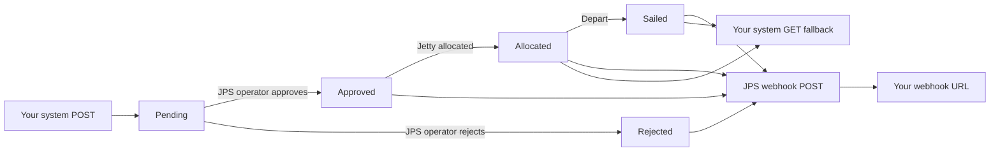

# Jetty Planning System — Shipping Instruction API Integration Guide

> **Version:** 5.3 · **Audience:** External full-stack developers building an integration from your system (EOS Export/Import, KLIPS, ERP, TMS, etc.) into the Jetty Planning System (JPS).
>
> **What you can do:** Sync reference master data, submit Shipping Instructions, update PO/SO while Pending, **send HTTP or HTTPS links** to SI / contract / B/L documents, **receive approval and milestone updates via webhooks**, and poll enriched status (including TA, ETB, TB, ETC, TC, cast off, sailed). JPS operators update berthing milestones in the web app — your system receives those changes; you do not write them back via API.
>
> **What's new in v5.3:** **Hub-only POST:** **`port_hub_code`**, **`vessel_hub_code`**, and **`cargo[].cargo_hub_code`** are **required**; legacy **`port_id`**, **`cargo_type`**, and **`vessel_name`-only** submits return **400**. **`agent_name`** is optional (may be **`null`** or omitted). Document link fields accept **`http://`** or **`https://`**. Header **`X-JPS-API-Version: 5.3`**. Breaking for v5.2 clients still sending short names or `port_id`.
>
> **What's new in v5.2:** **`port_hub_code`** and **`cargo[].cargo_hub_code`** on POST — preferred DHM/JPS hub identifiers (same pattern as `vessel_hub_code`). Catalog adds **`GET /catalog/port`** and **`referenceRows`** on port/cargo-type entities.
>
> **What's new in v5.1:** Optional document link fields on **POST/PATCH/GET**: `shipping_instruction_document_url`, `contract_document_url`, `bl_document_url` (HTTPS URLs to documents hosted on your side; JPS stores the link only). **`GET /catalog`** (§3.8) for live field discovery. Additive for v5.0 clients.
>
> **What's new in v5.0:** Webhook registration (`POST/PATCH /webhooks`), signed outbound events (`status.changed`, `schedule.updated`), enriched `GET` response with `approval`, `schedule`, and `plan_reference`. New partner status **`Sailed`**. v4.x clients remain compatible (new JSON fields are additive).
>
> **This document is self-contained:** API contract, staging environment details, and step-by-step tests you can run yourself.

---

## 1. Overview

### 1.1 How it works

1. Your system **lists** JPS reference data (`GET /terms`, `/agents`, `/surveyors`, `/shippers`) and **registers** agents/shippers via `POST`/`PATCH` when needed.
2. Your system **submits** a Shipping Instruction via `POST`, identifying the vessel by **`vessel_hub_code`** (preferred) or unique **`vessel_name`**. JPS maps this to master vessel data and snapshots name/LOA/GT/draft on the plan. Optionally include `po_no`, `so_no`, `shipper_name`, `trade_term`, `surveyor_name`.
3. If PO/SO are not ready at submit time, your system **PATCH**es the instruction while status is **`Pending`**.
4. JPS creates a real **Shipment Plan** + **Shipping Instruction** with partner status **`Pending`**.
5. A JPS operator **reviews** in the web app and **Approves** or **Rejects**.
6. Once approved, an operator **allocates** a jetty/berth → status becomes **`Allocated`**.
7. Operators log **milestones** (TA, ETB, TB, ETC, TC, cast off, sailed) in JPS.
8. Your system **registers a webhook** (recommended) and/or **polls** `GET` to track approval status and milestones.
9. When the vessel **departs**, status becomes **`Sailed`**.


```mermaid
flowchart LR
    yourSystem[Your system POST] --> pendingState[Pending]
    pendingState -->|JPS operator approves| approvedState[Approved]
    pendingState -->|JPS operator rejects| rejectedState[Rejected]
    approvedState -->|Jetty allocated| allocatedState[Allocated]
    allocatedState -->|Depart| sailedState[Sailed]
    jpsWebhook[JPS webhook POST] --> yourReceiver[Your webhook URL]
    allocatedState --> jpsWebhook
    approvedState --> jpsWebhook
    rejectedState --> jpsWebhook
    sailedState --> jpsWebhook
    allocatedState --> yourPoll[Your system GET fallback]
    sailedState --> yourPoll
```

### 1.2 Source identification

JPS records three layers on every submission:

| Layer | How it is captured | Example |
|-------|-------------------|---------|
| Source system | API key (assigned per integrating system) | `EOS-EXPORT`, `EOS-IMPORT`, `KLIPS` |
| Source document | `external_reference` in your payload | `EOS-EXPORT-2026-091` |
| Requestor | `requested_by` in your payload (optional) | `budi.santoso@kpn.com` |

Provision **one API key per integrating system**. Use `external_reference` for your document/order number — no separate document field is needed.

### 1.3 Environments

| Environment | Integration base URL | Web app (operator UI) | Notes |
|-------------|---------------------|----------------------|-------|
| **Staging** | `http://172.28.92.56:3080/api/v1/integrations` | `http://172.28.92.56:3080` | Use for development and UAT |
| Production | `https://<production-host>/api/v1/integrations` | `https://<production-host>` | Provided at go-live |

**Staging server layout:**

| Server | IP | Role |
|--------|-----|------|
| Frontend | `172.28.92.56` | Nginx + React UI (port **3080**); proxies `/api/` to backend |
| Backend | `172.28.92.57` | Node API (port **3000**, private network) |
| Database | `172.28.92.60` | PostgreSQL (private network) |

**Call the API through the frontend proxy** (`172.28.92.56:3080`) — that is the URL external integrators should use. Direct backend access (`172.28.92.57:3000`) is only available from inside the private network.

**Network access:** Your workstation or integration server must reach `172.28.92.56:3080` (VPN, bastion, or corporate network). Confirm connectivity before coding:

```bash
curl -sS http://172.28.92.56:3080/api/v1/health
```

Expected: `{"status":"ok","timestamp":"..."}`

### 1.4 Basics

- **Protocol:** HTTP on staging (HTTPS on production when TLS is configured).
- **Content type:** `application/json` (request and response).
- **Encoding:** UTF-8.
- **Dates:** ISO 8601 UTC, e.g. `2026-07-01T08:00:00Z`.
- **Rate limit:** 120 requests per minute per API key → HTTP `429` if exceeded.
- **Discovery:** call `GET /catalog` (§3.8) to read the live field contract — enum values (trade terms, surveyors, cargo types) come straight from JPS master data, so it stays accurate even if this document lags behind. Prefer it over the tables in §4 when mapping fields programmatically.

---

## 2. Authentication

Authentication uses a single API key in the `x-api-key` header. No OAuth, no token refresh, no request signing.

### 2.1 What you receive at onboarding

| Item | Example | Notes |
|------|---------|-------|
| API key | `jps_live_a73fc30d...` | **Server-side only.** Never commit to git or expose in browser code. |
| Partner name | `EOS-EXPORT` | Identifies your system on the JPS side (not sent in requests). |
| Port access | any | Keys are not port-scoped. Pass required **`port_hub_code`** on each request (see **`GET /catalog/port`**). Staging Bontang hub: **`PORT-0048`** (maps to JPS port id 1). |

**Request your staging API key** from the JPS team. They create it with:

```bash
# (JPS admin only — run on backend server)
docker compose --env-file Backend/.env -f docker-compose.backend.yml exec -T jps-api \
  node scripts/create-integration-api-key.mjs --partner "YOUR-SYSTEM-NAME"
```

The plaintext key is shown **once**. Store it in your secrets manager or `.env` file immediately.

**JPS operators — monitor key usage:** **Admin → System Health Dashboard** (`/admin/operations`) includes a **Partner Integration API** card: active keys, last API activity, submissions in the last 7 days, and per-partner stats. Manage keys under **Admin → Partner API Keys** (`/admin/partner-api`).

### 2.2 Header

Every request must include:

```
x-api-key: jps_live_<your-key>
Content-Type: application/json   # required on POST
```

### 2.3 Code examples

**curl:**

```bash
curl -sS "http://172.28.92.56:3080/api/v1/integrations/shipping-instructions/10" \
  -H "x-api-key: $JPS_API_KEY"
```

**JavaScript (Node / server-side fetch):**

```javascript
const BASE = process.env.JPS_API_BASE_URL; // http://172.28.92.56:3080/api/v1/integrations
const KEY  = process.env.JPS_API_KEY;

const res = await fetch(`${BASE}/shipping-instructions/10`, {
  headers: { "x-api-key": KEY },
});
const result = await res.json();
```

**Python:**

```python
import os, requests

BASE = os.environ["JPS_API_BASE_URL"]
KEY  = os.environ["JPS_API_KEY"]

r = requests.get(
    f"{BASE}/shipping-instructions/10",
    headers={"x-api-key": KEY},
    timeout=30,
)
result = r.json()
```

### 2.4 Key handling rules

- Send the key on **every** request. Missing/invalid key → HTTP `401`.
- Store in environment variables or a secrets manager — not in frontend bundles.
- Contact JPS to rotate or revoke a compromised key.
- Each partner can only read submissions made with **their own** API key.

---

## 3. Endpoints

| Method | Path | Purpose |
|--------|------|---------|
| `POST` | `/shipping-instructions` | Submit a new Shipping Instruction |
| `PATCH` | `/shipping-instructions/{id}` | Update PO/SO/shipper (and optional header fields) while **Pending** |
| `PATCH` | `/shipping-instructions?external_reference={ref}` | Same as PATCH by id, using your reference |
| `GET` | `/shipping-instructions/{id}` | Check status by JPS id (returned from POST) |
| `GET` | `/shipping-instructions?external_reference={ref}` | Check status by your own reference |
| `GET` | `/terms` | List trade terms (FOB, CIF, …) |
| `GET` | `/agents` | List shipping agents |
| `GET` | `/agents/{id}` | Get one agent |
| `POST` | `/agents` | Create or match agent by name (upsert) |
| `PATCH` | `/agents/{id}` | Update agent name / long name |
| `GET` | `/surveyors` | List surveyors |
| `GET` | `/surveyors/{id}` | Get one surveyor |
| `GET` | `/shippers` | List shippers |
| `GET` | `/shippers/{id}` | Get one shipper |
| `POST` | `/shippers` | Create or match shipper by name (upsert) |
| `PATCH` | `/shippers/{id}` | Update shipper name / long name |
| `POST` | `/webhooks` | Register HTTP/HTTPS webhook URL (v5.0) |
| `PATCH` | `/webhooks/{id}` | Update webhook URL, events, or rotate secret |
| `GET` | `/webhooks` | List your webhook endpoints |
| `DELETE` | `/webhooks/{id}` | Deactivate a webhook endpoint |
| `GET` | `/catalog` | List entities available to your API key (v5.1) |
| `GET` | `/catalog/{entity}` | Field-level contract for one entity, e.g. `shipping-instruction`, `webhook` (v5.1) |

Full staging submit URL:

```
http://172.28.92.56:3080/api/v1/integrations/shipping-instructions
```

---

### 3.1 `POST /shipping-instructions` — Submit

Creates a Shipment Plan (`Submitted`) + linked Shipping Instruction + cargo breakdown. Returns JPS id and status `Pending`.

**Request example (staging-valid payload):**

```bash
curl -sS -X POST "http://172.28.92.56:3080/api/v1/integrations/shipping-instructions" \
  -H "x-api-key: $JPS_API_KEY" \
  -H "Content-Type: application/json" \
  -d '{
    "external_reference": "EOS-EXPORT-2026-091",
    "requested_by": "developer@your-company.com",
    "port_hub_code": "PORT-0048",
    "vessel_hub_code": "VSL-0001",
    "voyage_no": "VY-8891",
    "purpose": "Loading",
    "eta": "2026-07-01T08:00:00Z",
    "etd": "2026-07-03T18:00:00Z",
    "agent_name": "PT Samudera Agency",
    "agent_contact": "ops@agency.example.com",
    "trade_term": "FOB",
    "surveyor_name": "PT SGS Indonesia",
    "notes": "Submitted from EOS Export",
    "shipping_instruction_document_url": "https://your-system.example/docs/si-2026-091.pdf",
    "contract_document_url": "https://your-system.example/docs/contract-7788.pdf",
    "bl_document_url": "https://your-system.example/docs/bl-draft.pdf",
    "cargo": [
      {
        "cargo_hub_code": "CMD-0006",
        "description": "Main lot",
        "tonnage": 25000,
        "unit": "MT",
        "contract_no": "CTR-7788",
        "po_no": "PO-12345",
        "so_no": "SO-67890",
        "shipper_name": "PT TJIM"
      }
    ]
  }'
```

**Success — `201 Created`:**

```json
{
  "success": true,
  "data": {
    "id": 10,
    "external_reference": "EOS-EXPORT-2026-091",
    "requested_by": "developer@your-company.com",
    "status": "Pending",
    "vessel_name": "MV NUSANTARA",
    "vessel_hub_code": "VSL-0001",
    "port_hub_code": "PORT-0048",
    "port_id": 1,
    "received_at": "2026-06-15T06:53:59.935Z"
  }
}
```

`vessel_name` and `vessel_hub_code` in the response are the **canonical values from JPS master data** (plan snapshot), not necessarily what you sent.

**Store `data.id`** — you need it for status polling. Also store `external_reference` in your system.

#### Vessel identification (`vessel_hub_code`)

| Field | Required? | Description |
|-------|-----------|-------------|
| `vessel_hub_code` | **Yes** | DataHub / JPS master vessel code (e.g. `VSL-0001`). JPS resolves `master_vessels` and snapshots name, LOA, GT, draft on the plan. |
| `vessel_name` | No (optional cross-check) | When sent with `vessel_hub_code`, names must agree (case-insensitive) or **400**. **`vessel_name` alone is not accepted (v5.3+).** |

Partners do **not** send `master_vessel_id`, LOA, GT, or draft — JPS copies those from master internally.

**Common vessel errors (`400 VALIDATION_ERROR`):**

| Issue | Typical `details[].field` |
|-------|---------------------------|
| Unknown `vessel_hub_code` | `vessel_hub_code` |
| Name mismatch with `vessel_hub_code` | `vessel_name` |
| Unknown or ambiguous `vessel_name` | `vessel_name` |
| Master missing LOA/GT/draft | `vessel_name` |

#### Port identification (`port_hub_code`)

| Field | Required? | Description |
|-------|-----------|-------------|
| `port_hub_code` | **Yes** | DHM/JPS port hub code on `ports.hub_code`. JPS resolves to internal `port_id`. |
| `port_id` | **Not accepted (v5.3+)** | Returns **400** — use **`port_hub_code`**. |

Study live mappings: **`GET /catalog/port`** (includes `referenceRows` with `hub_code` and `jps_port_id`).

#### Commodity identification (`cargo[].cargo_hub_code`)

| Field | Required? | Description |
|-------|-----------|-------------|
| `cargo_hub_code` | **Yes** (each line) | DHM/JPS commodity hub code on `si_commodities.hub_code`. |
| `cargo_type` | **Not accepted (v5.3+)** | Returns **400** — use **`cargo_hub_code`**. |

Study live mappings: **`GET /catalog/cargo-type`** (`referenceRows`: `hub_code`, `short_name`, `jps_commodity_id`).

#### Idempotency

`external_reference` must be **unique per API key**.

- Resubmitting the same reference → HTTP `409 DUPLICATE_REFERENCE` (original untouched).
- Safe to retry on timeout/`5xx`: you get either `201` (new) or `409` (already exists — then `GET ?external_reference=` to recover the id).

---

### 3.2 `GET /shipping-instructions/{id}` — Check status

```bash
curl -sS "http://172.28.92.56:3080/api/v1/integrations/shipping-instructions/10" \
  -H "x-api-key: $JPS_API_KEY"
```

**Success — `200 OK` (v5.0 enriched example):**

```json
{
  "success": true,
  "data": {
    "id": 10,
    "external_reference": "EOS-EXPORT-2026-091",
    "requested_by": "developer@your-company.com",
    "status": "Allocated",
    "plan_reference": "SP-26-09-00010",
    "vessel_name": "MV NUSANTARA",
    "vessel_hub_code": "VSL-0001",
    "voyage_no": "VY-8891",
    "purpose": "Loading",
    "eta": "2026-07-01T08:00:00.000Z",
    "etd": "2026-07-03T18:00:00Z",
    "port_hub_code": "PORT-0048",
    "port_id": 1,
    "approval": {
      "status": "Approved",
      "approved_at": "2026-06-16T01:00:00.000Z",
      "rejected_at": null,
      "rejection_reason": null
    },
    "schedule": {
      "eta": "2026-07-01T08:00:00.000Z",
      "ta": "2026-07-01T09:30:00.000Z",
      "etb": "2026-07-01T10:00:00.000Z",
      "tb": "2026-07-01T10:15:00.000Z",
      "etc": "2026-07-03T18:00:00.000Z",
      "tc": null,
      "cast_off_at": null,
      "sailed_at": null
    },
    "etr_minutes": 4200,
    "allocation": {
      "jetty_name": "Jetty 1A",
      "jetty_code": "1A",
      "planned_berthing_time": "2026-07-01T10:15:00.000Z"
    },
    "rejection_reason": null,
    "submitted_at": "2026-06-15T06:53:59.935Z",
    "last_updated_at": "2026-06-16T02:40:11.000Z"
  }
}
```

**Schedule field mapping (v5.0):**

| Field | Meaning | JPS source |
|-------|---------|------------|
| `ta` | Time of Arrival | Operator arrival log |
| `etb` | Estimated Time of Berthing | Plan / allocation |
| `tb` | Time of Berthing (actual) | Operator berthing log |
| `etc` | Estimated Time of Completion | Operator SLA / ETC |
| `tc` | Operations completed (sign-off) | Sign-off approval |
| `cast_off_at` | Cast off | Clearance / depart |
| `sailed_at` | Sailed | Depart (status `Sailed`) |

- `allocation` is `null` until status is `Allocated` or `Sailed`.
- `rejection_reason` is set only when status is `Rejected`.
- `etr_minutes` is derived from `etc` minus now (read-only hint; not stored in JPS).

#### Lookup by your reference

```bash
curl -sS "http://172.28.92.56:3080/api/v1/integrations/shipping-instructions?external_reference=EOS-EXPORT-2026-091" \
  -H "x-api-key: $JPS_API_KEY"
```

Same response shape as `GET /{id}`. HTTP `404` if not found or not yours.

#### Polling guidance

- **Recommended:** register a webhook (§3.4) for approval and milestone updates.
- Fallback poll **at most once every 5 minutes** per instruction.
- Continue polling (or listen for webhooks) through **`Sailed`** if you track departure.

---

### 3.3 `PATCH /shipping-instructions` — Update PO/SO while Pending

Use this when PO or SO numbers (or shipper / trade term / surveyor) are not ready at initial submit.

**Allowed only while partner status is `Pending`.** After approve/reject/allocate → **409** `INVALID_STATE`.

```bash
curl -sS -X PATCH "http://172.28.92.56:3080/api/v1/integrations/shipping-instructions/10" \
  -H "x-api-key: $JPS_API_KEY" \
  -H "Content-Type: application/json" \
  -d '{
    "trade_term": "FOB",
    "surveyor_name": "PT SGS Indonesia",
    "cargo": [
      { "line_order": 0, "po_no": "PO-12345", "so_no": "SO-67890", "shipper_name": "PT TJIM" }
    ]
  }'
```

Identify each cargo line with **`line_order`** (0-based, same as POST order) or **`contract_no`**. Returns **200** with the same status shape as GET.

---

### 3.4 Webhooks — register and manage (v5.0)

Register an **HTTP or HTTPS** URL where JPS POSTs signed events when approval status or berthing milestones change (internal receivers often use `http://`).

**Register (secret shown once):**

```bash
curl -sS -X POST "$JPS_API_BASE_URL/webhooks" \
  -H "x-api-key: $JPS_API_KEY" \
  -H "Content-Type: application/json" \
  -d '{
    "url": "https://your-system.example.com/jps/webhook",
    "events": ["status.changed", "schedule.updated"]
  }'
```

**Success — `201 Created`:**

```json
{
  "success": true,
  "data": {
    "id": 1,
    "url": "https://your-system.example.com/jps/webhook",
    "events": ["status.changed", "schedule.updated"],
    "active": true,
    "secret_prefix": "whsec_a1b2c3d4",
    "secret": "whsec_a1b2c3d4e5f6...",
    "secret_note": "Store this secret securely; it is shown once and used to verify webhook signatures."
  }
}
```

| Method | Path | Purpose |
|--------|------|---------|
| `GET` | `/webhooks` | List endpoints + `available_events` |
| `PATCH` | `/webhooks/{id}` | Update `url`, `events`, `active`, or `rotate_secret: true` |
| `DELETE` | `/webhooks/{id}` | Deactivate endpoint |

Limits: max **3 active** endpoints per API key. **`url`** must be **`http://`** or **`https://`** (other schemes rejected).

---

### 3.5 Webhooks — events JPS sends to you

JPS **POSTs** to your URL (not your API key). Your endpoint must return **2xx** within 15 seconds.

**Headers:**

| Header | Description |
|--------|-------------|
| `X-JPS-Event` | `status.changed` or `schedule.updated` |
| `X-JPS-Delivery-Id` | Unique id — use for deduplication |
| `X-JPS-Timestamp` | Unix time in milliseconds |
| `X-JPS-Signature` | `sha256=<hex>` HMAC of `{timestamp}.{rawBody}` |

**Body:**

```json
{
  "event": "status.changed",
  "occurred_at": "2026-09-25T04:00:00.000Z",
  "data": { }
}
```

The `data` object matches the enriched **`GET /shipping-instructions/{id}`** shape (§3.2).

| Event | When fired |
|-------|------------|
| `status.changed` | Plan approved, rejected, allocated, or vessel sailed |
| `schedule.updated` | TA, ETB, TB, ETC, TC, cast off, or sailed timestamp updated |

Delivery is **at-least-once** (retries with backoff). Always dedupe on `X-JPS-Delivery-Id`.

---

### 3.6 Webhook signature verification

```javascript
import crypto from "crypto";

function verifyJpsWebhook(rawBody, headers, secret) {
  const ts = headers["x-jps-timestamp"];
  const sig = String(headers["x-jps-signature"] || "").replace(/^sha256=/, "");
  const expected = crypto
    .createHmac("sha256", secret)
    .update(`${ts}.${rawBody}`)
    .digest("hex");
  return crypto.timingSafeEqual(Buffer.from(sig), Buffer.from(expected));
}
```

Reject requests when the signature does not match. Parse JSON only after verification.

---

### 3.7 Master data — terms, agents, surveyors, shippers

**Read lists** (for mapping in your system):

```bash
curl -sS "$JPS_API_BASE_URL/terms" -H "x-api-key: $JPS_API_KEY"
curl -sS "$JPS_API_BASE_URL/shippers" -H "x-api-key: $JPS_API_KEY"
```

**Register a shipper before submit** (if not already in JPS):

```bash
curl -sS -X POST "$JPS_API_BASE_URL/shippers" \
  -H "x-api-key: $JPS_API_KEY" \
  -H "Content-Type: application/json" \
  -d '{"name": "PT TJIM", "long_name": "PT Tanjung Jati Indah Makmur"}'
```

Returns **201** when created, **200** when the name already exists (case-insensitive match). Same pattern for **`POST /agents`**.

Terms and surveyors are **GET only** — JPS operators maintain them in the Master UI.

### 3.8 Catalog — discover the API (v5.1)

`GET /catalog` lists every entity your API key may call, with its path, HTTP methods, and field contract. `GET /catalog/{entity}` returns one entity in full detail. This is generated live from JPS validation and master data — the same source the API itself validates against — so it does not drift the way a static document can.

```bash
curl -sS "$JPS_API_BASE_URL/catalog" -H "x-api-key: $JPS_API_KEY"
curl -sS "$JPS_API_BASE_URL/catalog/shipping-instruction" -H "x-api-key: $JPS_API_KEY"
```

**List response** (`GET /catalog`):

```json
{
  "success": true,
  "data": {
    "api_version": "5.3",
    "auth_header": "x-api-key",
    "count": 7,
    "entities": [
      { "slug": "shipping-instruction", "name": "Shipping instruction", "path": "/shipping-instructions", "methods": ["POST", "GET", "PATCH"], "fieldCount": 18 },
      { "slug": "webhook", "name": "Webhook endpoint", "path": "/webhooks", "methods": ["POST", "GET", "PATCH", "DELETE"], "fieldCount": 4 },
      { "slug": "term", "name": "Trade term", "path": "/terms", "methods": ["GET"], "fieldCount": 1 },
      { "slug": "agent", "name": "Shipping agent", "path": "/agents", "methods": ["POST", "GET", "PATCH"], "fieldCount": 2 },
      { "slug": "surveyor", "name": "Surveyor", "path": "/surveyors", "methods": ["GET"], "fieldCount": 2 },
      { "slug": "shipper", "name": "Shipper", "path": "/shippers", "methods": ["POST", "GET", "PATCH"], "fieldCount": 2 },
      { "slug": "port", "name": "Port", "path": null, "methods": [], "fieldCount": 3 },
      { "slug": "cargo-type", "name": "Cargo type", "path": null, "methods": [], "fieldCount": 3 }
    ]
  }
}
```

**Single-entity response** (`GET /catalog/shipping-instruction`, abridged — each field also carries `patchable`, `maxLength`, `enumValues`, `description`):

```json
{
  "success": true,
  "data": {
    "slug": "shipping-instruction",
    "name": "Shipping instruction",
    "path": "/shipping-instructions",
    "methods": ["POST", "GET", "PATCH"],
    "fields": [
      { "key": "purpose", "type": "STRING", "required": true, "patchable": false, "enumValues": ["Loading", "Unloading"] },
      { "key": "trade_term", "type": "STRING", "required": false, "patchable": true, "enumValues": ["FOB", "CIF", "CFR", "..."] },
      { "key": "shipping_instruction_document_url", "type": "URL", "required": false, "patchable": true, "maxLength": 2048 },
      { "key": "cargo", "type": "ARRAY", "required": true, "patchable": true, "items": [ { "key": "cargo_hub_code", "type": "STRING", "required": true, "enumValues": ["CMD-0006", "CMD-0010", "..."] } ] },
      { "key": "legacyFieldsRejected", "type": "ARRAY", "description": "POST fields that return 400 in v5.3 — e.g. cargo_type → use cargo_hub_code" }
    ]
  }
}
```

- **Field types:** `STRING`, `NUMBER`, `BOOLEAN`, `DATETIME`, `URL`, `ARRAY`, `ARRAY<STRING>`.
- **`enumValues`** is only present when the field is constrained to a fixed set, and reflects current master data (trade term codes, surveyor names, **commodity hub codes** on `cargo[].cargo_hub_code`, port hub codes, webhook event types). Use **`GET /catalog/cargo-type`** `referenceRows` to map hub codes to short names.
- **`legacyFieldsRejected`** on **`shipping-instruction`** lists POST fields that v5.3 rejects (including **`cargo_type`** — send **`cargo_hub_code`** instead).
- **`patchable`** marks fields the `PATCH` endpoint accepts (§3.3, §4.1.1).
- Unknown `{entity}` returns **404** with `error.code = "NOT_FOUND"`.
- Cache the catalog at startup; it changes when JPS master data changes (a new commodity, surveyor, or trade term), not on every submission.

---

## 4. Request & response reference

### 4.1 Submission fields (`POST` body)

| Field | Type | Required | Description |
|-------|------|----------|-------------|
| `external_reference` | string (max 100) | Yes | Your unique document/order ID. Idempotency key. |
| `requested_by` | string (max 200) | No | Person or service account in your system. Shown to JPS operators. If omitted, JPS stores the API partner name. |
| `port_hub_code` | string (max 50) | Yes | DHM/JPS port hub code. See **`GET /catalog/port`**. |
| `vessel_hub_code` | string (max 50) | Yes | DataHub / JPS master vessel code. |
| `vessel_name` | string (max 200) | No | Optional cross-check when `vessel_hub_code` is sent (must match master). |
| `voyage_no` | string (max 50) | No | Voyage number. |
| `purpose` | string | Yes | `"Loading"` or `"Unloading"`. |
| `eta` | datetime (ISO 8601 UTC) | Yes | Estimated time of arrival. |
| `etd` | datetime (ISO 8601 UTC) | No | Estimated departure. Must be after `eta` when provided. |
| `agent_name` | string (max 200) or null | No | Shipping agent / sender company. Omit or **`null`** when unknown. |
| `agent_contact` | string (max 200) | No | Agent email or phone. |
| `trade_term` | string | No | Trade term code (e.g. `FOB`, `CIF`). Must match **`GET /terms`**. |
| `surveyor_name` | string (max 200) | No | Must match a name from **`GET /surveyors`**. |
| `notes` | string (max 2000) | No | Free-text remarks for operators. |
| `shipping_instruction_document_url` | string (HTTP or HTTPS URL, max 2048) | No | Link to your hosted SI document (PDF/page). JPS stores the URL only. |
| `contract_document_url` | string (HTTP or HTTPS URL, max 2048) | No | Link to your hosted contract document. |
| `bl_document_url` | string (HTTP or HTTPS URL, max 2048) | No | Link to your hosted bill of lading document. |
| `cargo` | array | Yes | At least one cargo line (see below). |

**Cargo line fields** (`cargo[]`):

| Field | Type | Required | Description |
|-------|------|----------|-------------|
| `cargo_hub_code` | string (max 50) | Yes | DHM/JPS commodity hub code. See **`GET /catalog/cargo-type`**. |
| `description` | string (max 500) | No | Extra detail about the lot. |
| `tonnage` | number ≥ 0 | Yes | Quantity. |
| `unit` | string | Yes | `"MT"` or `"KL"` only. |
| `contract_no` | string (max 100) | No | Your contract reference. |
| `po_no` | string (max 100) | No | Purchase order number (breakdown line). |
| `so_no` | string (max 100) | No | Sales order number (breakdown line). |
| `shipper_name` | string (max 200) | No | Must exist in JPS — create first via **`POST /shippers`**. |

All cargo lines on one instruction must be the same commodity type category (Solid or Liquid).

### 4.1.1 PATCH body (`PATCH /shipping-instructions`)

At least one field required. Allowed while status is **`Pending`** only.

| Field | Description |
|-------|-------------|
| `trade_term` | Update SI trade term (code from **`GET /terms`**) |
| `surveyor_name` | Update SI surveyor (from **`GET /surveyors`**) |
| `cargo[]` | Array of line updates — each line must include **`line_order`** or **`contract_no`** to identify the row, plus any of: `po_no`, `so_no`, `shipper_name` |
| `shipping_instruction_document_url` | Update SI document link (HTTP or HTTPS) |
| `contract_document_url` | Update contract document link |
| `bl_document_url` | Update B/L document link |

### 4.1.2 Master data POST/PATCH (Agent, Shipper)

| Field | Required | Description |
|-------|----------|-------------|
| `name` | Yes (POST) | Display name; unique among active rows (case-insensitive) |
| `long_name` | No | Optional full legal name |

**POST** upserts by `name`. **PATCH** `/{id}` updates `name` and/or `long_name`.

### 4.2 Partner status values

| Status | Meaning | Your action |
|--------|---------|-------------|
| `Pending` | Received, awaiting operator review. | Poll or wait for `status.changed` webhook. |
| `Approved` | Operator accepted. Awaiting jetty allocation. | Poll / webhook until `Allocated`. |
| `Rejected` | Operator declined. See `rejection_reason`. | Fix data; submit **new** instruction with **new** `external_reference`. |
| `Allocated` | Jetty/berth assigned. See `allocation`. | Watch `schedule.updated` for TA/TB/ETC milestones. |
| `Sailed` | Vessel departed. See `schedule.sailed_at`. | Terminal state for voyage tracking. |

### 4.3 Response envelope

**Success:**

```json
{ "success": true, "data": { } }
```

**Error:**

```json
{
  "success": false,
  "error": {
    "code": "VALIDATION_ERROR",
    "message": "Payload validation failed",
    "details": [
      { "field": "cargo[0].cargo_type", "issue": "legacy cargo_type is not accepted; use cargo_hub_code" },
      { "field": "cargo[0].cargo_hub_code", "issue": "unknown cargo hub code(s): CMD-9999", "valid_cargo_hub_codes": ["CMD-0006", "CMD-0010", "..."] }
    ]
  },
  "request_id": "req_01HXYZABC123"
}
```

Always log `request_id` when reporting issues to JPS support.

### 4.4 HTTP status codes

| HTTP | Error code | When | Retry? |
|------|------------|------|--------|
| `201` | — | Created (SI or new agent/shipper) | — |
| `200` | — | Status retrieved; master upsert matched existing; PATCH applied | — |
| `400` | `VALIDATION_ERROR` | Bad payload | No — fix payload |
| `401` | `INVALID_API_KEY` | Missing/wrong key | No |
| `404` | `NOT_FOUND` | Unknown id/reference | No |
| `409` | `DUPLICATE_REFERENCE` | `external_reference` already used | No — use GET to recover |
| `409` | `INVALID_STATE` | PATCH when status is not Pending | No — submit new instruction |
| `429` | `RATE_LIMITED` | Rate limit exceeded | Yes — backoff |
| `500` | `INTERNAL_ERROR` | Server error | Yes — backoff |

**Retry policy:** Retry only `429` and `5xx` with exponential backoff. `POST` retries are safe (idempotent via `external_reference`).

---

## 5. Staging master data

### 5.1 Commodity hub codes (`cargo_hub_code`)

Each cargo line must include **`cargo_hub_code`** — the DHM/JPS hub code on `si_commodities.hub_code` (e.g. `CMD-0006` for CPO on staging). **Do not send `cargo_type`** on POST in v5.3; that field is rejected even if the value looks like a hub code or short name.

**Authoritative list for your environment:**

```bash
curl -sS "$JPS_API_BASE_URL/catalog/cargo-type" -H "x-api-key: $JPS_API_KEY"
```

Use `data.referenceRows[]` (`hub_code`, `short_name`, `name`, `jps_commodity_id`). The catalog **`shipping-instruction`** entity also lists allowed hub codes in `cargo.items[].cargo_hub_code.enumValues`.

**Reference mapping (short names are informational only — not accepted on POST):**

| Example `cargo_hub_code` (staging) | JPS short_name | JPS display name | Type |
|-----------------------------------|----------------|------------------|------|
| *from catalog* | `CG` | CRUDE GLYCERINE | Liquid |
| *from catalog* | `CPKO` | CRUDE PALM KERNEL OIL | Liquid |
| `CMD-0006` (example) | `CPO` | CRUDE PALM OIL | Liquid |
| *from catalog* | `FAME` | Fatty Acid Methyl Ester | Liquid |
| *from catalog* | `INS POME FAD` | INS PALM OIL MILL EFFLUENT FATTY ACID DISTILLATE | Liquid |
| *from catalog* | `INS RPOME` | INS REFINED PALM OIL MILL EFFLUENT | Liquid |
| *from catalog* | `ISCC POMEPFAD` | ISCC PALM OIL MILL EFFLUENT FATTY ACID DISTILLATE (POMEPFAD) | Liquid |
| *from catalog* | `ISCC RPOME` | ISCC REFINED PALM OIL MILL EFFLUENT | Liquid |
| *from catalog* | `METHANOL` | METHANOL | Liquid |
| *from catalog* | `PFAD` | Palm Fatty Acid Distillate | Liquid |
| *from catalog* | `PKE` | Palm Kernel Expeller | Solid |
| *from catalog* | `PKM` | Palm Kernel Meal | Solid |
| *from catalog* | `PKS` | Palm Kernel Shell | Solid |
| *from catalog* | `POME` | Palm Oil Mill Effluent | Liquid |
| *from catalog* | `RBD PO` | RBD PO | Liquid |
| *from catalog* | `RG` | REFINED GLYCERINE | Liquid |
| *from catalog* | `ROL` | Refined Olein | Liquid |
| *from catalog* | `RPOME` | REFINED PALM OIL MILL EFFLUENT | Liquid |
| *from catalog* | `SPLIT CPKO FA` | SPLIT CRUDE PALM KERNEL OIL FATTY ACID | Liquid |
| *from catalog* | `SPLIT RBD PKO FA` | SPLIT RBD PALM KERNEL OIL FATTY ACID | Liquid |

*Hub codes differ by environment — always use **`GET /catalog/cargo-type`**, not hard-coded examples.*

If you send an unknown **`cargo_hub_code`**, the API returns **`400`** with **`valid_cargo_hub_codes`** in `error.details`.

**Do not send full commodity display names** (e.g. `CRUDE PALM OIL`) in any field — they are rejected.

### 5.1.1 Deprecated: `cargo_type` (v5.2 and earlier)

Prior API versions accepted **`cargo[].cargo_type`** with JPS **short_name** values (`CPO`, `PKE`, …). **v5.3 rejects `cargo_type` on POST.** Map your internal commodity code to **`cargo_hub_code`** using the catalog.

| JPS short_name (legacy `cargo_type` only) | JPS display name | Type |
|-------------------------------------------|------------------|------|
| `CG` | CRUDE GLYCERINE | Liquid |
| `CPKO` | CRUDE PALM KERNEL OIL | Liquid |
| `CPO` | CRUDE PALM OIL | Liquid |
| `FAME` | Fatty Acid Methyl Ester | Liquid |
| `INS POME FAD` | INS PALM OIL MILL EFFLUENT FATTY ACID DISTILLATE | Liquid |
| `INS RPOME` | INS REFINED PALM OIL MILL EFFLUENT | Liquid |
| `ISCC POMEPFAD` | ISCC PALM OIL MILL EFFLUENT FATTY ACID DISTILLATE (POMEPFAD) | Liquid |
| `ISCC RPOME` | ISCC REFINED PALM OIL MILL EFFLUENT | Liquid |
| `METHANOL` | METHANOL | Liquid |
| `PFAD` | Palm Fatty Acid Distillate | Liquid |
| `PKE` | Palm Kernel Expeller | Solid |
| `PKM` | Palm Kernel Meal | Solid |
| `PKS` | Palm Kernel Shell | Solid |
| `POME` | Palm Oil Mill Effluent | Liquid |
| `RBD PO` | RBD PO | Liquid |
| `RG` | REFINED GLYCERINE | Liquid |
| `ROL` | Refined Olein | Liquid |
| `RPOME` | REFINED PALM OIL MILL EFFLUENT | Liquid |
| `SPLIT CPKO FA` | SPLIT CRUDE PALM KERNEL OIL FATTY ACID | Liquid |
| `SPLIT RBD PKO FA` | SPLIT RBD PALM KERNEL OIL FATTY ACID | Liquid |

*List as of JPS master data export (20 commodities). JPS operators may add or update commodities over time.*

If you send **`cargo_type`** on v5.3 POST, the API returns **`400`** with `legacy cargo_type is not accepted; use cargo_hub_code` — not `valid_cargo_types`.

**Do not send full commodity names** (e.g. `CRUDE PALM OIL`) — they are rejected.

### 5.2 Staging port

| `port_hub_code` | Name | `jps_port_id` (informational) |
|-----------------|------|-------------------------------|
| `PORT-0048` | BONTANG | `1` |

Pass **`port_hub_code`** from **`GET /catalog/port`**. Do **not** send **`port_id`** on POST (v5.3). API keys are not port-scoped, but the hub code must exist in JPS master data.

### 5.3 Map your system's commodity codes to JPS hub codes

Resolve **`cargo_hub_code`** from **`GET /catalog/cargo-type`** (`referenceRows`). Map your internal product code to the row's **`hub_code`**, not to **`short_name`**.

| Your system code (example) | Lookup by `short_name` | Send on POST (`cargo_hub_code`) |
|----------------------------|------------------------|----------------------------------|
| `CPO` | `CPO` | e.g. `CMD-0006` (confirm in catalog) |
| `PKO` | `CPKO` | hub code from catalog row for CPKO |
| `POME` | `POME` | hub code from catalog |
| `PKE` | `PKE` | hub code from catalog |

Example integration mapping (refresh hub codes from catalog at deploy time):

```javascript
// hub codes are environment-specific — load from GET /catalog/cargo-type referenceRows
const JPS_COMMODITY_HUB_BY_SHORT = {
  CPO: "CMD-0006",
  CPKO: "CMD-????", // replace from catalog
  POME: "CMD-????",
};

function mapCargoHubCode(yourCode) {
  const short = YOUR_TO_JPS_SHORT[yourCode.toUpperCase()] ?? yourCode.toUpperCase();
  const hub = JPS_COMMODITY_HUB_BY_SHORT[short];
  if (!hub) throw new Error(`No JPS hub mapping for commodity: ${yourCode}`);
  return hub;
}

const payload = {
  cargo: [{ cargo_hub_code: mapCargoHubCode(order.commodityCode), tonnage: 25000, unit: "MT" }],
};
```

Confirm ambiguous mappings (e.g. PKOFA variants) with JPS before production go-live.

---

## 6. Self-service testing on staging

Follow these steps to verify your integration **before** writing application code.

### 6.1 Prerequisites

- [ ] Network access to `http://172.28.92.56:3080`
- [ ] Staging API key from JPS team (`jps_live_...`)
- [ ] `curl` or Postman installed

### 6.2 Environment variables

```bash
export JPS_API_BASE_URL="http://172.28.92.56:3080/api/v1/integrations"
export JPS_API_KEY="jps_live_PASTE_YOUR_KEY"
```

PowerShell:

```powershell
$env:JPS_API_BASE_URL = "http://172.28.92.56:3080/api/v1/integrations"
$env:JPS_API_KEY      = "jps_live_PASTE_YOUR_KEY"
```

### 6.3 Test 1 — Health check

```bash
curl -sS http://172.28.92.56:3080/api/v1/health
```

### 6.4 Test 2 — Submit instruction (`201`)

Use a **unique** `external_reference` each time:

```bash
REF="YOUR-SYSTEM-TEST-$(date +%Y%m%d-%H%M%S)"

curl -sS -X POST "$JPS_API_BASE_URL/shipping-instructions" \
  -H "x-api-key: $JPS_API_KEY" \
  -H "Content-Type: application/json" \
  -d "{
    \"external_reference\": \"$REF\",
    \"requested_by\": \"developer@your-company.com\",
    \"port_hub_code\": \"PORT-0048\",
    \"vessel_hub_code\": \"VSL-0001\",
    \"voyage_no\": \"VY-001\",
    \"purpose\": \"Loading\",
    \"eta\": \"2026-07-01T08:00:00Z\",
    \"etd\": \"2026-07-03T18:00:00Z\",
    \"agent_name\": \"PT Test Agency\",
    \"agent_contact\": \"ops@test.example.com\",
    \"notes\": \"Self-service API test\",
    \"cargo\": [{
      \"cargo_hub_code\": \"CMD-0006\",
      \"tonnage\": 25000,
      \"unit\": \"MT\",
      \"contract_no\": \"CTR-001\"
    }]
  }"
```

**Check:** `"success": true`, `"status": "Pending"`, note `data.id` (e.g. `10`).

### 6.5 Test 3 — Poll status (`200`)

```bash
SI_ID=10   # replace with your id from Test 2

curl -sS "$JPS_API_BASE_URL/shipping-instructions/$SI_ID" \
  -H "x-api-key: $JPS_API_KEY"

curl -sS "$JPS_API_BASE_URL/shipping-instructions?external_reference=$REF" \
  -H "x-api-key: $JPS_API_KEY"
```

**Check:** `"status": "Pending"`.

### 6.6 Test 4 — Master data and PO/SO

```bash
# List reference data
curl -sS "$JPS_API_BASE_URL/terms" -H "x-api-key: $JPS_API_KEY"
curl -sS "$JPS_API_BASE_URL/shippers" -H "x-api-key: $JPS_API_KEY"

# Register shipper (201 create, 200 if name already exists)
curl -sS -X POST "$JPS_API_BASE_URL/shippers" \
  -H "x-api-key: $JPS_API_KEY" \
  -H "Content-Type: application/json" \
  -d '{"name":"PT TJIM","long_name":"PT Tanjung Jati Indah Makmur"}'

# PATCH PO/SO while Pending (replace SI_ID)
curl -sS -X PATCH "$JPS_API_BASE_URL/shipping-instructions/$SI_ID" \
  -H "x-api-key: $JPS_API_KEY" \
  -H "Content-Type: application/json" \
  -d '{"cargo":[{"line_order":0,"po_no":"PO-12345","so_no":"SO-67890","shipper_name":"PT TJIM"}]}'
```

**Check:** PATCH returns `200` and `"status": "Pending"`. After operator approval, PATCH returns **409** `INVALID_STATE`.

### 6.7 Test 5 — Error paths

```bash
# Bad key → 401
curl -sS "$JPS_API_BASE_URL/shipping-instructions/$SI_ID" \
  -H "x-api-key: jps_live_invalid"

# Duplicate reference → 409 (re-run Test 2 POST with same $REF)
# Unknown port → 400 (use port_hub_code "PORT-9999")
# Legacy cargo_type → 400 (use cargo_hub_code instead)
# Unknown cargo hub → 400 (use cargo_hub_code "CMD-9999")
# Unknown shipper on POST → 400 (create via POST /shippers first)
```

### 6.8 Test 6 — Full lifecycle (with JPS operator)

API tests alone stop at `Pending`. To see `Approved` / `Allocated`:

| Step | Who | Action |
|------|-----|--------|
| 1 | You | `POST` → `Pending` |
| 2 | JPS operator | Log in to `http://172.28.92.56:3080` → **Shipment Plans** → find your vessel |
| 3 | JPS operator | Verify **External reference** and **Requested by** columns |
| 4 | JPS operator | **Approve** the plan |
| 5 | You | `GET` → expect `"status": "Approved"` |
| 6 | JPS operator | **Allocation** → assign jetty |
| 7 | You | `GET` → expect `"status": "Allocated"` with `allocation.jetty_name` |

Coordinate with the JPS team for operator steps, or request a test login if you need to observe the UI yourself.

### 6.9 Postman setup

1. Create collection **JPS Integration API (Staging)**.
2. Collection variables:

| Variable | Value |
|----------|-------|
| `baseUrl` | `http://172.28.92.56:3080/api/v1/integrations` |
| `apiKey` | your `jps_live_...` key |
| `siId` | (fill after first POST) |
| `externalRef` | (fill after first POST) |

3. Add requests:
   - **GET** `{{baseUrl}}/terms` and `{{baseUrl}}/shippers`
   - **POST** `{{baseUrl}}/shippers` — body: `{"name":"PT TJIM"}`
   - **POST** `{{baseUrl}}/shipping-instructions` — headers: `x-api-key: {{apiKey}}`, body: JSON from Test 2 (add `po_no`, `so_no`, `shipper_name`, `trade_term` as needed)
   - **PATCH** `{{baseUrl}}/shipping-instructions/{{siId}}` — body: `{"cargo":[{"line_order":0,"po_no":"PO-1","so_no":"SO-1"}]}`
   - **GET** `{{baseUrl}}/shipping-instructions/{{siId}}` — header: `x-api-key: {{apiKey}}`
   - **GET** `{{baseUrl}}/shipping-instructions?external_reference={{externalRef}}`

**Local developers:** JPS provides an automated script — see [INBOUND-SHIPPING-INSTRUCTION-API-TEST-GUIDE.md](./INBOUND-SHIPPING-INSTRUCTION-API-TEST-GUIDE.md) §4.2 (`run-integration-self-test.ps1`).

---

## 7. Building your integration

### 7.1 Recommended environment variables

| Variable | Staging example |
|----------|-----------------|
| `JPS_API_BASE_URL` | `http://172.28.92.56:3080/api/v1/integrations` |
| `JPS_API_KEY` | `jps_live_...` |
| `JPS_PORT_ID` | `1` |

### 7.2 Minimal submit + poll flow (pseudocode)

```
function ensureShipper(name):
    POST /shippers { name }   // 201 or 200

function submitInstruction(order):
    ensureShipper(order.shipperName)        // if using shipper_name on cargo
    payload = mapOrderToJpsPayload(order)   // your mapping layer
    response = POST /shipping-instructions
    if response.status == 201:
        save jps_id and external_reference in your DB
    if response.status == 409:
        ref = GET ?external_reference=order.ref
        save jps_id from ref.data.id
    if response.status >= 500 or 429:
        retry with backoff

function pollStatus(jps_id):
    response = GET /shipping-instructions/{jps_id}
    update your DB with response.data.status
    if status == Rejected:
        notify user with rejection_reason
    if status == Allocated:
        notify user with allocation.jetty_name

function updatePoSo(jps_id, lines):
    // only while GET status == Pending
    PATCH /shipping-instructions/{jps_id} { cargo: lines }
    if response.status == 409 INVALID_STATE:
        submit new instruction with new external_reference
```

### 7.3 Mapping checklist

- [ ] `external_reference` ← your document / order / SI number (unique per submission)
- [ ] `requested_by` ← user email or service account from your system
- [ ] `vessel_hub_code` ← your ERP/DataHub vessel code (store in your vessel master; **primary identifier**)
- [ ] `cargo_hub_code` ← DHM/JPS commodity hub code from `GET /catalog/cargo-type` (§5.1)
- [ ] `port_hub_code` ← from `GET /catalog/port` (§5.2)
- [ ] `trade_term` / `surveyor_name` ← codes/names from `GET /terms` and `GET /surveyors`
- [ ] `shipper_name` ← create via `POST /shippers` before submit if not in JPS
- [ ] `po_no` / `so_no` ← on cargo lines at submit, or via `PATCH` while Pending
- [ ] `purpose` ← `"Loading"` or `"Unloading"` from your business logic
- [ ] `eta` / `etd` ← ISO 8601 UTC
### 7.4 What you do not need to build

- Operator approval UI (JPS web app)
- Jetty allocation logic (JPS Allocation module)
- OAuth or token refresh
- Webhook receiver (polling only for v1)

---

## 8. Go-live checklist

- [ ] Staging API key received and stored securely
- [ ] Health check passes from your integration server
- [ ] `GET /terms`, `/shippers` work; `POST /shippers` upsert verified
- [ ] `POST` returns `201` with valid staging payload (including PO/SO if used)
- [ ] `PATCH` PO/SO while Pending returns `200`; after approval returns `409 INVALID_STATE`
- [ ] `GET` by id and by `external_reference` work
- [ ] Duplicate `POST` returns `409` (idempotency verified)
- [ ] Error paths tested (`401`, `400`, `409 INVALID_STATE`)
- [ ] Commodity mapping table built from §5.1 and validated on staging
- [ ] Full lifecycle observed (`Pending` → `Approved` → `Allocated`) with JPS operator
- [ ] Production API key, base URL, and **`port_hub_code`** / commodity hub codes from JPS catalog or handoff
- [ ] Support contact agreed for incidents (include `request_id` from errors)

---

## 9. Support

When reporting issues, include:

- `request_id` from the error response
- Timestamp (UTC)
- `external_reference` and/or JPS `id`
- HTTP status and `error.code`
- Whether the call was to staging or production

---

## 10. Document history

| Version | Date | Changes |
|---------|------|---------|
| 5.3 | 2026-10-02 | **Hub-only POST** (required **`port_hub_code`**, **`vessel_hub_code`**, **`cargo[].cargo_hub_code`**); legacy **`port_id`**, **`cargo_type`**, vessel_name-only rejected. **`agent_name`** optional/nullable. Document URLs accept **HTTP or HTTPS**. Catalog updated. Header **`X-JPS-API-Version: 5.3`**. |
| 5.2 | 2026-10-01 | **`port_hub_code`** and **`cargo[].cargo_hub_code`** on POST (preferred); legacy **`port_id`** / **`cargo_type`** retained. GET/201 echo **`port_hub_code`**. Catalog: entity **`port`**, extended **`cargo-type`**, **`referenceRows`**, updated **`shipping-instruction`** field contract. Header **`X-JPS-API-Version: 5.2`**. |
| 5.1 | 2026-09-28 | **Document links:** optional `shipping_instruction_document_url`, `contract_document_url`, `bl_document_url` on POST/PATCH/GET/webhook `data`. **Catalog API:** `GET /catalog` and `GET /catalog/{entity}` for live, self-describing field discovery (§3.8). Header **`X-JPS-API-Version: 5.1`**. |
| 5.0 | 2026-09-25 | **Webhooks:** `POST/PATCH/GET/DELETE /webhooks`; signed outbound `status.changed` and `schedule.updated` events. **Enriched GET:** `plan_reference`, `approval`, `schedule` (TA, ETB, TB, ETC, TC, cast off, sailed), `etr_minutes`. New status **`Sailed`**. Header **`X-JPS-API-Version: 5.0`**. v4.x additive-compatible. |
| 4.2 | 2026-09-23 | Renamed partner field **`hub_code`** → **`vessel_hub_code`** (request + response). |
| 4.1 | 2026-09-23 | **Vessel master link:** `vessel_hub_code` primary identifier (sufficient alone); `vessel_name` fallback; 201/GET return canonical `vessel_name` + `vessel_hub_code` from master snapshot. See §3.1 vessel identification. |
| 4.0 | 2026-09-21 | Master data GET (`/terms`, `/agents`, `/surveyors`, `/shippers`); POST/PATCH upsert for agents and shippers; POST submit extended with `trade_term`, `surveyor_name`, `po_no`, `so_no`, `shipper_name`; PATCH SI while Pending for PO/SO updates. §6 master-data tests; corrected unknown port to `400` (not `403`). |
| 3.3 | 2026-06-15 | API keys are no longer port-scoped: removed `403 FORBIDDEN_PORT`; `port_id` is still required and must be a valid JPS port (unknown port returns `400`). Key creation no longer uses `--ports`. |
| 3.2 | 2026-06-12 | §5.1 full commodity mapping table (short_name → display name → type) from JPS master data. §5.3 partner-to-JPS mapping examples. |
| 3.1 | 2026-06-12 | `cargo_type` now resolves against JPS commodity **short name** (not full display name). `valid_cargo_types` in errors lists short codes. Breaking change for partners sending full names. |
| 3.0 | 2026-06-15 | Staging environment details (`172.28.92.56:3080`), self-service test walkthrough, staging commodity names, integration build guide for external full-stack developers. Consolidated testing into this document. |
| 2.1 | 2026-06-12 | Added `requested_by`; source identification table. |
| 2.0 | 2026-06-12 | Rewritten for `x-api-key` auth; flat payload; partner status lifecycle. |
| 1.0 | 2026-04-23 | Initial draft (HMAC-SHA256). |

Owner: JPS Backend/API Team
