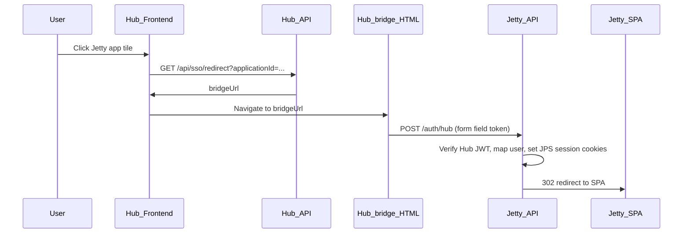

# Jetty Planning System — Downstream Hub SSO integration

This document is the **single source of truth** for Hub-initiated SSO on the Jetty side. It is aligned with Downstream Hub `Backend/src/routes/sso.js` (Hub repository) and the Jetty backend layout (`Backend/src/index.js`, `Backend/src/routes/auth.js`, `Backend/src/middleware/csrf.js`).

**Do not merge this into `technical-architecture.md`.** Optional: add a one-line link there to this file.

---

## Implementation status (this repo)

| Item | Location |
|------|----------|
| `POST /auth/hub` | `Backend/src/routes/hub-sso.js` (mounted in `Backend/src/index.js` as `app.use('/auth', hubSsoRoutes)`) |
| Shared session cookies | `Backend/src/lib/session-cookies.js` — used by `hub-sso.js` and `Backend/src/routes/auth.js` (local login unchanged) |

---

## 0. Local login and Hub SSO must coexist (non-negotiable)

Jetty supports **both** authentication paths **in parallel**; SSO is **additive**, not a replacement.

| Path | Purpose | Must remain |
|------|---------|-------------|
| **Local (direct) login** | `POST /api/v1/auth/login` with `username` + `password`; bcrypt check; sets `jps_at` / `jps_xsrf` | **Unchanged** for existing local users. |
| **Hub SSO** | `POST /auth/hub` with form field `token` (Hub JWT); sets the **same** session cookies after verification | In **addition** to local login. |

**Rules:**

- Do not change login/logout so that valid local users are rejected or Hub is required for normal login.
- If a user already exists with a **password** and Hub sends a matching **email**, SSO only issues cookies — **do not overwrite** `password_hash` (implemented: lookup only, no password update on SSO).

---

## 1. End-to-end flow

The Hub **bridge** sends an **HTML form POST** to the **Target URL** configured in Hub Admin, with path **`/auth/hub`** unless the Target URL already contains `/auth/` (see Hub `sso.js`).

---

## 2. Contract from Downstream Hub

### 2.1 Token (inner JWT in form field `token`)

- **Algorithm:** HS256.
- **Signing key:** same string as Hub `SSO_TOKEN_SECRET` (Jetty `SSO_TOKEN_SECRET`).
- **Claims:** `user_id`, `email`, `iat`, `exp` (Hub default ~60s TTL).

### 2.2 HTTP

- **Method:** `POST`
- **Content-Type:** `application/x-www-form-urlencoded`
- **Field name:** `token`

Jetty parses this with `express.urlencoded({ extended: false })` on the `/auth/hub` route.

### 2.3 Target URL

Hub sets `targetUrl = <target_url> + '/auth/hub'` when the stored URL does not contain `/auth/`. Jetty must serve **`POST /auth/hub`** at the **same origin** as the Hub Application **Target URL**.

---

## 3. Jetty wiring (dev)

| Service | URL |
|---------|-----|
| Vite SPA | `http://localhost:5173` |
| Jetty API | `http://localhost:3000` (default `PORT`) |

**Recommended (approach A):** In Hub Admin, set Jetty app **Target URL** to `http://localhost:3000`. After SSO, Jetty redirects to **`JPS_PUBLIC_ORIGIN`** (default `http://localhost:5173`).

**Approach B:** Target URL `http://localhost:5173` and proxy `/auth` in Vite to port 3000.

`POST /auth/hub` is mounted on the **root** Express app (`/auth/...`), not under `/api/v1`, so it does not go through the CSRF middleware used for `/api/v1/*`.

---

## 4. User identity mapping

1. **Lookup** Jetty user by **case-insensitive email**.
2. **If found and active:** issue JPS session cookies; **do not** change `password_hash`.
3. **If not found:**
   - Default: **403** with a short HTML message (invite-only).
   - Optional **JIT:** set `HUB_SSO_JIT_PROVISION=true` and required role/ports env vars (see below).

---

## 5. Environment variables (Jetty)

| Variable | Purpose |
|----------|---------|
| `SSO_TOKEN_SECRET` | **Must equal** Hub’s `SSO_TOKEN_SECRET` for that environment. If unset, `/auth/hub` returns 503. |
| `JPS_PUBLIC_ORIGIN` | Base URL for **302** after successful SSO (no trailing slash). Default: `http://localhost:5173`. |
| `HUB_SSO_JIT_PROVISION` | `true` to auto-create users when email is unknown. Default: off. |
| `HUB_SSO_JIT_ROLE_NAME` | Role **name** to assign when JIT runs (must exist in `roles`). Required when JIT is on. |
| `HUB_SSO_JIT_ASSIGN_PORTS` | `first` (default): assign first active port; `all`: assign all active ports. |

Existing `JWT_SECRET`, `JWT_EXPIRES_IN`, `COOKIE_SECURE`, `CORS_ORIGIN` apply to the issued JPS session (same as local login).

---

## 6. Hub-side checklist

In **Downstream Hub Admin → Applications** for Jetty:

- **Local dev:** Target URL `http://localhost:3000` (approach A) or `http://localhost:5173` with Vite proxy (approach B).
- **SIT:** Public origin that forwards `POST /auth/hub` to this Node process (e.g. `http://172.28.92.56:3080` if Nginx proxies `/auth/hub` to the API).

Hub **`API_PUBLIC_URL`** must be reachable by the browser for the bridge page.

---

## 7. Verification checklist

1. Local login: `POST /api/v1/auth/login` still works.
2. Hub: user can open Jetty from the grid; lands on Jetty SPA after redirect with session.
3. SIT: Nginx (if any) forwards `POST /auth/hub` to Express; `TRUST_PROXY` is already set in `index.js` when behind a proxy.

---

## 8. Optional product decisions

- JIT vs invite-only for unknown emails.
- Default RBAC role for JIT users (set `HUB_SSO_JIT_ROLE_NAME` accordingly).
- SIT URL and port layout (adjust Target URL and reverse proxy).

---

## 9. Document history

| Date | Change |
|------|--------|
| 2026 | Initial guideline; Jetty implementation in `hub-sso.js` + `session-cookies.js`. |
