# Plan — Auto `operations.status` + expanded at-berth lifecycle

**Status:** not implemented  
**Last updated:** 2026-04-10  
**Owner:** Product / Engineering  

**Context:** At-Berth **Phase** is derived from `operations.status`. Today **`COMPLETED`** overloads “post work / Ready to Sail / signed off”. This plan separates **checklist-driven** states (**`POST_OPS`**) from **sign-off** states using explicit names **`SIGNOFF_REQUESTED`** and **`SIGNOFF_APPROVED`**, and adds **auto promotions** from hub saves.

**Related:** [AT-BERTH-TWO-LEVEL-PHASE-AND-WORKSPACE-STAGE-PLAN.md](./AT-BERTH-TWO-LEVEL-PHASE-AND-WORKSPACE-STAGE-PLAN.md); [OPERATION-SIGNOFF-REQUEST-AND-APPROVAL-PLAN.md](./OPERATION-SIGNOFF-REQUEST-AND-APPROVAL-PLAN.md).

---

## 1. Product model

### 1.1 Lifecycle states and list “Phase” mapping

| `operations.status` | Intended meaning | At-Berth list **Phase** label (proposal) |
|---------------------|------------------|----------------------------------------|
| `DOCKED` | Berthed; Pre-Checking hub work | **Pre-Checking** |
| `IN_PROGRESS` | Operational milestone work captured | **Operational** |
| `POST_OPS` | Post-Checking sub-process work captured | **Post-Checking** |
| `SIGNOFF_REQUESTED` | Operator **requested** operation sign-off → **Ready to Sail** (pending approver) | **Ready to Sail** / **Sign-off requested** |
| `SIGNOFF_APPROVED` | Approver **signed off**; cleared for cast-off / depart | **Signed off** (or only in Clearance) |
| `SAILED` | Cast off / depart recorded | *(not on At-Berth berthed list)* |

**Pre-berth (unchanged):** `PENDING`, `ALLOCATED` remain valid where they exist today.

**Removed from lifecycle:** `COMPLETED` as a stored `operations.status` value — see §4.0 (migration replaces it with **`SIGNOFF_REQUESTED`** / **`SIGNOFF_APPROVED`** semantics).

### 1.2 Automatic transitions (hub-driven)

| Transition | When | From → To |
|------------|------|------------|
| **Operational capture** | Successful create/update of operational milestone data (§3.1) | **`DOCKED` → `IN_PROGRESS`** |
| **Post-Checking capture** | Successful upsert of Post-Checking sub-process for trigger keys (§3.2) | **`IN_PROGRESS` → `POST_OPS`** |

### 1.3 Sign-off and depart (manual)

| User action | Status change |
|-------------|----------------|
| **Request operation sign-off** | **`POST_OPS` → `SIGNOFF_REQUESTED`** (default: only from **`POST_OPS`**; tighten/loosen in API rules) |
| **Approve / Sign off operation** | **`SIGNOFF_REQUESTED` → `SIGNOFF_APPROVED`** |
| **Record depart / cast off** | **`SIGNOFF_APPROVED` → `SAILED`** |

**Clearance / Verification:** Typically **`SIGNOFF_REQUESTED`** = awaiting approval; **`SIGNOFF_APPROVED`** = approved, still alongside until depart (exact filters and card copy in `Verification.jsx`).

---

## 2. Assessment of `SIGNOFF_REQUESTED` / `SIGNOFF_APPROVED`

**Strengths**

- **Readable in DB, logs, and support tickets** — no ambiguity with “completed” meaning checklist vs approval vs sailed.
- **Aligns UI language** with “request sign-off” vs “approve sign-off” already used in the hub.
- **Stable for future reporting** (e.g. time from `SIGNOFF_REQUESTED` to `SIGNOFF_APPROVED`).

**Trade-offs**

- **Breaking enum change:** every reference to `COMPLETED` in code, SQL seeds, and docs must be updated or backfilled.
- **Longer literals** in CHECK constraints and a few UI spots if raw status is ever shown (usually you show labels only).
- **API clients** outside this repo (if any) must adopt the new enum.

**Conclusion:** The naming is **stronger than reusing `COMPLETED`/`SIGNED_OFF`** and is worth the one-time migration cost.

---

## 3. Impact inventory (careful pass)

### 3.1 Database

| Area | Impact |
|------|--------|
| [`004_shipping_operations_tables.sql`](../../Backend/migrations/004_shipping_operations_tables.sql) | Replace `operations.status` CHECK: drop **`COMPLETED`**, add **`POST_OPS`**, **`SIGNOFF_REQUESTED`**, **`SIGNOFF_APPROVED`**. |
| **Backfill** | `UPDATE operations SET status = 'SIGNOFF_APPROVED' WHERE status = 'COMPLETED'` (old meaning = signed off / ready for depart). If any row was “completed” without approval in legacy data, treat as product data cleanup. |
| [`049_operations_signoff_request.sql`](../../Backend/migrations/049_operations_signoff_request.sql) | Predicate `status IN (...)` for views — extend to **`POST_OPS`** (and drop **`DOCKED`/`IN_PROGRESS`** only if sign-off request is **only** from **`POST_OPS`**). |
| Seeds | [`031_seed_dev_clearance_data.sql`](../../Backend/migrations/031_seed_dev_clearance_data.sql), [`023_seed_dev_operational_data.sql`](../../Backend/migrations/023_seed_dev_operational_data.sql), [`Backend/scripts/reset-and-seed-dev.sql`](../../Backend/scripts/reset-and-seed-dev.sql) — replace **`COMPLETED`** with **`SIGNOFF_REQUESTED`** or **`SIGNOFF_APPROVED`** per scenario. |

### 3.2 Backend routes / libs

| File | Impact |
|------|--------|
| [`Backend/src/routes/operations.js`](../../Backend/src/routes/operations.js) | `AT_BERTH_STATUSES`, `PUT /:id` allowed statuses, **signoff-request** allowed from **`POST_OPS`** → set **`SIGNOFF_REQUESTED`**; **signoff** → **`SIGNOFF_APPROVED`**; **depart** requires **`SIGNOFF_APPROVED`**; pending-signoff queries; exception/signoff guards that mention **`COMPLETED`**. |
| [`Backend/src/routes/allocation.js`](../../Backend/src/routes/allocation.js) | **`occupiedStatuses`**: must include **`POST_OPS`**, **`SIGNOFF_REQUESTED`**, **`SIGNOFF_APPROVED`** so jetty stays occupied until **`SAILED`**. |
| [`Backend/src/routes/shipping-instructions.js`](../../Backend/src/routes/shipping-instructions.js) | **Berthed / incoming** SQL: extend status lists with new values wherever **`DOCKED`/`IN_PROGRESS`/`COMPLETED`** appear. |
| `checkSignoffEligible` (and related) | Eligibility and allowed statuses for request/approve. |

### 3.3 Dashboard (yes — impacted)

[`Frontend/src/pages/Dashboard.jsx`](../../Frontend/src/pages/Dashboard.jsx):

- **`statusToPhase`** — today maps **`COMPLETED` → Post-Checking** (wrong under new model). Must map **`POST_OPS` → Post-Checking**, **`SIGNOFF_REQUESTED` / `SIGNOFF_APPROVED`** to new phase labels or exclude from “at-berth phase” widgets per product.
- **KPI counts** (`docked`, `inProgress`, `completed` from `by('DOCKED')` etc.) — the bucket currently named **`completed`** counting **`COMPLETED`** must be **redesigned**: e.g. count **`SIGNOFF_REQUESTED`** + **`SIGNOFF_APPROVED`** separately, or map them into “Ready to Sail” / “Approved” cards.
- **SLA & schedule risk / at-berth lists** built from `fetchOperations` / queue — any filter on **`COMPLETED`** must align with **`SIGNOFF_*`**.

[`Frontend/src/utils/dashboardQueueClassification.js`](../../Frontend/src/utils/dashboardQueueClassification.js):

- **`DOCKED`/`IN_PROGRESS`/`COMPLETED`** used for berthed vs incoming — **must add** **`POST_OPS`**, **`SIGNOFF_REQUESTED`**, **`SIGNOFF_APPROVED`** so classification stays correct.

### 3.4 Other frontend

| File | Impact |
|------|--------|
| [`Frontend/src/pages/AtBerthExecutions.jsx`](../../Frontend/src/pages/AtBerthExecutions.jsx) | **`statusToPhase`**; **berthed** row filter (same as occupancy — include new statuses until sailed); **summary cards** by phase. |
| [`Frontend/src/pages/Verification.jsx`](../../Frontend/src/pages/Verification.jsx) | **`fetchOperations({ status: 'COMPLETED' })`** → fetch **`SIGNOFF_REQUESTED`** and/or **`SIGNOFF_APPROVED`** as needed; counts **`readyCount`/`departedCount`**; filters **`READY`**; modal actions (sign off from table). |
| [`Frontend/src/utils/atBerthOpenPath.js`](../../Frontend/src/utils/atBerthOpenPath.js) | Heuristics for **`COMPLETED`/`IN_PROGRESS`** — extend for **`POST_OPS`**, **`SIGNOFF_*`**. |
| [`Frontend/src/pages/Loading.jsx`](../../Frontend/src/pages/Loading.jsx) | Sign-off banner eligibility (**`DOCKED`/`IN_PROGRESS`** today); hide hub when **`SIGNOFF_APPROVED`/`SAILED`**?; copy that says “COMPLETED”. |
| [`Frontend/src/pages/Allocation.jsx`](../../Frontend/src/pages/Allocation.jsx) | **`COMPLETED`** / **`actualCompletionDateTime`** / berthed detection lines. |
| [`Frontend/src/data/dailyActivitiesReportFromApi.js`](../../Frontend/src/data/dailyActivitiesReportFromApi.js) | **`AT_BERTH_STATUSES`** array. |

### 3.5 Documentation

- [FUNCTIONAL-SPEC-Jetty-Schedule-and-Arrival.md](../FUNCTIONAL-SPEC-Jetty-Schedule-and-Arrival.md), [TECH-SPEC-Jetty-Planning-System.md](../TECH-SPEC-Jetty-Planning-System.md) — every **`COMPLETED`** for operations lifecycle.
- [OPERATION-SIGNOFF-REQUEST-AND-APPROVAL-PLAN.md](./OPERATION-SIGNOFF-REQUEST-AND-APPROVAL-PLAN.md) — status names after request vs approve.

---

## 4. Trigger definitions (auto promotions)

### 4.1 Operational milestones (`DOCKED` → `IN_PROGRESS`)

Keys: `opening_h1_h2`, `cargo_pre_conditioning`, `cargo_operations`, `other`; trigger on `activity` and `milestone_na` saves.

**Idempotency:** `UPDATE … SET status = 'IN_PROGRESS' WHERE id = $1 AND status = 'DOCKED'`.

### 4.2 Post-Checking sub-processes (`IN_PROGRESS` → `POST_OPS`)

Keys: `final_tank_inspection`, `final_hold_inspection`, `final_sounding`; phase `Post-Checking`; trigger on successful upsert.

**Idempotency:** `UPDATE … SET status = 'POST_OPS' WHERE id = $1 AND status = 'IN_PROGRESS'`.

---

## 5. Architecture

```mermaid
flowchart LR
  DOCKED[DOCKED]
  IN_PROGRESS[IN_PROGRESS]
  POST_OPS[POST_OPS]
  SIGNOFF_REQUESTED[SIGNOFF_REQUESTED]
  SIGNOFF_APPROVED[SIGNOFF_APPROVED]
  SAILED[SAILED]
  opSave[Operational save]
  postSave[Post-Checking upsert]
  reqSignoff[Request sign-off]
  apprSignoff[Approve sign-off]
  depart[Depart cast off]
  DOCKED --> opSave
  opSave -->|auto| IN_PROGRESS
  IN_PROGRESS --> postSave
  postSave -->|auto| POST_OPS
  POST_OPS --> reqSignoff
  reqSignoff --> SIGNOFF_REQUESTED
  SIGNOFF_REQUESTED --> apprSignoff
  apprSignoff --> SIGNOFF_APPROVED
  SIGNOFF_APPROVED --> depart
  depart --> SAILED
```

---

## 6. Implementation outline

### 6.0 Database migration (prerequisite)

1. Backfill: `COMPLETED` → **`SIGNOFF_APPROVED`** (legacy “signed off / ready for depart”).
2. Alter CHECK constraint: remove **`COMPLETED`**, add **`POST_OPS`**, **`SIGNOFF_REQUESTED`**, **`SIGNOFF_APPROVED`**.
3. Fix views / indexes / seeds that reference **`COMPLETED`**.

### 6.1 Shared helper — auto status

[`Backend/src/lib/operation-auto-status.js`](../../Backend/src/lib/operation-auto-status.js): `promoteDockedToInProgressIfDocked`, `promoteInProgressToPostOpsIfInProgress` (transactional).

### 6.2 Routes wiring

- [`operation-operational-activities.js`](../../Backend/src/routes/operation-operational-activities.js) — operational promote.
- [`operation-sub-processes.js`](../../Backend/src/routes/operation-sub-processes.js) — post promote.
- [`operations.js`](../../Backend/src/routes/operations.js) — sign-off + depart + `PUT` valid statuses + pending lists.

### 6.3 Frontend phase + Clearance + Dashboard

Implement §3.3 and §3.4 in one release slice to avoid mixed enums in production.

### 6.4 Activity log

Log auto transitions; update sign-off log copy to new status strings.

---

## 7. Resolved design points

- Post-Checking save **does not** set sign-off states — only **`POST_OPS`**.
- **`SIGNOFF_REQUESTED`** / **`SIGNOFF_APPROVED`** replace the old single **`COMPLETED`** flag for operations lifecycle.

---

## 8. Out of scope (unless added later)

- Downgrading status on delete of activities / sub-processes.
- Post trigger only when sub-process **`status === 'Done'`**.

---

## 9. Acceptance / QA checklist

1. **`DOCKED`** + operational save → **`IN_PROGRESS`**; At-Berth / Dashboard phase counts consistent.
2. **`IN_PROGRESS`** + Post upsert → **`POST_OPS`**.
3. **`POST_OPS`** + request → **`SIGNOFF_REQUESTED`**; Clearance shows pending approval.
4. **`SIGNOFF_REQUESTED`** + approve → **`SIGNOFF_APPROVED`**.
5. **`SIGNOFF_APPROVED`** + depart → **`SAILED`**.
6. Jetty **occupancy** and **Allocation berthed** rules include **`POST_OPS`** and **`SIGNOFF_*`** until sailed.
7. **Dashboard** KPIs and at-berth widgets match product definitions for new statuses.
8. Legacy data: former **`COMPLETED`** rows **`SIGNOFF_APPROVED`** and behave on depart.

---

## 10. Rollout

1. Migration + backfill + API + frontend + Dashboard/Verification in **one coordinated release**.  
2. Rebuild `jps-api` / deploy per [REBUILD-RESTART-CONTAINERS.md](../Troubleshoot/REBUILD-RESTART-CONTAINERS.md).  
3. Update specs and operator comms.

---

## 11. Author note

Using **`SIGNOFF_REQUESTED`** and **`SIGNOFF_APPROVED`** is **clearer than `COMPLETED`/`SIGNED_OFF`** and reduces long-term bugs. The **largest risk** is missing a **`COMPLETED`** reference (Dashboard and **occupancy** sets are easy to overlook); use repo-wide search for `COMPLETED`, `statusToPhase`, and berthed/occupancy logic during implementation.

---

## 12. Implementation to-dos

Use this as the build checklist (order can be adjusted; **migration before API** is mandatory).

### 12.1 Database

- [ ] New migration: backfill `operations.status` from **`COMPLETED`** → **`SIGNOFF_APPROVED`** (legacy semantics).
- [ ] Alter `operations.status` CHECK: remove **`COMPLETED`**, add **`POST_OPS`**, **`SIGNOFF_REQUESTED`**, **`SIGNOFF_APPROVED`**.
- [ ] Update any DB views / partial indexes / SQL that reference **`COMPLETED`** (e.g. sign-off pending views in migration **049** pattern).
- [ ] Refresh dev seeds: [`031_seed_dev_clearance_data.sql`](../../Backend/migrations/031_seed_dev_clearance_data.sql), [`023_seed_dev_operational_data.sql`](../../Backend/migrations/023_seed_dev_operational_data.sql), [`Backend/scripts/reset-and-seed-dev.sql`](../../Backend/scripts/reset-and-seed-dev.sql).

### 12.2 Backend — auto promotions

- [ ] Add [`Backend/src/lib/operation-auto-status.js`](../../Backend/src/lib/operation-auto-status.js): `promoteDockedToInProgressIfDocked`, `promoteInProgressToPostOpsIfInProgress` (use transaction `client`).
- [ ] [`operation-operational-activities.js`](../../Backend/src/routes/operation-operational-activities.js): call docked→`IN_PROGRESS` on qualifying milestone saves (POST + PUT; wrap `milestone_na` PUT in transaction if needed).
- [ ] [`operation-sub-processes.js`](../../Backend/src/routes/operation-sub-processes.js): call `IN_PROGRESS`→`POST_OPS` inside `upsertSubProcess` before `COMMIT` for Post-Checking + three final keys.
- [ ] (Optional) Activity log lines when auto-promote `UPDATE` affects a row.

### 12.3 Backend — lifecycle & sign-off

- [ ] [`operations.js`](../../Backend/src/routes/operations.js): extend `PUT /:id` allowed statuses; replace all lifecycle **`COMPLETED`** logic with **`SIGNOFF_*`**.
- [ ] **`POST …/signoff-request`**: allowed from **`POST_OPS`** (confirm product); set **`SIGNOFF_REQUESTED`**; update pending-query filters.
- [ ] **`POST …/signoff`**: **`SIGNOFF_REQUESTED` → `SIGNOFF_APPROVED`**; idempotent if already **`SIGNOFF_APPROVED`**.
- [ ] **`POST …/depart`**: require **`SIGNOFF_APPROVED`** (not old **`COMPLETED`**).
- [ ] **`checkSignoffEligible`** (and exception routes if they branch on **`COMPLETED`**): align with new statuses.
- [ ] [`allocation.js`](../../Backend/src/routes/allocation.js): **`occupiedStatuses`** includes **`POST_OPS`**, **`SIGNOFF_REQUESTED`**, **`SIGNOFF_APPROVED`**.
- [ ] [`shipping-instructions.js`](../../Backend/src/routes/shipping-instructions.js): berthed / incoming status lists include new enums.

### 12.4 Frontend — phase & berthed classification

- [ ] [`AtBerthExecutions.jsx`](../../Frontend/src/pages/AtBerthExecutions.jsx): `statusToPhase` for **`POST_OPS`**, **`SIGNOFF_*`**; berthed row filter; summary phase counts.
- [ ] [`Dashboard.jsx`](../../Frontend/src/pages/Dashboard.jsx): `statusToPhase`; redesign KPI buckets (`by('COMPLETED')` → **`SIGNOFF_REQUESTED` / `SIGNOFF_APPROVED`** per product).
- [ ] [`dashboardQueueClassification.js`](../../Frontend/src/utils/dashboardQueueClassification.js): berthed vs incoming includes **`POST_OPS`** and **`SIGNOFF_*`**.
- [ ] [`atBerthOpenPath.js`](../../Frontend/src/utils/atBerthOpenPath.js): default tab heuristics for new statuses.
- [ ] [`Allocation.jsx`](../../Frontend/src/pages/Allocation.jsx): any **`COMPLETED`** / berthed detection.
- [ ] [`dailyActivitiesReportFromApi.js`](../../Frontend/src/data/dailyActivitiesReportFromApi.js): **`AT_BERTH_STATUSES`**.

### 12.5 Frontend — hub & Clearance

- [ ] [`Loading.jsx`](../../Frontend/src/pages/Loading.jsx): sign-off banner eligibility, `apiOp.status` checks, user-facing copy mentioning **`COMPLETED`**.
- [ ] [`Verification.jsx`](../../Frontend/src/pages/Verification.jsx): `fetchOperations` filters; Ready to Sail / pending sign-off counts and table actions vs **`SIGNOFF_REQUESTED`** / **`SIGNOFF_APPROVED`**.

### 12.6 Documentation

- [ ] [FUNCTIONAL-SPEC-Jetty-Schedule-and-Arrival.md](../FUNCTIONAL-SPEC-Jetty-Schedule-and-Arrival.md) — At-Berth phase, sign-off §9.2, summary cards.
- [ ] [TECH-SPEC-Jetty-Planning-System.md](../TECH-SPEC-Jetty-Planning-System.md) — status enum, routes.
- [ ] [OPERATION-SIGNOFF-REQUEST-AND-APPROVAL-PLAN.md](./OPERATION-SIGNOFF-REQUEST-AND-APPROVAL-PLAN.md) — align status names with **`SIGNOFF_*`**.

### 12.7 QA & release

- [ ] Run through **§9 Acceptance / QA checklist** end-to-end.
- [ ] Repo-wide search: `COMPLETED`, `statusToPhase`, `occupiedStatuses`, berthed SQL — no stale operation lifecycle references.
- [ ] Deploy API + frontend together; rebuild `jps-api` if Docker ([REBUILD-RESTART-CONTAINERS.md](../Troubleshoot/REBUILD-RESTART-CONTAINERS.md)).
