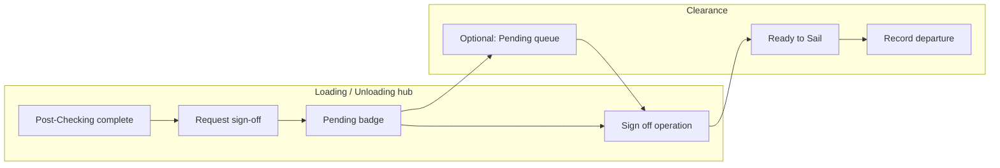

# Plan — Operation sign-off: request → RBAC approval → Clearance (Ready to Sail)

**Status:** planned  
**Last updated:** 2026-04-09  
**Owner:** Product / Engineering  

**Context:** At-berth Pre / Operational / Post checklist completion does **not** set `operations.status` to `COMPLETED`. Clearance lists **Ready to Sail** only for `COMPLETED` rows. Today `POST /operations/:id/signoff` exists but is **not called from the UI**. This plan adds a **Shipping Instruction–style** flow: **request** sign-off, then **approve** (permissioned).

---

## 1. Product flow (agreed)

| Step | Actor | Where | Action |
|------|--------|--------|--------|
| 1 | Operational user (berth team) | **Loading / Unloading** hub (`Loading.jsx`), when **Post-Checking is complete** | Primary CTA: **Request operation sign-off** (or similar label). Confirms intent; optional short remark. |
| 2 | System | Backend | Persist a **pending sign-off request** on the operation (see §3). Enforce same **eligibility gates** as today’s `checkSignoffEligible` *before* accepting the request (or document if request is allowed earlier with stricter approval-time checks). |
| 3 | Authorised user | Same hub **and/or** **Clearance** (`Verification.jsx`) — TBD in UX | Sees pending state. Primary action: **Sign off operation** (final). Calls logic equivalent to today’s `POST /operations/:id/signoff` after verifying request exists and caller has **approve** permission. |
| 4 | System | DB | `status` → `COMPLETED`; activity log entries for request + approval. |
| 5 | Clearance user | Clearance | Vessel appears under **Ready to Sail**; existing **depart** flow unchanged. |

**Principles (mirror SI where helpful):**

- **Request** = “submit for approval” — does **not** complete the operation.
- **Approve / sign off** = executive action — sets `COMPLETED`.
- **RBAC:** separate **who can request** vs **who can sign off**, configured in **Admin → Roles** like **Approve internal SI**.

---

## 2. RBAC proposal

**Reuse the existing `approve` flag** on page permissions (same mechanism as Shipping Instruction’s “Approve internal SI”), to avoid a new permission column type unless necessary.

| Permission | Suggested mapping | Meaning |
|------------|-------------------|---------|
| **Request sign-off** | **`loading` page — `edit`** (and user can open the operation) | Can complete Post-Checking work and **submit** a sign-off request. |
| **Approve operation sign-off** | **`loading` page — `approve`** (new sub-checkbox in Admin UI, like SI) | Can perform the final **sign off** that sets `COMPLETED`. |

**Notes:**

- Page key **`loading`** in this codebase is **“Loading / Unloading”** and covers both purposes; one **approve** flag applies to sign-off for Loading and Unloading operations (same as SI approve living under one page).
- If product wants **only Clearance officers** to approve, optionally also require **`verification` — `view` or `edit`** to see the approval control on Clearance, while keeping **`approve` on `loading`** as the gate for the API. (Alternative: add a second approve sub-permission under **`verification`** only — slightly more migration/UI work.)

**Admin UI:** Add an inline row under **Loading / Unloading**, analogous to `ShippingInstructionApproveSubrow` in `AdminRoles.jsx`:

- Label e.g. **Approve operation sign-off** — *allows final operation sign-off after a request (Ready to Sail / Clearance).*

Seed roles: decide whether default **Admin** role gets `approve` on `loading`; document for ops.

---

## 3. Data model (backend)

**Minimum viable (recommended):** columns on **`operations`**:

- `signoff_requested_at TIMESTAMPTZ NULL`
- `signoff_requested_by BIGINT NULL` (FK to `users`, optional)
- `signoff_request_remark TEXT NULL` (optional, like SI comments)

**Rules:**

- **Request:** allowed only when post-checking completion rules are satisfied (define explicitly: e.g. same checks as UI “Post-Checking complete” **and** `checkSignoffEligible` passes — see §4).
- **Single active request:** if already `PENDING` (request present, status still `IN_PROGRESS`/`DOCKED`), either block duplicate or allow **withdraw / supersede** (product choice).
- **Approve:** requires `signoff_requested_at IS NOT NULL` and operation still in `DOCKED` | `IN_PROGRESS`, then run existing signoff update + clear request fields (or retain for audit).
- **Reject / return:** optional phase-2 — `signoff_request_rejected_at`, reason; clears pending without `COMPLETED`.

**API sketch:**

- `POST /operations/:id/signoff-request` — body optional `remark`; sets request fields; auth + port scope + **edit** on `loading`.
- `POST /operations/:id/signoff` — **change:** require pending request (unless feature flag / admin bypass for break-glass); auth + **`approve` on `loading`** (enforced in route middleware using same pattern as SI approve).

Alternatively keep one `POST .../signoff` for approvers only and add `POST .../signoff-request` for requesters — clearest separation.

---

## 4. Eligibility (align gates)

Today **`checkSignoffEligible`** uses `completion_percent`, `qc_surveys`, `quantity_checks`, exceptions.

**Recommendation:**

- **At request time:** run **full** `checkSignoffEligible` so the request is only stored when the operation *could* be signed off immediately if an approver agreed. User sees the same error messages as today (e.g. completion %, QC).
- **At approval time:** run **again** (data may have changed) before setting `COMPLETED`.

Longer term: align `completion_percent` and legacy QC/qty with the hybrid sub-process / activity model (separate backlog item).

---

## 5. Frontend UX

**Loading / Unloading hub (`Loading.jsx`):**

- When **Post-Checking is complete** (reuse same predicate as summary “3 / 3”):
  - If **no** pending request and not `COMPLETED`: show **Request operation sign-off** (enabled if user has edit; disabled + tooltip if gates fail on last check).
  - If **pending** request: show status chip **Sign-off requested** (date/user); hide or disable repeat request per product rules.
  - If user has **`approve`** and pending request: show **Sign off operation** (primary) — or link to Clearance with deep link.

**Clearance (`Verification.jsx`):**

- Optional **tab or filter**: **Pending sign-off** (operations with request, not yet `COMPLETED`) for approvers — improves discoverability.
- Or keep approval **only** on the hub; still list **Ready to Sail** from `COMPLETED` only.

**Copy / education:**

- Tooltip or helper: *Clearance (Ready to Sail) lists vessels after a manager **signs off** the operation; requesting sign-off notifies the approval step.*

---

## 6. Activity log

- Log **sign-off requested** (who, when, optional remark).
- Log **signed off** (existing or extended summary) with **who approved**.

Use `pageKey` **`loading`** for request; **`verification`** or **`loading`** for approval — align with where the action is taken.

---

## 7. Rollout order

1. Migration: request columns on `operations`.
2. Backend: `signoff-request` endpoint; tighten `signoff` to require request + `approve` permission.
3. RBAC: expose **Approve operation sign-off** in Admin; enforce in middleware.
4. Frontend: CTA on `Loading.jsx`; optional Clearance queue for approvers.
5. Docs: TECH-SPEC / FUNCTIONAL-SPEC — status model, Clearance prerequisites, RBAC.

---

## 8. Acceptance criteria

- Post-checking complete + eligible user can **request** sign-off; ineligible users see **why** (API error surfaced).
- User **without** `approve` cannot call final signoff (403).
- User **with** `approve` can sign off **only** when a request exists (400 otherwise).
- After signoff, operation appears on Clearance as **Ready to Sail**; depart unchanged.
- Admin can grant/revoke **Approve operation sign-off** independently of **Edit**.

---

## 9. References

- `Backend/src/routes/operations.js` — `checkSignoffEligible`, `POST .../signoff`
- `Frontend/src/pages/Verification.jsx` — Clearance list (`COMPLETED` / `SAILED`)
- `Frontend/src/api/operations.js` — `signoff` (today unused from pages)
- `Frontend/src/pages/AdminRoles.jsx` — `ShippingInstructionApproveSubrow` pattern
- `Frontend/src/data/rolesData.js` — page `loading`, `verification`

---

## 10. Lo-fi UI/UX (wireframes)

Grey-box wireframes below are **structure-only** (not final visual design). Copy and placement should match existing `Loading.jsx` / `Verification.jsx` / modal patterns.

**Companion sketch (optional):** `Docs/Plan/operation-signoff-lofi-wireframe.png` — three-panel schematic (hub + modal + clearance).

### 10.1 Journey (high level)



### 10.2 Screen A — Hub: Post-Checking complete, **no request yet**

```
┌──────────────────────────────────────────────────────────────────────────┐
│ ← Back to At-Berth Executions          Port: BONTANG    Hi, Admin        │
├──────────────────────────────────────────────────────────────────────────┤
│  MV VESSEL NAME                                    [ UNLOADING ]          │
│                                                                           │
│  ┌─────────────┐  ┌─────────────┐  ┌─────────────┐                       │
│  │ Pre-Checking│  │ Operational │  │ Post-Checking│                       │
│  │ ● 7/7       │  │ ● 4/4       │  │ ● 3/3       │                       │
│  │ complete    │  │ complete    │  │ complete    │                       │
│  └─────────────┘  └─────────────┘  └─────────────┘                       │
│                                                                           │
│  ┌────────────────────────────────────────────────────────────────────┐ │
│  │  OPERATION SIGN-OFF                                      (banner)   │ │
│  │  Post-checking is complete. Request sign-off to hand the vessel to   │ │
│  │  Clearance (Ready to Sail).                                          │ │
│  │                                                                       │ │
│  │  [ Request operation sign-off ]  (primary button)                    │ │
│  └────────────────────────────────────────────────────────────────────┘ │
│                                                                           │
│  Detailed At-Berth Executions Log                                         │
│  ┌──────────┬─────────────┬───────┬─────────┬─────────┬──────────┐      │
│  │ Phase    │ Title       │ ...   │ Start   │ End     │ Actions  │      │
│  └──────────┴─────────────┴───────┴─────────┴─────────┴──────────┘      │
└──────────────────────────────────────────────────────────────────────────┘
```

- Banner sits **below** the three phase cards (or above the log), full width of content column.
- Users **without** `edit`: banner shows read-only text + disabled button + tooltip.

### 10.3 Screen B — Modal: **Request sign-off** (after click)

```
┌────────────────────────────────────────┐
│  Request operation sign-off         ✕  │
├────────────────────────────────────────┤
│  This notifies approvers. The vessel     │
│  will appear for final sign-off.         │
│                                          │
│  Remark (optional)                       │
│  ┌────────────────────────────────────┐  │
│  │                                    │  │
│  └────────────────────────────────────┘  │
│                                          │
│  [ Cancel ]          [ Submit request ]   │
└────────────────────────────────────────┘
```

- **Submit** calls `POST .../signoff-request`; on error, inline alert with API `error` / gate reason.

### 10.4 Screen C — Hub: **Pending request** (requester view)

```
┌──────────────────────────────────────────────────────────────────────────┐
│  ... same header / phase cards (all complete) ...                        │
│                                                                           │
│  ┌────────────────────────────────────────────────────────────────────┐ │
│  │  SIGN-OFF REQUESTED                                    (info banner)  │ │
│  │  Requested 09/04/2026 14:32 by J. Operator.                          │ │
│  │  Awaiting approval with sign-off permission.                         │ │
│  │  (No second request; optional: [ Withdraw request ] — phase 2)       │ │
│  └────────────────────────────────────────────────────────────────────┘ │
└──────────────────────────────────────────────────────────────────────────┘
```

- Requester **without** `approve`: no **Sign off** button here (or disabled with explanation).

### 10.5 Screen D — Hub: **Approver** (has `approve`, request pending)

Same layout as C, replace/extend banner:

```
│  ┌────────────────────────────────────────────────────────────────────┐ │
│  │  SIGN-OFF PENDING APPROVAL                                            │ │
│  │  Requested … by …  |  Remark: "…"                                    │ │
│  │                                                                       │ │
│  │  [ Sign off operation ]  (primary)   [ View activity log ]           │ │
│  └────────────────────────────────────────────────────────────────────┘ │
```

- **Sign off operation** opens a **light confirm modal** (“This marks the operation complete and sends the vessel to Clearance.”) → `POST .../signoff`.

### 10.6 Screen E — Clearance: **optional “Pending sign-off” queue**

```
┌──────────────────────────────────────────────────────────────────────────┐
│  Clearance                                                                │
│  Record vessel departure after sign-off…                                  │
│                                                                           │
│  [ All ] [ Ready to Sail (n) ] [ Sailed (n) ] [ Pending sign-off (n) ]    │
│                                                                           │
│  Pending sign-off = request submitted, not yet COMPLETED.                │
│  ┌────────────┬──────┬─────────┬────────────────────────────────────┐  │
│  │ Vessel     │ SI   │ Purpose │ Actions                             │  │
│  │ MV EXAMPLE │ …    │ Loading │ [ Open operation ] [ Sign off ]     │  │
│  └────────────┴──────┴─────────┴────────────────────────────────────┘  │
└──────────────────────────────────────────────────────────────────────────┘
```

- **Open operation** → deep link to `/{loading|unloading}/op-{id}/post-checking` (or hub root).
- **Sign off** only if user has `approve`; same confirm + API as hub.

### 10.7 Screen F — Clearance: **Ready to Sail** (unchanged pattern)

Existing table; vessel appears **after** successful sign-off (`COMPLETED`). User then uses existing **Record departure** flow.

### 10.8 Admin → Roles (RBAC lo-fi)

Under **Loading / Unloading** permission row, mirror SI sub-row:

```
│  Loading / Unloading    ☑ View   ☑ Edit   ☐ Delete                      │
│      ↳ ☑ Approve operation sign-off                                      │
│         — Final sign-off after a request (Clearance / Ready to Sail).     │
```

### 10.9 States cheat sheet

| State | Phase cards | Banner | Primary CTA |
|-------|-------------|--------|-------------|
| Post incomplete | Some incomplete | Hidden or grey “Complete Post-Checking first” | — |
| Post complete, eligible, no request | All complete | “Request operation sign-off” | Request |
| Request pending, no approve | All complete | “Sign-off requested …” | — |
| Request pending, has approve | All complete | “Sign off operation” | Sign off |
| COMPLETED | All complete (or hide banner) | “Operation signed off — use Clearance” link | Link to Clearance |
