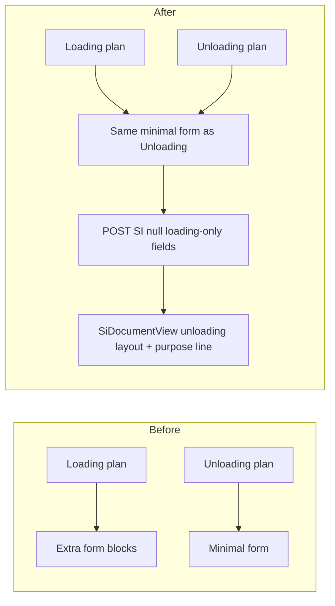

# Plan-linked SI minimal form + unified SI document view

> **Status:** **Deferred** — awaiting stakeholder confirmation. Execution will happen later once you approve.

## Context (clarification of `buildSiCreateApiPayload`)

**`buildSiCreateApiPayload`** ([`Frontend/src/utils/siPlanLinkedDraft.js`](../Frontend/src/utils/siPlanLinkedDraft.js)) turns the **draft form object** into the JSON body for `POST /shipping-instructions`. It does **not** mirror the HTML 1:1; it **conditionally includes fields** based on purpose:

- For **Unloading**, it sends **`tradeTermId`** from the form and leaves loading-style text fields out (or null).
- For **Loading**, it sends **`destinationText`, `freightTerms`, B/L fields, …** only when `isLoading` is true (today those values come from the Loading-only UI).

After this change, the **plan-linked form** will no longer collect Loading-only text for **Loading** plans, so the payload should **always send `null`** for those columns from this flow (same as Unloading). The **`tradeTermId`** line stays **Unloading-only** in the payload (`isUnloading ? num(form.tradeTermId) : null`). No DB migration; the API already accepts nullable columns.

---

## Decisions (locked in)

| Topic | Decision |
|--------|-----------|
| Plan-linked form | **Minimal parity**: same field set as current **Unloading** for **both** purposes; **hide** Loading-only sections (route/freight, NPWP, B/L block) even when the plan purpose is **Loading**. **Trade term** row remains **Unloading only** (unchanged behaviour). |
| Standalone SI page | **Out of scope** — [`Frontend/src/pages/ShippingInstruction.jsx`](../Frontend/src/pages/ShippingInstruction.jsx) stays as-is; list route is already [`RetiredPage`](../Frontend/src/App.jsx) for `/shipping-instruction`. |
| SI view / document | Use the **current Unloading** layout for **Loading and Unloading**; add a clear **purpose** (and optional short vessel-call hint) so users know which applies. |
| Backend / data | **No** migrations, **no** API contract or route changes; only **frontend** edits. |

---

## 1. Plan-linked form — [`Frontend/src/components/ShippingInstructionSiLinkedFields.jsx`](../Frontend/src/components/ShippingInstructionSiLinkedFields.jsx)

- **Remove** the gated blocks that render only when `isLoadingPurpose`:
  - Route / freight (`formRouteFreightSection`: destination, freight terms).
  - NPWP read-only row in Party & port.
  - B/L & consignee section (`formBlConsigneeSection`: BL split, clause, consignee, notify, BL indicated).
- **Keep** the same structure for both purposes: vessel/trip (with `omitVesselAndJetty` as today), Party & port (shipper, loading port, surveyor + **trade term only if** `isUnloadingPurpose`), breakdown, documents (unless omitted), note.
- **Optional polish**: a single subtle line under the plan-linked note or section title stating **purpose** (Loading vs Unloading) using existing `purposeCode` / lookups so labels feel “purpose aware” without extra inputs.

No changes to [`Frontend/src/pages/ShipmentPlansList.jsx`](../Frontend/src/pages/ShipmentPlansList.jsx) beyond what already passes `linkedPlan` unless you need an extra prop (unlikely).

---

## 2. Draft defaults — [`Frontend/src/utils/siPlanLinkedDraft.js`](../Frontend/src/utils/siPlanLinkedDraft.js)

- **`defaultSiDraftForPlanPreview`**: today it always defaults `tradeTermId` to the first trade term. For **Loading** plans, default **`tradeTermId` to `''`** (resolve purpose from `linkedPlan.purposeId` + `lookups.purposes`, same pattern as validation). **Unloading** keeps auto-first trade term if you want parity with today’s unloading UX.
- **`buildSiCreateApiPayload`**: set **`destinationText`, `freightTerms`, `billOfLadingClause`, `blSplitText`, `consigneeText`, `notifyPartyText`, `blIndicated`** to **`null`** for plan-linked creates (or simply **always `null`** from this helper if this helper is only used for plan-linked flow — confirm call sites). Keep **`tradeTermId: isUnloading ? num(form.tradeTermId) : null`**.
- **`validateSiDraftForCreate`**: no Loading-only required checks today; confirm nothing assumes those fields exist after UI removal.

**Call sites to grep** after editing `buildSiCreateApiPayload`: [`Frontend/src/components/ShippingInstructionCreateForm.jsx`](../Frontend/src/components/ShippingInstructionCreateForm.jsx), [`Frontend/src/pages/ShipmentPlansList.jsx`](../Frontend/src/pages/ShipmentPlansList.jsx). If the helper is shared with a path that still needs Loading fields, split helpers or add a flag — verify with grep.

---

## 3. SI document view — [`Frontend/src/components/SiDocumentView.jsx`](../Frontend/src/components/SiDocumentView.jsx)

- **Collapse** the `isLoading ? (letterhead) : (summary+table)` split: always render the **Unloading** branch (`si-view-doc` summary + table).
- **Insert** at the top of that layout (inside the card, before VESSEL row):
  - **`PURPOSE:`** (or i18n key) with `si.purpose` / normalized display (`Loading` / `Unloading`).
  - Optionally **`PLAN / VOYAGE`**: if `si` already exposes `voyageNo`, `planReference`, or similar from [`Frontend/src/pages/SIView.jsx`](../Frontend/src/pages/SIView.jsx) / API, show one line; if not available on `si`, skip to avoid API changes.
- **Remove** or dead-code the Loading-only letterhead branch to avoid drift (default: delete unused branch and CSS class `si-view-doc--loading` if nothing else references it).
- Add/adjust strings in [`Frontend/src/locales/en/shippingInstruction.json`](../Frontend/src/locales/en/shippingInstruction.json) (and `id`) for the new purpose label.

**Callers** (unchanged imports): [`Frontend/src/components/SiDocumentModal.jsx`](../Frontend/src/components/SiDocumentModal.jsx), [`Frontend/src/pages/SIView.jsx`](../Frontend/src/pages/SIView.jsx).

---

## 4. Docs / QA (light)

- One line in [`Docs/FUNCTIONAL-SPEC-Jetty-Schedule-and-Arrival.md`](FUNCTIONAL-SPEC-Jetty-Schedule-and-Arrival.md) document history **only if** you maintain that habit for UX changes.
- **Manual QA**: create plan **Loading** + SI in modal — confirm UI has **no** route/BL/NPWP blocks; submit; open SI view — document shows **Unloading-style** layout + **Purpose: Loading**. Repeat for **Unloading** + trade term. Confirm existing Loading SIs with legacy populated B/L data still **preview** sensibly (summary + table; extra text simply not shown unless you add optional rows later — acceptable per “no backend” scope).

---

## Risk note (product)

Loading SIs created **only** via this plan modal will **no longer capture** destination / freight / B/L text at creation time. If business still needs those for Loading, they must be captured elsewhere (e.g. post-create edit on a different screen) or scope must widen — stakeholder explicitly chose **minimal_loading**.

---

## Cursor plan copy

An equivalent plan file may also exist under your Cursor plans directory (e.g. `plan-si_minimal_parity_*.plan.md`). **This repo copy** under `Docs/Plan/` is the canonical place for your team to review and approve before execution.
