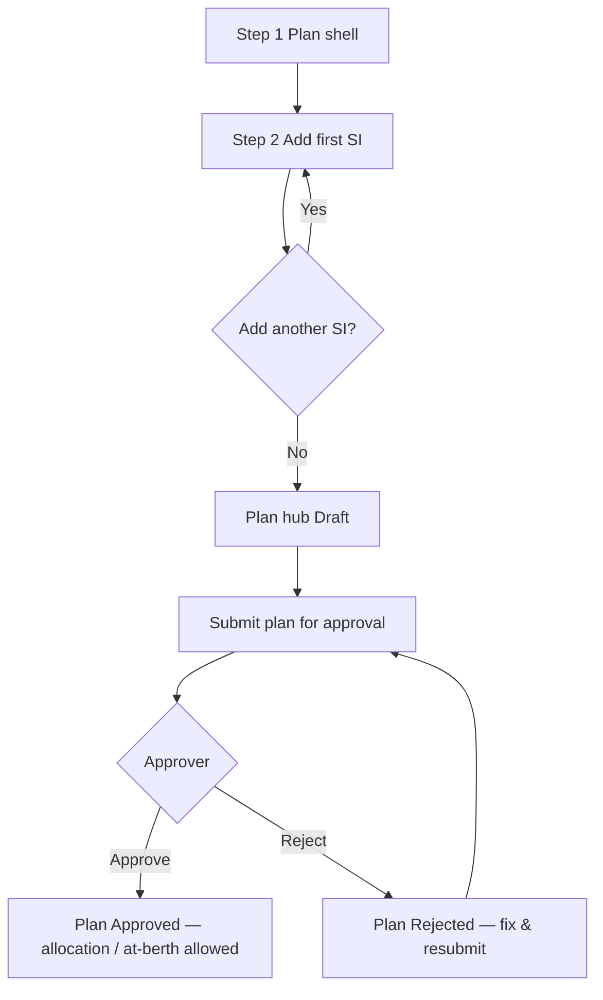

# Shipment Plan — UI/UX wireframe specs & lo-fi design

**Status:** Design specification (no implementation in this document)  
**Audience:** Product, design, frontend  
**Goals:** (1) Make **one trip = one shipment plan (vessel call)** obvious in the UI. (2) Let users run **at-berth work from one trip workspace** instead of mentally juggling multiple `op-*` entry points. (3) Make **approval a single decision on the shipment plan** (not per–shipping instruction) so the trip is the governed unit.  
**Constraints:** Reuse existing **templates, tokens, and components** (`allocation-page`, `card`, `data-table`, `btn`, `modal`, `toast`, table expand patterns, Loading hub patterns). **Terminology:** “Shipment plan” / “Vessel call” for the aggregate; “Shipping instruction” for **documents / execution rows** under that plan.

---

## 1A. Plan-level approval — behaviour spec (UX contract)

**Rule:** **One approval workflow per shipment plan.** Approvers act on the **vessel call** once linked SIs and required data meet submission rules. Individual SIs are **not** separately “Approved” / “Rejected” as the **gate** to berth, allocation, or at-berth (unless a legacy read-only label is kept for document completeness only).

### 1A.1 Plan approval states (display)

| State | User meaning | Typical next actions |
|-------|----------------|----------------------|
| **Draft** | Plan exists; may be incomplete; not submitted. | Edit plan, add/edit SIs, **Submit for approval**. |
| **Submitted** | Awaiting approver. | Approver: **Approve** or **Reject** (with reason). |
| **Approved** | Trip authorised; downstream modules may proceed per other rules. | Allocation / berthing / ops creation as today. |
| **Rejected** | Trip not authorised; reason visible. | Planner: fix SIs or plan fields, **Resubmit**. |

*(Exact enum names can align with backend `shipment_plans.status` or a dedicated `approval_status` field — UX treats the four concepts above.)*

### 1A.2 What moves from “SI approval” to “plan approval”

| Previously (SI-centric mental model) | Target (plan-centric) |
|--------------------------------------|------------------------|
| “SI must be Approved before …” | **“Shipment plan must be Approved before …”** |
| Approver opens each SI in SI Approval | Approver opens **plan hub** or **Plans list → pending filter** and approves **once per trip** |
| Status column “Approved” on SI list as trip gate | **Plan** column or chip: **Submitted / Approved / …**; SI rows show **document / completeness** only if still useful (e.g. “Complete”, “Missing fields”) — **not** as the legal approval gate |

### 1A.3 Downstream gates (when UI should block or warn)

| Surface | If plan is **not** `Approved` |
|---------|-------------------------------|
| **Allocation queue / berth** | **Block** or show read-only with CTA **“Submit plan for approval”** / **“View pending approval”** (same pattern as jetty OOS guard messaging). |
| **Plan at-berth workspace** | **Block** entry or show full-width **banner** with link to plan hub approval panel. |
| **Clearance / depart** | Unchanged dependency on execution/sign-off; plan must already be **Approved** earlier in the lifecycle (assumed invariant). |
| **Shipping instructions list** | Optional: badge **“Plan: Submitted”** on grouped row; SI lines do not show duplicate “Approved” as authority. |

### 1A.4 Submission payload (UX, not API schema)

- **Submit for approval** is enabled when: plan shell valid, **≥1 SI** linked, and **blocking validations** pass (product-defined: e.g. all SIs have required breakdown, document date, etc. — same business rules as today but evaluated **at submit time** for the whole plan).
- **Approve** shows read-only summary: vessel, plan ref, **list of SI refs + purpose**, key dates, optional “open SI detail” links (modal), **comment optional**, **Approve** / **Reject**.

---

## 1. Information architecture

| Route (proposal) | Purpose |
|------------------|---------|
| `/shipment-plans` | List all shipment plans for the selected port (primary entry). |
| `/shipment-plans/new` | Create plan shell + optional first SI (wizard or two-step). |
| `/shipment-plans/:planId` | Plan hub (overview, SI list, **plan approval** panel, actions). |
| `/shipment-plans/:planId/at-berth` | Trip-scoped at-berth workspace (SI switcher + embedded hub). |
| `/shipment-plans/:planId/allocation` | Optional: deep-link wrapper that opens Allocation filtered to this `planId` (or embed summary + “Open in Allocation”). |

**Nav:** Add **“Shipment plans”** next to **Shipping instructions** in the main sidebar (same icon weight / `NavLink` pattern as existing items).

**Legacy:** `/shipping-instruction`, `/allocation`, `/loading/op-*`, `/at-berth` remain; links from plan hub route to them where reuse is faster than embed.

---

## 2. Global layout pattern (all new pages)

Reuse **`Layout`** shell: header (port, user, lang), **sidebar** active state for **Shipment plans**.

Page wrapper: **`allocation-page`** (or a sibling class `shipment-plan-page` that **only** adds a BEM block name but **inherits** spacing/typography from `allocation-page` rules — avoid a second design language).

**Breadcrumb (optional row above title):**

```text
[ Plans ]  >  [ MV PACIFIC 01 ]
```

Use muted text + chevron; same typography as existing secondary lines.

---

## 3. Screen A — Shipment plans list (`/shipment-plans`)

### 3.1 Purpose

Primary **entry point** after POV change. User finds **trips**, not individual SIs first.

### 3.2 Lo-fi wireframe

```text
┌──────────────────────────────────────────────────────────────────────────────┐
│  [Sidebar]   SHIPMENT PLANS                                    [ + New plan ]  │
├──────────────────────────────────────────────────────────────────────────────┤
│  ┌────────────┐ ┌────────────┐ ┌─────────┐ ┌─────────┐ ┌─────────┐         │
│  │ Pending    │ │ Approved   │ │ Incoming│ │ At berth│ │ Clear   │         │
│  │ plan appr. │ │ plans      │ │   n     │ │   n     │ │   n     │         │
│  │   n        │ │   n        │ │         │ │         │ │         │         │
│  └────────────┘ └────────────┘ └─────────┘ └─────────┘ └─────────┘         │
├──────────────────────────────────────────────────────────────────────────────┤
│  [ Filter vessel ] [ Filter plan approval ] [ Ops status ] [ Jetty ]  [Clear] │
├──────────────────────────────────────────────────────────────────────────────┤
│  ▾  │ Plan ref      │ Vessel        │ #SI │ Plan approval │ Ops      │ Jetty │ ETA │ ⋮ │
│─────┼───────────────┼───────────────┼─────┼───────────────┼──────────┼───────┼─────┼───│
│  >  │ SP-26-05-0042 │ MV PACIFIC 01 │  2  │ ● Approved    │ At berth │ 1A    │ …   │… │
│     │               │               │     │               │          │       │     │   │
│  >  │ SP-26-05-0041 │ MV BONTANG 02 │  1  │ ○ Submitted   │ Incoming │ —     │ …   │… │
└──────────────────────────────────────────────────────────────────────────────┘
```

- **Row expand (`>`):** expands inline **SI sub-table** (same interaction as Allocation expand: second row or panel below).

### 3.3 Expanded row (lo-fi)

```text
        ┌─────────────────────────────────────────────────────────────────────┐
        │  SIs on this plan                                                    │
        │  ─────────────────────────────────────────────────────────────────  │
        │  SI ref      │ Purpose   │ Doc / complete │ Execution │ [ Open SI ]   │
        │  SI-2025-001 │ Loading   │ Complete       │ Post-ops  │ [ Open hub ]  │
        │  SI-2025-002 │ Loading   │ Missing X      │ —         │ [ Open SI ]   │
        └─────────────────────────────────────────────────────────────────────┘
```

- Plan approval (Approved / Submitted / …) is shown on the **parent plan row** only — not repeated per SI.

### 3.4 Components to reuse

- Summary: **`AtBerthExecutions`-style** or **Shipping Instructions** summary cards (same CSS classes).
- Table: **`data-table`**, **`allocation-table__sort`**, column filter row as on SI list.
- Primary CTA: **`btn btn--primary`** — label e.g. **“New shipment plan”** (i18n: `shipmentPlans.newPlan`).

### 3.5 States

| State | UI |
|-------|-----|
| Loading | Same skeleton/spinner pattern as SI list. |
| Empty | Card: “No shipment plans yet” + **New shipment plan** + short copy that a plan groups SIs for one vessel call. |
| Error | Red banner line (Allocation pattern). |
| No permission | Same 403 / “contact admin” pattern as other modules. |
| **Submitted (plan)** | Row highlight or amber left border; quick action **Approve** (if user has approver role) opens same modal as hub. |

### 3.6 Data (for implementers later)

- New API: e.g. **`GET /shipment-plans`** with pagination, port scope, aggregates `#si`, **`planApprovalStatus`** (Draft / Submitted / Approved / Rejected), optional **`planSubmittedAt`**, **`planApprovedAt`**, reject reason, `jetty`, `eta`, `vesselName`, `planRef` (needs stable display id — Jetty Op style code or `SP-YY-MM-####` product decision). **Operational** status (Incoming / At berth / …) remains derivable from plan + operations but **must not** replace plan approval in the **Plan approval** column.

---

## 4. Screen B — New shipment plan (`/shipment-plans/new`)

### 4.1 Purpose

Create **plan shell** first; then user adds **one or more** SIs (reuse SI form in “attach to plan” mode).

### 4.2 Flow (high level)



- **Submit for approval** lives on **plan hub** (primary CTA when plan is Draft and validation passes). Optionally also offered at end of **New plan** wizard as “Submit now” vs “Save as draft”.

### 4.3 Lo-fi — Step 1: Plan shell (card form)

```text
┌──────────────────────────────────────────────────────────────────────────────┐
│  NEW SHIPMENT PLAN                                                           │
├──────────────────────────────────────────────────────────────────────────────┤
│  ┌────────────────────────────────────────────────────────────────────────┐ │
│  │  Vessel name *          [________________________________]                │ │
│  │  ETA (optional)          [ datetime-local ]                               │ │
│  │  Preferred jetty         [ Searchable select  ▼ ]                        │ │
│  │  Note                    [ textarea, maxLength per constants ]           │ │
│  │                                                                         │ │
│  │            [ Cancel ]     [ Continue to shipping instructions → ]        │ │
│  └────────────────────────────────────────────────────────────────────────┘ │
└──────────────────────────────────────────────────────────────────────────────┘
```

- Same **`datetime-local`** + **`scheduleDateTime`** behaviour as Allocation (device IANA).
- Jetty: reuse **Master / Allocation** jetty select component if available.

### 4.4 Lo-fi — Step 2: First SI (reuse)

- Either **full-page** embedding of existing **SI create form** with banner: **“Shipping instruction will be linked to this vessel call.”**
- Or **modal** wrapping the same form component with `shipmentPlanId` fixed (hidden field).

**Footer:**

```text
[ Save draft SI ]   [ Save & add another SI ]   [ Done — go to plan ]
```

### 4.5 Validation (UX copy)

- Vessel name required on plan shell.
- SI ref uniqueness / required fields — same as today’s SI create (document rules); **no separate “Approve SI”** step in this flow for trip authorisation.
- If user hits **Cancel** from step 2: confirm dialog “Discard unsaved SI?” (modal pattern existing in app).
- **Submit for approval** (plan hub): disabled with tooltip listing **blocking checks** across all SIs (e.g. “SI-002: missing document date”).

---

## 5. Screen C — Plan hub (`/shipment-plans/:planId`)

### 5.1 Purpose

**Single home** for the trip: see all SIs, status rollup, jump to allocation / at-berth / clearance.

### 5.2 Lo-fi — Header + summary + **plan approval strip**

```text
┌──────────────────────────────────────────────────────────────────────────────┐
│  Plans > MV PACIFIC 01                                                       │
│                                                                              │
│  SHIPMENT PLAN  SP-26-05-0042          [ At berth ] [ Allocation ] [ SI + ] │
│  ─────────────────────────────────────────────────────────────────────     │
│  Ops / berth: ● At berth     Jetty: 1A-01     ETA: …     Last updated: …      │
├──────────────────────────────────────────────────────────────────────────────┤
│  PLAN APPROVAL  ● Approved    (or: ○ Submitted | ○ Draft | ✕ Rejected)        │
│  ───────────────────────────────────────────────────────────────────────    │
│  [ If Draft:     Submit for approval  (primary) ]  [ If Submitted: awaiting ] │
│  [ If Submitted & user is approver:  Approve   Reject  ]                     │
│  [ If Rejected:  Reason: "…"        [ Edit plan / SIs ]  [ Resubmit ] ]       │
├──────────────────────────────────────────────────────────────────────────────┤
│  ┌──────────────┐ ┌──────────────┐ ┌──────────────┐ ┌──────────────┐         │
│  │ SIs          │ │ Ready to sail│ │ Clearance   │ │ Exceptions  │         │
│  │  2 linked    │ │  0 / 2       │ │  Pending    │ │  None       │         │
│  └──────────────┘ └──────────────┘ └──────────────┘ └──────────────┘         │
└──────────────────────────────────────────────────────────────────────────────┘
```

- **Two-line status model in the header:** (1) **Plan approval** (authorisation for the trip). (2) **Operational / berth** state (where the call is in execution). Users must never confuse them; use **labels** + **colour chips** consistent with SI status chips today (`loading-list__badge`-style pattern).
- **Tabs** (`[ At berth ] [ Allocation ] [ … ]`): same visual pattern as **Loading** section tabs (`loading-section-tabs`) — **not** a new tab component.
- **`[ SI + ]`:** opens **Add SI** (same as new flow step 2) attached to this `planId`. **While plan is Submitted**, either **disable** “Add SI” or allow only if product permits “late SI” per CR (then re-validate approval — spec: show confirm **“Adding SI may require re-approval”**).
- **Tab disabled state:** If plan is **not Approved**, **At berth** and **Allocation** tabs show **tooltip** “Available after plan approval” and navigate-on-click is blocked (or tabs render but content is the banner only — pick one pattern and apply consistently).

### 5.3 Lo-fi — Overview tab (default)

```text
┌──────────────────────────────────────────────────────────────────────────────┐
│  TIMELINE (read-only, plan-level) — same field order as Allocation full detail │
│  ETA │ TA │ ETB │ TB │ Est. completion │ …                                   │
├──────────────────────────────────────────────────────────────────────────────┤
│  SHIPPING INSTRUCTIONS ON THIS PLAN                         [ + Add SI ]     │
│  ─────────────────────────────────────────────────────────────────────────   │
│  SI ref    │ Purpose │ Doc / validation │ Op status │ Jetty op id │ Actions   │
│  …         │ Loading │ OK               │ Post-ops  │ LD-…        │ Open …  │
│  …         │ Loading │ Missing X        │ —         │ —           │ Open …   │
└──────────────────────────────────────────────────────────────────────────────┘
```

- **No “SI Approved” column** as the trip gate. **Plan approval strip** (§5.2) is the only **Approved / Submitted / …** authority for the call.
- **“Open”** → existing **SiDetailModal** or navigate to `/shipping-instruction` with highlight (read/edit **document** content; does not re-introduce per-SI approval as gate if backend no longer exposes it).
- **“At berth”** → `/shipment-plans/:id/at-berth?si=<siId>` **only if plan is Approved**; else tooltip / inline alert.

### 5.3A Lo-fi — **Approve / Reject** modal (reuse SI approval modal pattern)

```text
┌────────────────────────────────────────────────────────────┐
│  Approve shipment plan                              [ X ]    │
├────────────────────────────────────────────────────────────┤
│  Plan SP-26-05-0042 · MV PACIFIC 01                         │
│  SIs: SI-001 (Loading), SI-002 (Loading)                    │
│  [ View SI details ]  (opens SiDetailModal, read-only)       │
│                                                             │
│  Comment (optional)  [______________________________]       │
│                                                             │
│          [ Cancel ]              [ Reject ]   [ Approve ]    │
└────────────────────────────────────────────────────────────┘
```

- **Reject** requires **reason** (required textarea, `maxLength` per `inputLimits.js`).
- **Approve** confirms single action for the **whole plan**; toast: “Shipment plan approved.”

### 5.4 Trip checklist (optional right column on wide screens)

```text
┌─────────────────────┐
│ TRIP PROGRESS       │
│ ☐ SI-001 Pre       │
│ ☐ SI-001 Ops       │
│ ☑ SI-001 Post      │
│ ☐ SI-002 Pre       │
│ …                  │
│ [ Open next task ] │
└─────────────────────┘
```

- On **narrow**: collapsible **`card`** below the SI table (“Trip progress”).
- Checkmarks driven from **aggregated operation** + sub-process state (same rules as Loading hub — implementers map from existing APIs).

---

## 6. Screen D — Plan at-berth workspace (`/shipment-plans/:planId/at-berth`)

### 6.1 Purpose

**One URL per trip** for execution; user switches **SI** without leaving the mental context of the call.

### 6.2 Lo-fi — Top: SI rail + trip context

**Gate:** If **`planApprovalStatus !== Approved`**, replace the workspace below with a **full-width banner** (reuse `at-berth-card` / warning styles):

```text
│  ⚠ At-berth is available after the shipment plan is approved.               │
│     [ View plan ]   [ Submit for approval ]                                  │
```

When **Approved**, show:

```text
┌──────────────────────────────────────────────────────────────────────────────┐
│  ← Back to plan      MV PACIFIC 01 · 2 SIs   · Plan: ● Approved              │
├──────────────────────────────────────────────────────────────────────────────┤
│  Active SI:  [ SI-2025-001 (Loading)  ▼ ]     Trip: SP-26-05-0042             │
│              └ mini list: SI-001 ✓  SI-002 …                                 │
├──────────────────────────────────────────────────────────────────────────────┤
│  STAGE RAIL (reuse Loading)   Pre-checking | Operational | Post-checking     │
├──────────────────────────────────────────────────────────────────────────────┤
│                                                                              │
│   [ EMBEDDED: same PreCheckingSections / Operational / PostChecking          │
│     as today, fed by operationId for the selected SI ]                        │
│                                                                              │
├──────────────────────────────────────────────────────────────────────────────┤
│  Sign-off banner (per active operation) — reuse OperationSignoffBanner        │
└──────────────────────────────────────────────────────────────────────────────┘
```

### 6.3 Behaviour spec

| Rule | Detail |
|------|--------|
| Default SI on load | First SI whose operation is **not** `SAILED` and **not** fully signed off; tie-break by `operationId` or TB. |
| **Plan approval gate** | Workspace **hidden or disabled** until plan is **Approved** (§1A.3). |
| URL query | `?si=123` optional; reflects selected SI for shareable link. |
| Deep link compatibility | Existing `/loading/op-42/...` still works; plan hub may **redirect** to plan URL with `si` query for consistency. |
| Clearance CTA | Same **“Proceed to Clearance”** link as Loading hub when **all** SIs on plan are ready (product rule — align with CR). **Plan must already be Approved.** |

### 6.4 Components to reuse

- **`Loading.jsx`** subcomponents: `PreCheckingSections`, `OperationalMilestoneWorkspace`, `PostCheckingSections`, `StageTabs`, `OperationSignoffBanner`, `VesselDetailCard` (plan-level detail merged from allocation overview or plan API).

---

## 7. Screen E — Shipping instructions list (enhancement, same route)

**No new route required** if you prefer; enhance **`/shipping-instruction`**.

### 7.1 Lo-fi — Grouped rows by `shipmentPlanId`

```text
│ … │ Vessel / Plan              │ Plan approval │ SI ref   │ … │
├───┼────────────────────────────┼────────────────┼──────────┼───│
│   │ ▼ Vessel call · SP-…       │ ● Approved     │ (group)  │   │  ← group header: plan approval chip
│   │   SI-001                   │                │ …        │   │
│   │   SI-002                   │                │ …        │   │
│   │ MV SOLO · SP-… (single SI) │ ○ Submitted    │ SI-010   │   │  ← single-SI plan: chip still on plan
```

- **Toggle:** “**Group by vessel call**” (`checkbox` + label) — persisted in `sessionStorage` optional.
- Reuses same **table**; only row renderer changes.

---

## 8. Screen F — Allocation (optional enhancement)

- **Filter chip** or quick filter: **“This plan only”** when navigated from plan hub (`?planId=`).
- **Group header** in queue (same as SI list) — optional phase 2 to reduce duplicate vessel rows visually.

---

## 9. Copy & terminology (EN; ID mirrors in `locales`)

| Key | EN copy |
|-----|---------|
| `nav.shipmentPlans` | Shipment plans |
| `shipmentPlans.title` | Shipment plans |
| `shipmentPlans.subtitle` | One vessel call can include multiple shipping instructions. |
| `shipmentPlans.newPlan` | New shipment plan |
| `shipmentPlans.planRef` | Plan reference |
| `shipmentPlans.siCount` | # of SIs |
| `shipmentPlans.open` | Open |
| `shipmentPlans.addSi` | Add shipping instruction |
| `shipmentPlans.atBerthWorkspace` | At-berth (this vessel call) |
| `shipmentPlans.activeSi` | Active SI |
| `shipmentPlans.tripProgress` | Trip progress |
| `shipmentPlans.planApproval` | Plan approval |
| `shipmentPlans.planApproval.draft` | Draft |
| `shipmentPlans.planApproval.submitted` | Submitted |
| `shipmentPlans.planApproval.approved` | Approved |
| `shipmentPlans.planApproval.rejected` | Rejected |
| `shipmentPlans.submitForApproval` | Submit for approval |
| `shipmentPlans.approvePlan` | Approve shipment plan |
| `shipmentPlans.rejectPlan` | Reject shipment plan |
| `shipmentPlans.resubmitPlan` | Resubmit for approval |
| `shipmentPlans.awaitingPlanApproval` | Awaiting plan approval |
| `shipmentPlans.blockedUntilApproved` | Available after the shipment plan is approved. |

---

## 10. RBAC (proposal)

| Page key | View | Edit / action |
|----------|------|----------------|
| `shipment-plan` (new) | List + hub read | Create plan, add SI to plan, edit plan shell fields, **Submit for approval** |
| **`shipment-plan-approve`** (new) or extend **`shipping-instruction`** approve | See pending plans, open approve modal | **Approve** / **Reject** plan (single action per plan) |
| Reuse | SI document create/edit still **`shipping-instruction`** (no separate SI-level trip approval) | At-berth actions still **`loading`** / **`unloading`** |

**Migration note for admins:** Map existing **“Approve internal SI”** users to **plan approver** if product wants one role; or keep separate **`shipment-plan-approve`** for least privilege.

Alternatively **merge** view into **`allocation`** view permission for v1 to ship faster (product call) — **approval** should still be explicit in UI even if permission is merged.

---

## 11. Responsive notes

- **≤768px:** SI rail becomes **select** full width above stage tabs (same as proposed Loading multi-SI select).
- **Trip checklist:** moves below stage content.
- **Tables:** horizontal scroll + sticky first column (match Allocation mobile behaviour if any).

---

## 12. Non-goals (this release of the spec)

- Redesigning **SI document** sections inside **SiDetailModal**.
- Replacing **Gantt** / **schematic** components (only cross-links from plan hub).
- New illustration set or new colour palette.
- Reintroducing a **separate per-SI “Approved” gate** for the same trip in parallel with plan approval (avoid duplicate authority in UI).

---

## 13. Handoff checklist for design / dev

- [ ] Approve **plan reference** format (display id).
- [ ] Approve **status rollup** rules for plan list card counts (**pending plan approval** vs **approved plans** vs operational buckets).
- [ ] Confirm **“Add SI”** is always **modal** vs **full page** (recommend modal for speed).
- [ ] Confirm **at-berth** is **embed** vs **redirect** to `/loading` with plan chrome (recommend dedicated route for POV).
- [ ] Wire **i18n** keys for ID locale.
- [ ] Backend: **`shipment_plans`** approval state machine + **`POST submit` / `POST approve` / `POST reject`** (or equivalent) and **gates** on allocation / operation creation per §1A.3.
- [ ] Deprecate or hide **per-SI “Approved”** as trip gate in **Shipping instructions** list columns and **filters** (replace with **plan approval** column/group chip).
- [ ] **Activity log:** plan submit / approve / reject events with `entityType: ShipmentPlan` (align with TECH-SPEC).

---

**Document history**

| Version | Date | Author | Notes |
|---------|------|--------|--------|
| 0.1 | 2026-05-11 | Engineering | Initial wireframe + lo-fi from agreed UX direction; code not changed. |
| 0.2 | 2026-05-11 | Engineering | **Plan-level approval:** §1A lifecycle, gates, list/hub/at-berth/SI list wireframes, approve modal lo-fi, i18n + RBAC + handoff updates. |
