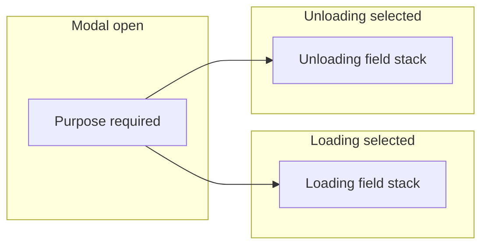

# Shipping Instruction — Loading vs Unloading forms & NPWP master

**Status:** planned — implementation timing per phase below.  
This document combines: **(A)** purpose-first, **different forms for Loading vs Unloading** on create/edit; **(B)** **NPWP** stored in a **per-port master table** and shown read-only on form, View, and Approval.

---

## Part A — Different forms for Loading vs Unloading

### A.1 Goals

1. User **chooses Purpose first** (Loading or Unloading) before or as the gate to the rest of the form.
2. **Loading** and **Unloading** each show a **different field set and order**, using **only existing inputs and sections** from the current **Create Vessel Trip / New Shipping Instruction** modal (`ShippingInstruction.jsx`) — **no new labels-as-components** beyond text changes; reuse `input-group`, breakdown table, file upload, etc.
3. **Label change (both purposes where field appears):** **Loading port** → **`Loading Port / Shipment From`**.

### A.2 Target field sets (product)

**Loading**

1. Vessel Name  
2. Shipping Instructions No.  
3. Document date *  
4. ETA from  
5. ETA To  
6. Preferred jetty  
7. Voyage no. (optional)  
8. Shipment breakdown (Contract / PO)  
9. B/L Split  
10. Loading Port — label **Loading Port / Shipment From**  
11. Destination  
12. Bill of Lading (existing: *Bill of lading clause*)  
13. Consignee  
14. Notify Party  
15. Freight (existing: *Freight terms*)  
16. Shipper  
17. NPWP — **read-only from master** (see Part B); not a free-text field on the SI.  
18. BL Indicated  
19. Note  
20. Document upload  

**Unloading**

1. Vessel Name  
2. Shipping Instructions No.  
3. Document date *  
4. ETA from  
5. ETA To  
6. Preferred jetty  
7. Voyage no. (optional)  
8. Shipment breakdown (Contract / PO)  
9. Shipper  
10. Loading Port — label **Loading Port / Shipment From**  
11. Term (existing trade term / “Term” select)  
12. Note  
13. Document upload  

### A.3 Current implementation (baseline)

- **Single combined form** for all purposes; **Purpose** is not first — it sits in the **Vessel & trip** grid with other fields.
- Sections today: Vessel & trip → Route & freight → Party & port → Breakdown → B/L & consignee → Document upload → Note.
- **Default purpose** on open tends to **Unloading** when lookups load (`defaultFormFromLookups`).
- **Gap:** conditional **show/hide** and **field order** per purpose; **Purpose-first** step or ordering.

### A.4 Implementation notes (when building)

- Derive **`isLoading` / `isUnloading`** from selected **`purposeId`** + `lookups.purposes` (`code === 'Loading'` / `'Unloading'`).
- **Reorder** JSX blocks to match product order within each branch; **wrap** existing field groups in purpose conditionals — **no new field components**.
- **Loading-only extras** today not in Unloading list: e.g. **Destination**, **Freight terms**, **B/L** block (split, clause, consignee, notify, BL indicated), **Surveyor**, **Agent** — show only where Loading requires them; **hide** for Unloading per §A.2.
- **Unloading:** omit B/L-heavy block, destination, freight, NPWP line, etc., per §A.2.
- **Validation:** align required fields with **which purpose** is selected (document date, ETAs, breakdown, etc. — confirm with product).
- **NPWP display:** read-only line fed from **Part B** master API (not `shipping_instructions` column).

### A.5 Lo-fi design (wireframes)

Low-fidelity only: **layout, grouping, and order** — not pixel-perfect UI. Reuses the existing **wide modal** (`modal modal--wide`) and current section titles where they still fit.

#### A.5.1 Flow (both create and edit Draft)



- **Purpose** is the **first control** users must set (or a dedicated first “step” before the rest of the form is visible — product can choose **inline** vs **two-step**; wireframes below assume **inline**: Purpose row at top, then the rest **enabled only when Purpose ≠ empty**).

#### A.5.2 Modal shell (common)

```text
+------------------------------------------------------------------+
|  Create Vessel Trip / New Shipping Instruction              [X]  |
+------------------------------------------------------------------+
|                                                                  |
|  PURPOSE *                                                       |
|  [  Loading  |  Unloading  ]     <- segmented control OR select  |
|                                                                  |
|  (When purpose not chosen: show hint; disable / hide blocks     |
|   below — wireframe shows full layout for each branch.)          |
|                                                                  |
|  ... branch-specific content (A.5.3 or A.5.4) ...                |
|                                                                  |
|                                        [ Cancel ]  [ Submit ]    |
+------------------------------------------------------------------+
```

#### A.5.3 Loading — vertical stack (top → bottom)

Section boundaries can match today’s **card/section titles** or be flattened into one scroll; numbers match §A.2.

```text
+------------------------------------------------------------------+
| PURPOSE *          [ Loading (selected) | Unloading ]            |
+------------------------------------------------------------------+
| VESSEL & TRIP                                                    |
|   Vessel Name *              Shipping Instructions No. *        |
|   Document date *            ETA from *          ETA to *       |
|   Preferred jetty            Voyage no. (optional)               |
+------------------------------------------------------------------+
| SHIPMENT BREAKDOWN (CONTRACT / PO)                               |
|   [ existing table: commodity | qty | unit | contract | PO ]   |
|   [ + Add row ]                                                  |
+------------------------------------------------------------------+
| B/L & ROUTE (labels per existing controls)                      |
|   B/L Split                         (textarea)                 |
|   Loading Port / Shipment From *    [ dropdown ]               |
|   Destination                       (text)                       |
|   Bill of lading clause             (textarea)                |
|   Consignee                         (textarea)                   |
|   Notify party                      (textarea)                   |
|   Freight terms                     [ dropdown ]                 |
+------------------------------------------------------------------+
| PARTY                                                            |
|   Shipper                         [ dropdown ]                  |
+------------------------------------------------------------------+
| NPWP (PORT MASTER) — READ ONLY                                   |
|   81.291.248.3-018.000   OR   ⚠ Not configured for this port   |
+------------------------------------------------------------------+
|   BL indicated                      (textarea)                 |
+------------------------------------------------------------------+
| NOTE                                                             |
|   (textarea)                                                     |
+------------------------------------------------------------------+
| DOCUMENT UPLOAD                                                  |
|   [ Choose files ]    list of attached names                     |
+------------------------------------------------------------------+
```

**Notes for Lo-fi**

- **Surveyor** / **Agent** are **not** in the §A.2 Loading list; keep them **hidden** for Loading unless product revises the list.
- **Term** (trade term) is **not** in the Loading list; **hide** for Loading (or move only if product adds it back).

#### A.5.4 Unloading — vertical stack (shorter)

```text
+------------------------------------------------------------------+
| PURPOSE *          [ Loading | Unloading (selected) ]            |
+------------------------------------------------------------------+
| VESSEL & TRIP                                                    |
|   Vessel Name *              Shipping Instructions No. *        |
|   Document date *            ETA from *          ETA to *       |
|   Preferred jetty            Voyage no. (optional)               |
+------------------------------------------------------------------+
| SHIPMENT BREAKDOWN (CONTRACT / PO)                               |
|   [ existing table ]                                             |
|   [ + Add row ]                                                  |
+------------------------------------------------------------------+
| PARTY & ROUTE                                                    |
|   Shipper                         [ dropdown ]                  |
|   Loading Port / Shipment From    [ dropdown ]                  |
|   Term                            [ dropdown ]                  |
+------------------------------------------------------------------+
| NOTE                                                             |
|   (textarea)                                                     |
+------------------------------------------------------------------+
| DOCUMENT UPLOAD                                                  |
|   [ Choose files ]    list of attached names                     |
+------------------------------------------------------------------+
```

**Notes for Lo-fi**

- **No** B/L block, **no** destination freight/consignee/notify/BL indicated, **no** NPWP line, **no** surveyor/agent for Unloading per §A.2.

#### A.5.5 Narrow / mobile

- Same **single column** order as above; **pipeline-flow**-style horizontal strips are **not** used for the form — **vertical scroll** inside the modal (as today).

### A.6 References (files)

- `Frontend/src/pages/ShippingInstruction.jsx` — modal form, `defaultFormFromLookups`, `handleSubmit`, `mapSiFromApi`.
- `Frontend/src/api/shippingInstructions.js` — payloads unchanged unless product adds new persisted fields (NPWP is **not** on SI body in Part B).

---

## Part B — NPWP master (per port)

### B.1 Background

- **NPWP** on **SI View** / **SI Approval** today uses a **hardcoded fallback** and is **not** stored reliably on `shipping_instructions` or shipper master.
- NPWP must be **one per port** in master data, **read-only** on SI flows.

### B.2 Phase B.1 — Database (**table + seed first**; **no Master UI**)

1. **New table** (name TBD; e.g. `si_npwp_master` or `port_npwp`):
   - **`port_id`** — FK to `ports`, **UNIQUE** (one NPWP row per port).
   - **`npwp`** — **TEXT** (formatted NPWP).
   - Audit columns consistent with other masters (`created_at`, `updated_at`; optional `deleted_at`).
2. **Migration / seed:** insert **`81.291.248.3-018.000`** for a **real `port_id`** in dev/demo seeds (align `reset-and-seed-dev.sql` or port seeds).

### B.3 Phase B.2 — Backend API

- **Read** NPWP for **selected port** (same port scope as SI routes).
- Prefer a **small dedicated read** (e.g. part of `GET /si-lookups` or `GET /si-npwp`) — avoid bloating SI list unless agreed.

### B.4 Phase B.3 — Create / Edit SI form

- Fetch master NPWP when opening modal; **read-only** notice (label / disabled / helper text).
- If **missing**: message that NPWP is not configured for this port in Master.

### B.5 Phase B.4 — SI View & SI Approval

- **`SIView.jsx`** / **`SIApproval.jsx`**: use **master NPWP** for the relevant port; **remove hardcoded default string**.

### B.6 Phase B.5 — Master NPWP UI (**open / later**)

- Full **Master – NPWP** (or under Master – SI): CRUD per port; RBAC like other masters.

### B.7 Open items (NPWP)

| Item | Notes |
|------|--------|
| **Master – NPWP (full CRUD UI)** | Deferred until scheduled. |
| Optional: NPWP on **exports/PDF** | After master is live. |
| Optional: **NPWP snapshot** on `shipping_instructions` | Only if legal/ops need point-in-time copy. |

### B.8 References (NPWP)

- `Frontend/src/pages/SIView.jsx`, `SIApproval.jsx` — replace fallback.
- `Frontend/src/pages/ShippingInstruction.jsx` — read-only NPWP.
- `Backend/src/routes/shipping-instructions.js` — port scope.
- `Backend/migrations/` — new migration.

---

## Consolidated open items (cross-cutting)

| Item | Area |
|------|--------|
| **Loading vs Unloading form UX** | Part A — purpose-first, conditional sections, validation, label **Loading Port / Shipment From**. |
| **Master – NPWP admin UI** | Part B.6 |
| **NPWP export / snapshot** | Part B.7 optional rows |

---

## Document history

| Date | Notes |
|------|--------|
| 2026-04-08 | Initial NPWP-only plan (`SI-NPWP-MASTER-PLAN.md`). |
| 2026-04-08 | Consolidated: Part A Loading/Unloading forms + Part B NPWP master; single doc. |
| 2026-04-08 | Part A: added **§A.5 Lo-fi design** (Mermaid flow + ASCII wireframes Loading / Unloading). |
