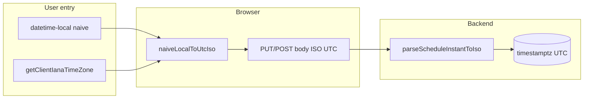

# Searchable timezone dropdown (Master – Port) + device-timezone schedule entry

## Goal

In [Frontend/src/pages/MasterPort.jsx](Frontend/src/pages/MasterPort.jsx), replace the `<input>` for “Schedule timezone (IANA)” (lines 233–243) with a **searchable single-select** where each row shows **IANA id + UTC offset** (e.g. `Asia/Jakarta · UTC+07:00`). The value saved to the API remains the **raw IANA string** (`formScheduleTimezone` unchanged in meaning).

## Approach (no new npm dependency)

The repo already has **Luxon** and a **dropdown trigger + panel** pattern in [Frontend/src/components/DropdownMultiSelect.jsx](Frontend/src/components/DropdownMultiSelect.jsx) + [Frontend/src/styles/allocation.css](Frontend/src/styles/allocation.css) (`.dropdown-multi__`*).

Add a focused `**SearchableSingleSelect`** (or `TimezoneSelect`) component that:

- Builds options from `**Intl.supportedValuesOf('timeZone')`** when available (modern Chromium/Edge/Firefox), with a **small static fallback array** if not (so older engines still work).
- For each zone, uses `**DateTime.now().setZone(id)`** from Luxon; if `!isValid`, skip. Label format: `**${id} · UTC${offset}`** where offset comes from something stable and readable, e.g. `dt.toFormat('ZZ')` mapped to a clear prefix (e.g. `UTC+07:00`) — align with what you already use elsewhere in [Frontend/src/utils/scheduleDateTime.js](Frontend/src/utils/scheduleDateTime.js).
- **Sort** options by **numeric offset** (Luxon `offset`), then by IANA id, so the list is scannable.
- **Filter** as the user types: case-insensitive match on **both** `value` and `label`.
- **Single choice**: clicking a row sets the IANA `value`, closes the panel, and updates parent state (same as today’s `setFormScheduleTimezone`).
- **Legacy / odd DB values**: if the current `formScheduleTimezone` is **not** in the built list (old typo or rare zone), **prepend** a synthetic option so the user still sees what is stored and can change away from it (label can note “current value”).

## Modal clipping (must fix)

[Frontend/src/styles/modal.css](Frontend/src/styles/modal.css) sets `.modal { overflow: auto; }`, which **clips** absolutely positioned dropdowns that extend past the modal box.

Pick **one** of these (recommended first):

1. **Portal the open panel** to `document.body` with `createPortal`, position with `getBoundingClientRect()` on the trigger, and close on outside click / Escape — same idea as `react-select`’s `menuPortalTarget`.
2. Or add a **narrow CSS exception** only for the port modal (e.g. a class on that modal instance setting `overflow: visible` and relying on `max-height` + internal scroll) — quicker but can regress scrolling for very tall modals.

The plan should implement **(1)** for robustness.

## Layout header: port vs browser timezone (icons + tooltips)

In [Frontend/src/components/Layout.jsx](Frontend/src/components/Layout.jsx), where the top bar shows the two IANA zones (today: `{portScheduleTz} · {getClientIanaTimeZone()}` around lines 204–206), update presentation so users are never confused when both strings match (e.g. two `Asia/Jakarta`):

- **Port schedule zone:** prefix `**⚓`** immediately before the port IANA string; set `**title="Port Timezone"`** on that segment (wrap in `` or equivalent). Optional: `aria-label` mirroring the tooltip for screen readers.
- **Browser / machine zone:** prefix `**💻`** immediately before `getClientIanaTimeZone()`; set `**title="Your / Browser Timezone"`** on that segment.

Keep the **middle dot (·)** as the separator between the two segments. Add minimal CSS if needed (e.g. slight gap, `cursor: help` on the spans — optional; native tooltips use `title`).

**i18n:** Tooltips are English-only per this request; if the app later needs EN/ID strings, move these to locale files in a follow-up.

After the **device-timezone schedule** work below, adjust this header copy so it is **accurate**: schedule **entry** follows **device (laptop icon)**; **anchor** remains the port’s configured site timezone for reference (reports, Master Port, future “show in port time” features), not the zone used to interpret `datetime-local` values.

## Device timezone for schedule datetimes (product change)

### Requirement

- When a user types `13:00` in a `datetime-local` control, that means **13:00 in their browser IANA zone** (e.g. `Asia/Jakarta`), not the port’s `schedule_timezone`.
- Another user in a different zone sees the **same stored instant** rendered in **their** local time (browser `Intl` / existing display helpers).
- **UX:** Inform users **elegantly**—no banners or long paragraphs. Prefer: **updated `title` tooltips** on the header segments plus **at most one short muted subtitle** in [Frontend/src/components/Layout.jsx](Frontend/src/components/Layout.jsx) (e.g. one line: schedule forms use your device clock; port zone is site reference only), or a tiny reusable `ScheduleTimeContextHint` component if the line must appear on heavy pages only.

### Why this matches the codebase

- [Frontend/src/utils/formatDateTimeDisplay.js](Frontend/src/utils/formatDateTimeDisplay.js) already formats ISO via `Date` / `Intl` in the **user’s locale**; wall clock shown follows the **device** for typical ISO inputs.
- The mismatch today is the `**datetime-local` pipeline**: [Frontend/src/utils/scheduleDateTime.js](Frontend/src/utils/scheduleDateTime.js) (`naiveLocalToUtcIso`, `utcIsoToNaiveLocal`, `normalizeForApi`, `nowToNaiveLocalInScheduleZone`) is called with `**selectedPort.scheduleTimezone`** from pages such as [Frontend/src/pages/Allocation.jsx](Frontend/src/pages/Allocation.jsx), [Frontend/src/pages/Loading.jsx](Frontend/src/pages/Loading.jsx), [Frontend/src/pages/Unloading.jsx](Frontend/src/pages/Unloading.jsx), [Frontend/src/pages/Verification.jsx](Frontend/src/pages/Verification.jsx), [Frontend/src/components/OperationalMilestoneWorkspace.jsx](Frontend/src/components/OperationalMilestoneWorkspace.jsx), [Frontend/src/components/SiDetailModal.jsx](Frontend/src/components/SiDetailModal.jsx), and API helpers in [Frontend/src/api/operations.js](Frontend/src/api/operations.js) plus hydration in [Frontend/src/utils/loadingHubProcessStagesFromApi.js](Frontend/src/utils/loadingHubProcessStagesFromApi.js).

### Implementation approach

1. **Single source for “entry zone”**
  Use [Frontend/src/utils/scheduleDateTime.js](Frontend/src/utils/scheduleDateTime.js) `getClientIanaTimeZone()` (already exported) everywhere the app currently threads `scheduleTz` / `scheduleIana` **only for interpreting or emitting `datetime-local` and naive schedule strings**.  
   Do **not** remove `ports.schedule_timezone` from the API: it remains **site metadata** (Master Port, header anchor, future port-local exports).
2. **Replace call sites**
  Grep-driven pass: for schedule flows, replace `selectedPort?.scheduleTimezone ?? DEFAULT` (used as the **second argument** to `normalizeForApi`*, `utcIsoToNaiveLocal`, `naiveLocalToUtcIso`, `nowToNaiveLocalInScheduleZone`, and `scheduleIana` passed into `operations.js` / hub loaders) with `**getClientIanaTimeZone()`** (or a thin alias `getScheduleEntryTimeZone()` in the same file for readability).  
   Keep using **port** `scheduleTimezone` only where the UI explicitly documents **port** context (e.g. Master Port editor itself).
3. **Backend**
  [Backend/src/lib/schedule-instant.js](Backend/src/lib/schedule-instant.js): `parseScheduleInstantToIso` interprets **naive** strings in **port** zone, but if the client sends **ISO with `Z` or numeric offset**, it uses `new Date(v).toISOString()` and **ignores** port zone for that value.  
   **Requirement:** the web app must **continue to send normalized ISO UTC** (or zoned ISO) for schedule fields after the frontend change so the server stores the correct instant.  
   **Audit:** grep API payloads for any path that still posts raw naive `YYYY-MM-DDTHH:mm` without `normalizeForApi`; fix those. Optional follow-up: comment in `schedule-instant.js` that naive+port is **legacy / non-web** behaviour.

### Data flow (after change)

### Verification (schedule behaviour)

- User A (e.g. `Asia/Jakarta`): enter a time, save; capture request body shows **Z** ISO.  
- User B (e.g. `Asia/Makassar`): open same operation; `datetime-local` and read-only displays reflect **their** local equivalent of that instant.  
- Port `schedule_timezone` can differ from both devices; schedule **entry** must still follow **device** only.

## Files to add/change

| Area                | Action                                                                                                                                                                                                                                                                                                                                                                                                                                                                                                                                                                                                                                                                                                                                                                                                                                    |
| ------------------- | ----------------------------------------------------------------------------------------------------------------------------------------------------------------------------------------------------------------------------------------------------------------------------------------------------------------------------------------------------------------------------------------------------------------------------------------------------------------------------------------------------------------------------------------------------------------------------------------------------------------------------------------------------------------------------------------------------------------------------------------------------------------------------------------------------------------------------------------- |
| New util            | e.g. [Frontend/src/utils/ianaTimeZoneOptions.js](Frontend/src/utils/ianaTimeZoneOptions.js) — `getIanaTimeZoneOptions()` returning `{ value, label }[]`, memoized at module scope after first call.                                                                                                                                                                                                                                                                                                                                                                                                                                                                                                                                                                                                                                       |
| New component       | e.g. [Frontend/src/components/SearchableSingleSelect.jsx](Frontend/src/components/SearchableSingleSelect.jsx) — trigger button, search input, scrollable list, portal for panel, a11y (`aria-expanded`, `listbox` / `option` roles, `aria-activedescendant` optional).                                                                                                                                                                                                                                                                                                                                                                                                                                                                                                                                                                    |
| Styles              | Small block in [Frontend/src/styles/allocation.css](Frontend/src/styles/modal.css) — reuse `.dropdown-multi__trigger` look-alike or extend with `searchable-select__`* for search input + highlighted row + portal z-index **above** `.modal-overlay` (e.g. `z-index: 1100`).                                                                                                                                                                                                                                                                                                                                                                                                                                                                                                                                                             |
| Page                | [Frontend/src/pages/MasterPort.jsx](Frontend/src/pages/MasterPort.jsx) — swap input for the new component; keep `DEFAULT_SCHEDULE_TIMEZONE` from `scheduleDateTime.js`.                                                                                                                                                                                                                                                                                                                                                                                                                                                                                                                                                                                                                                                                   |
| Layout header       | [Frontend/src/components/Layout.jsx](Frontend/src/components/Layout.jsx) — ⚓ / 💻 prefixes and `title` tooltips as above; optional tiny style in an existing global/topbar stylesheet if the line wraps oddly.                                                                                                                                                                                                                                                                                                                                                                                                                                                                                                                                                                                                                            |
| Schedule entry zone | [Frontend/src/pages/Allocation.jsx](Frontend/src/pages/Allocation.jsx), [Frontend/src/pages/Loading.jsx](Frontend/src/pages/Loading.jsx), [Frontend/src/pages/Unloading.jsx](Frontend/src/pages/Unloading.jsx), [Frontend/src/pages/Verification.jsx](Frontend/src/pages/Verification.jsx), [Frontend/src/components/OperationalMilestoneWorkspace.jsx](Frontend/src/components/OperationalMilestoneWorkspace.jsx), [Frontend/src/components/SiDetailModal.jsx](Frontend/src/components/SiDetailModal.jsx), [Frontend/src/api/operations.js](Frontend/src/api/operations.js), [Frontend/src/utils/loadingHubProcessStagesFromApi.js](Frontend/src/utils/loadingHubProcessStagesFromApi.js) — thread **device** IANA for all `datetime-local` encode/decode; grep for remaining `scheduleTimezone` / `scheduleIana` used for this purpose. |
| Optional util       | Add `getScheduleEntryTimeZone()` re-export or wrapper next to `getClientIanaTimeZone` in [Frontend/src/utils/scheduleDateTime.js](Frontend/src/utils/scheduleDateTime.js) so call sites read clearly.                                                                                                                                                                                                                                                                                                                                                                                                                                                                                                                                                                                                                                     |
| Backend             | Prefer **no code change** if audit passes; otherwise align comments or add dev-only warning when naive schedule strings hit the server without client normalization.                                                                                                                                                                                                                                                                                                                                                                                                                                                                                                                                                                                                                                                                      |

## Optional (out of scope unless you want it)

- Show **offset in the table column** (“Schedule TZ”) for quicker scanning — same helper as labels.

## Backend (schedule + master)

- **Master Port / `ports.schedule_timezone`:** [Backend/src/routes/ports.js](Backend/src/routes/ports.js) unchanged (IANA regex + storage).
- **Schedule instants:** [Backend/src/lib/schedule-instant.js](Backend/src/lib/schedule-instant.js) + allocation / subprocess / operational-activity routes — **no code change** if the SPA always sends **zoned or UTC ISO** for schedule fields. Naive strings without offset are still interpreted in **port** zone on the server (legacy / non-web); the plan’s **audit** confirms the web client does not rely on that after the device-zone switch.

## Verification

- Open **Master → Port**, Add/Edit: type `jaka` → select `Asia/Jakarta · …`, Save, confirm table and API payload still use `Asia/Jakarta`.
- Open modal near bottom of viewport: dropdown list is **not clipped** by the modal.
- If you manually had a weird stored TZ in DB, it still appears until the user picks a listed zone.
- With a port selected, header shows anchor and laptop icons; tooltips reflect **port site reference** vs **device zone used for schedule entry** (copy updated after device-entry work).
- **Cross-timezone:** two browsers in different `Intl` zones on the same operation: same DB instant; each sees appropriate local `datetime-local` / display.
- **Network:** schedule fields in request bodies use **ISO with Z or numeric offset**, not raw naive strings, under normal UI use.

